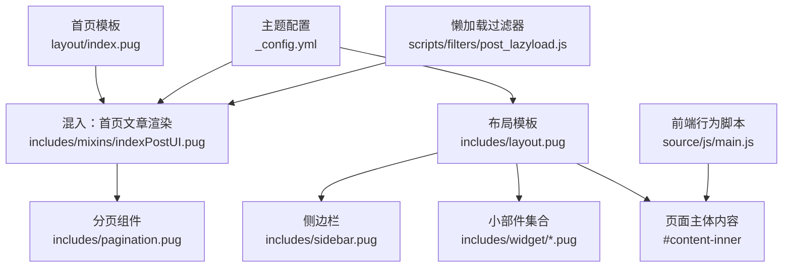
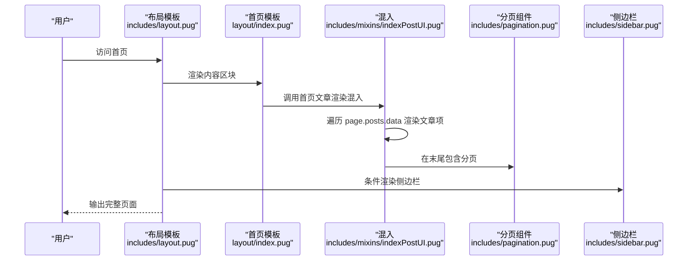
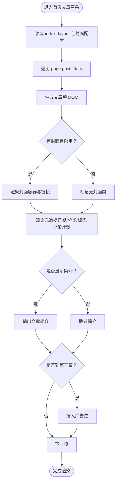
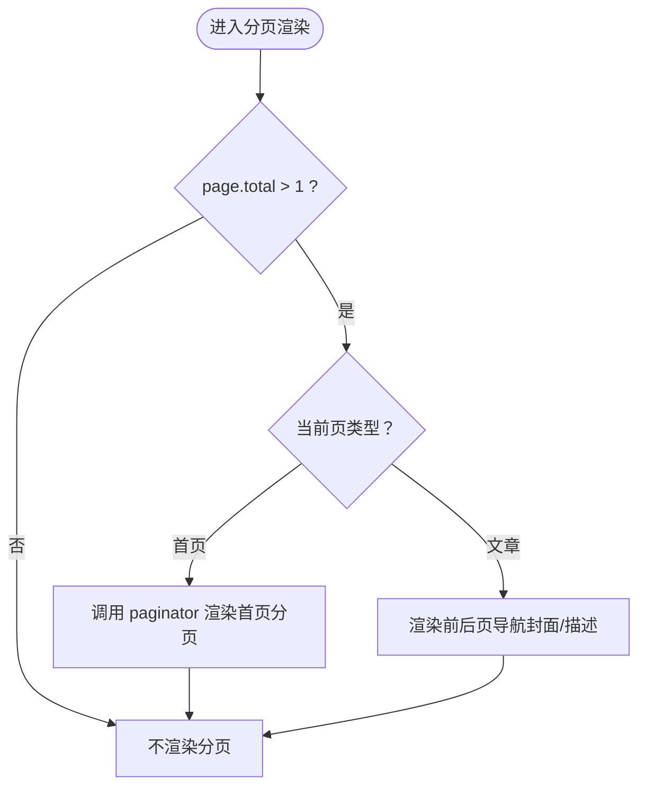
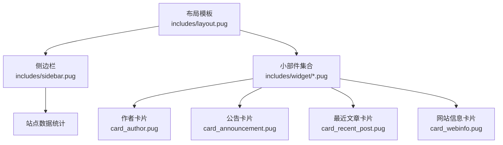
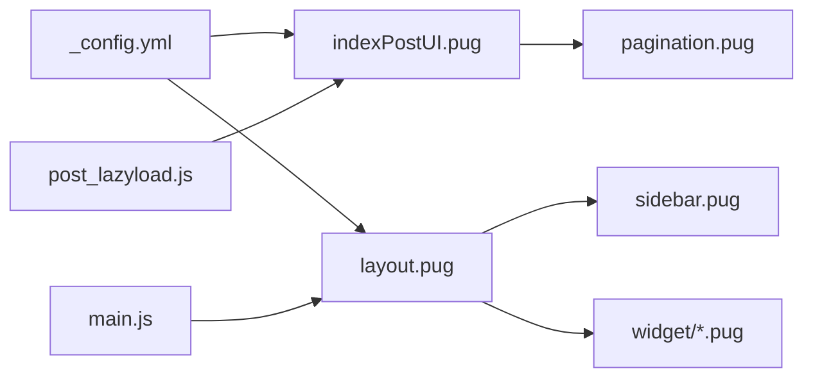

# 首页布局

<cite>
**本文引用的文件**
- [themes/butterfly/layout/index.pug](file://themes/butterfly/layout/index.pug)
- [themes/butterfly/layout/includes/mixins/indexPostUI.pug](file://themes/butterfly/layout/includes/mixins/indexPostUI.pug)
- [themes/butterfly/layout/includes/layout.pug](file://themes/butterfly/layout/includes/layout.pug)
- [themes/butterfly/layout/includes/pagination.pug](file://themes/butterfly/layout/includes/pagination.pug)
- [themes/butterfly/layout/includes/sidebar.pug](file://themes/butterfly/layout/includes/sidebar.pug)
- [themes/butterfly/layout/includes/widget/card_announcement.pug](file://themes/butterfly/layout/includes/widget/card_announcement.pug)
- [themes/butterfly/layout/includes/widget/card_author.pug](file://themes/butterfly/layout/includes/widget/card_author.pug)
- [themes/butterfly/layout/includes/widget/card_webinfo.pug](file://themes/butterfly/layout/includes/widget/card_webinfo.pug)
- [themes/butterfly/layout/includes/widget/card_recent_post.pug](file://themes/butterfly/layout/includes/widget/card_recent_post.pug)
- [themes/butterfly/scripts/filters/post_lazyload.js](file://themes/butterfly/scripts/filters/post_lazyload.js)
- [themes/butterfly/_config.yml](file://themes/butterfly/_config.yml)
- [themes/butterfly/source/js/main.js](file://themes/butterfly/source/js/main.js)
</cite>

## 目录
1. [引言](#引言)
2. [项目结构](#项目结构)
3. [核心组件](#核心组件)
4. [架构总览](#架构总览)
5. [详细组件分析](#详细组件分析)
6. [依赖关系分析](#依赖关系分析)
7. [性能考虑](#性能考虑)
8. [故障排查指南](#故障排查指南)
9. [结论](#结论)
10. [附录](#附录)

## 引言
本文件面向博客系统首页布局，围绕首页整体结构设计、文章列表渲染机制、分页系统实现、侧边栏组件集成进行深入说明，并覆盖首页卡片组件（最新文章、公告轮播、网站信息统计）、布局逻辑与响应式适配、性能优化策略（含懒加载）、以及首页布局定制与组件替换方案。目标是帮助读者在不深入源码的前提下，也能高效理解并定制首页。

## 项目结构
首页由 Pug 模板与 Stylus 样式、JavaScript 行为共同构成。核心入口为首页模板，通过混入渲染文章列表，再由布局模板统一挂载头部、侧边栏、底部与右侧控制按钮；分页组件在文章列表末尾渲染；侧边栏与小部件在布局中按配置启用。

图示来源
- [themes/butterfly/layout/index.pug:1-5](file://themes/butterfly/layout/index.pug#L1-L5)
- [themes/butterfly/layout/includes/mixins/indexPostUI.pug:1-119](file://themes/butterfly/layout/includes/mixins/indexPostUI.pug#L1-L119)
- [themes/butterfly/layout/includes/pagination.pug:1-38](file://themes/butterfly/layout/includes/pagination.pug#L1-L38)
- [themes/butterfly/layout/includes/layout.pug:1-59](file://themes/butterfly/layout/includes/layout.pug#L1-L59)
- [themes/butterfly/layout/includes/sidebar.pug:1-18](file://themes/butterfly/layout/includes/sidebar.pug#L1-L18)
- [themes/butterfly/_config.yml:140-188](file://themes/butterfly/_config.yml#L140-L188)
- [themes/butterfly/scripts/filters/post_lazyload.js:1-41](file://themes/butterfly/scripts/filters/post_lazyload.js#L1-L41)
- [themes/butterfly/source/js/main.js:1-800](file://themes/butterfly/source/js/main.js#L1-L800)

章节来源
- [themes/butterfly/layout/index.pug:1-5](file://themes/butterfly/layout/index.pug#L1-L5)
- [themes/butterfly/layout/includes/layout.pug:1-59](file://themes/butterfly/layout/includes/layout.pug#L1-L59)

## 核心组件
- 首页模板与混入：首页模板引入布局与混入，混入负责渲染文章列表、封面、元数据、评论计数与广告位。
- 分页组件：根据全局页类型渲染首页分页或文章内分页，支持前后页描述与封面。
- 布局模板：统一挂载头部、侧边栏、小部件、底部与右侧控制按钮，处理 aside 显示/隐藏与背景动画。
- 侧边栏与小部件：按配置启用作者、公告、最近文章、分类、标签、归档、网站信息等卡片。
- 懒加载过滤器：对站点或文章内容中的图片进行懒加载替换，提升首屏性能。
- 主题配置：控制首页布局样式、封面显示、文章摘要、侧边栏卡片开关与排序等。

章节来源
- [themes/butterfly/layout/includes/mixins/indexPostUI.pug:1-119](file://themes/butterfly/layout/includes/mixins/indexPostUI.pug#L1-L119)
- [themes/butterfly/layout/includes/pagination.pug:1-38](file://themes/butterfly/layout/includes/pagination.pug#L1-L38)
- [themes/butterfly/layout/includes/layout.pug:1-59](file://themes/butterfly/layout/includes/layout.pug#L1-L59)
- [themes/butterfly/layout/includes/sidebar.pug:1-18](file://themes/butterfly/layout/includes/sidebar.pug#L1-L18)
- [themes/butterfly/scripts/filters/post_lazyload.js:1-41](file://themes/butterfly/scripts/filters/post_lazyload.js#L1-L41)
- [themes/butterfly/_config.yml:140-188](file://themes/butterfly/_config.yml#L140-L188)

## 架构总览
首页渲染流程自上而下：布局模板承载全局结构，首页模板引入混入渲染文章列表，分页组件在列表末尾渲染；侧边栏与小部件在 aside 区域按配置显示；懒加载过滤器在构建阶段对 HTML 内容进行替换；前端脚本负责交互行为（滚动、目录、代码块工具、图库等）。

图示来源
- [themes/butterfly/layout/includes/layout.pug:40-51](file://themes/butterfly/layout/includes/layout.pug#L40-L51)
- [themes/butterfly/layout/index.pug:1-5](file://themes/butterfly/layout/index.pug#L1-L5)
- [themes/butterfly/layout/includes/mixins/indexPostUI.pug:6-119](file://themes/butterfly/layout/includes/mixins/indexPostUI.pug#L6-L119)
- [themes/butterfly/layout/includes/pagination.pug:1-38](file://themes/butterfly/layout/includes/pagination.pug#L1-L38)

## 详细组件分析

### 首页文章列表与卡片布局
- 文章项渲染：遍历 page.posts.data，根据 index_layout 控制封面与信息的左右/上下排列，支持交替布局与瀑布流类布局标识。
- 封面与占位：当启用封面且存在封面时，渲染封面容器与链接；支持背景色与图片两种封面类型，并内置错误占位图。
- 元数据：日期（创建/更新/两者）、分类、标签、评论计数（按评论系统类型分支），以及可选的文章简介。
- 广告插入：首页每三篇文章后插入广告位（若配置）。

图示来源
- [themes/butterfly/layout/includes/mixins/indexPostUI.pug:2-119](file://themes/butterfly/layout/includes/mixins/indexPostUI.pug#L2-L119)
- [themes/butterfly/_config.yml:169-188](file://themes/butterfly/_config.yml#L169-L188)

章节来源
- [themes/butterfly/layout/includes/mixins/indexPostUI.pug:1-119](file://themes/butterfly/layout/includes/mixins/indexPostUI.pug#L1-L119)
- [themes/butterfly/_config.yml:169-188](file://themes/butterfly/_config.yml#L169-L188)

### 分页系统实现
- 首页分页：当页总数大于 1 时，使用 paginator 渲染首页分页，格式化为“page/%d/#content-inner”锚点定位。
- 文章内分页：针对文章页，支持前后页导航，可按配置调整顺序与描述显示，封面支持图片或纯色背景。

图示来源
- [themes/butterfly/layout/includes/pagination.pug:1-38](file://themes/butterfly/layout/includes/pagination.pug#L1-L38)

章节来源
- [themes/butterfly/layout/includes/pagination.pug:1-38](file://themes/butterfly/layout/includes/pagination.pug#L1-L38)

### 侧边栏与小部件集成
- 侧边栏：包含头像、站点数据（文章/标签/分类数量）、菜单项等。
- 小部件：按配置启用作者、公告、最近文章、分类、标签、归档、网站信息等卡片；卡片默认开启若干，可通过配置关闭或限制数量。

图示来源
- [themes/butterfly/layout/includes/layout.pug:40-51](file://themes/butterfly/layout/includes/layout.pug#L40-L51)
- [themes/butterfly/layout/includes/sidebar.pug:1-18](file://themes/butterfly/layout/includes/sidebar.pug#L1-L18)
- [themes/butterfly/layout/includes/widget/card_author.pug](file://themes/butterfly/layout/includes/widget/card_author.pug)
- [themes/butterfly/layout/includes/widget/card_announcement.pug](file://themes/butterfly/layout/includes/widget/card_announcement.pug)
- [themes/butterfly/layout/includes/widget/card_recent_post.pug](file://themes/butterfly/layout/includes/widget/card_recent_post.pug)
- [themes/butterfly/layout/includes/widget/card_webinfo.pug](file://themes/butterfly/layout/includes/widget/card_webinfo.pug)

章节来源
- [themes/butterfly/layout/includes/layout.pug:1-59](file://themes/butterfly/layout/includes/layout.pug#L1-L59)
- [themes/butterfly/layout/includes/sidebar.pug:1-18](file://themes/butterfly/layout/includes/sidebar.pug#L1-L18)
- [themes/butterfly/_config.yml:285-356](file://themes/butterfly/_config.yml#L285-L356)

### 首页卡片组件详解
- 最新文章展示：支持限制数量与排序方式，用于侧边栏“最近文章”卡片。
- 公告轮播：支持启用与内容配置，用于侧边栏“公告”卡片。
- 网站信息统计：支持文章总数、最后更新时间、运行时长等统计项，用于侧边栏“网站信息”卡片。

章节来源
- [themes/butterfly/_config.yml:296-301](file://themes/butterfly/_config.yml#L296-L301)
- [themes/butterfly/_config.yml:293-295](file://themes/butterfly/_config.yml#L293-L295)
- [themes/butterfly/_config.yml:347-356](file://themes/butterfly/_config.yml#L347-L356)

### 响应式设计与交互行为
- 响应式菜单与导航：根据窗口宽度与菜单宽度动态隐藏/显示菜单，移动端侧边栏开关。
- 右侧控制按钮：包括阅读模式、深色模式切换、隐藏侧边栏、回到顶部、移动端目录等。
- 滚动行为：监听滚动方向与百分比，控制导航固定与右侧按钮显隐。
- 代码块增强：根据配置添加复制、展开、全屏等工具；按高度限制折叠。
- 图库无限滚动：支持瀑布流布局与“加载更多”按钮，按组增量渲染。

章节来源
- [themes/butterfly/source/js/main.js:1-800](file://themes/butterfly/source/js/main.js#L1-L800)

## 依赖关系分析
- 首页模板依赖布局模板与混入；混入依赖主题配置与辅助函数；分页组件独立于文章列表；侧边栏与小部件受 aside 配置影响。
- 懒加载过滤器在构建阶段对 HTML 进行替换，与文章内容渲染解耦。
- 前端脚本与页面 DOM 结构强相关，需与模板输出保持一致。

图示来源
- [themes/butterfly/_config.yml:140-188](file://themes/butterfly/_config.yml#L140-L188)
- [themes/butterfly/layout/includes/mixins/indexPostUI.pug:1-119](file://themes/butterfly/layout/includes/mixins/indexPostUI.pug#L1-L119)
- [themes/butterfly/layout/includes/pagination.pug:1-38](file://themes/butterfly/layout/includes/pagination.pug#L1-L38)
- [themes/butterfly/layout/includes/layout.pug:1-59](file://themes/butterfly/layout/includes/layout.pug#L1-L59)
- [themes/butterfly/layout/includes/sidebar.pug:1-18](file://themes/butterfly/layout/includes/sidebar.pug#L1-L18)
- [themes/butterfly/scripts/filters/post_lazyload.js:1-41](file://themes/butterfly/scripts/filters/post_lazyload.js#L1-L41)
- [themes/butterfly/source/js/main.js:1-800](file://themes/butterfly/source/js/main.js#L1-L800)

## 性能考虑
- 懒加载策略
  - 站点级：对整页 HTML 中的图片进行占位替换与延迟加载，减少首屏资源压力。
  - 文章级：对文章内容中的图片进行相同处理，避免大图阻塞。
  - 原生懒加载：可选择使用原生 loading=lazy 替换策略。
- 渲染优化
  - 首页布局支持瀑布流类布局标识，便于结合 CSS 实现更佳的视觉与性能体验。
  - 评论计数按系统类型分支渲染，避免不必要的请求。
- 前端交互节流
  - 滚动事件采用节流与防抖，降低频繁计算带来的性能损耗。
  - 代码块工具仅在需要时创建，避免冗余 DOM。

章节来源
- [themes/butterfly/scripts/filters/post_lazyload.js:1-41](file://themes/butterfly/scripts/filters/post_lazyload.js#L1-L41)
- [themes/butterfly/layout/includes/mixins/indexPostUI.pug:71-109](file://themes/butterfly/layout/includes/mixins/indexPostUI.pug#L71-L109)
- [themes/butterfly/source/js/main.js:440-503](file://themes/butterfly/source/js/main.js#L440-L503)

## 故障排查指南
- 首页无文章或分页异常
  - 检查首页模板是否正确引入混入与分页组件。
  - 确认 page.posts.data 是否为空或未正确注入。
- 封面不显示
  - 检查主题配置中封面开关与默认封面设置。
  - 确认文章 front-matter 中封面字段是否正确。
- 评论计数不显示
  - 检查评论系统配置与首页卡片评论计数开关。
  - 确认对应评论系统脚本已正确加载。
- 侧边栏不显示
  - 检查 aside 开关与 hide 设置。
  - 确认小部件卡片的 enable 配置。
- 懒加载无效
  - 检查懒加载开关与作用域（站点/文章）。
  - 确认图片标签未被排除（如带特定属性）。

章节来源
- [themes/butterfly/layout/includes/mixins/indexPostUI.pug:1-119](file://themes/butterfly/layout/includes/mixins/indexPostUI.pug#L1-L119)
- [themes/butterfly/layout/includes/pagination.pug:1-38](file://themes/butterfly/layout/includes/pagination.pug#L1-L38)
- [themes/butterfly/layout/includes/layout.pug:1-59](file://themes/butterfly/layout/includes/layout.pug#L1-L59)
- [themes/butterfly/_config.yml:108-111](file://themes/butterfly/_config.yml#L108-L111)
- [themes/butterfly/_config.yml:285-356](file://themes/butterfly/_config.yml#L285-L356)
- [themes/butterfly/scripts/filters/post_lazyload.js:29-40](file://themes/butterfly/scripts/filters/post_lazyload.js#L29-L40)

## 结论
首页布局以“布局模板 + 首页混入 + 分页组件 + 侧边栏与小部件”的组合实现，既保证了结构清晰、职责分离，又提供了丰富的配置能力与良好的性能表现。通过懒加载、节流与按需渲染等策略，首页在加载速度与交互体验上均具备较强竞争力。建议在定制时优先从主题配置入手，必要时再扩展或替换相应组件。

## 附录

### 首页布局定制指南
- 文章布局样式
  - 通过首页布局选项控制封面与信息的排列方式。
- 封面与简介
  - 启用/禁用封面与简介显示，控制简介长度与截取策略。
- 侧边栏卡片
  - 按需开启/关闭作者、公告、最近文章、分类、标签、归档、网站信息等卡片。
- 评论计数
  - 配置评论系统与首页卡片评论计数开关，确保脚本正确加载。
- 广告位
  - 在首页每 N 篇文章后插入广告位，提升收益。

章节来源
- [themes/butterfly/_config.yml:169-188](file://themes/butterfly/_config.yml#L169-L188)
- [themes/butterfly/_config.yml:285-356](file://themes/butterfly/_config.yml#L285-L356)
- [themes/butterfly/layout/includes/mixins/indexPostUI.pug:115-118](file://themes/butterfly/layout/includes/mixins/indexPostUI.pug#L115-L118)

### 组件替换方案
- 替换首页文章渲染混入
  - 自定义混入以改变文章项结构、封面与元数据渲染逻辑。
- 替换分页组件
  - 自定义分页渲染逻辑，适配不同分页风格或第三方分页服务。
- 替换侧边栏与小部件
  - 新增或替换 widget 下的卡片组件，按需扩展功能。
- 替换懒加载策略
  - 修改或替换懒加载过滤器，适配不同图片加载需求。

章节来源
- [themes/butterfly/layout/includes/mixins/indexPostUI.pug:1-119](file://themes/butterfly/layout/includes/mixins/indexPostUI.pug#L1-L119)
- [themes/butterfly/layout/includes/pagination.pug:1-38](file://themes/butterfly/layout/includes/pagination.pug#L1-L38)
- [themes/butterfly/layout/includes/sidebar.pug:1-18](file://themes/butterfly/layout/includes/sidebar.pug#L1-L18)
- [themes/butterfly/scripts/filters/post_lazyload.js:1-41](file://themes/butterfly/scripts/filters/post_lazyload.js#L1-L41)