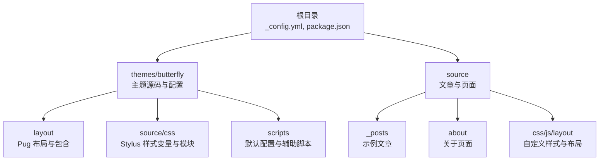
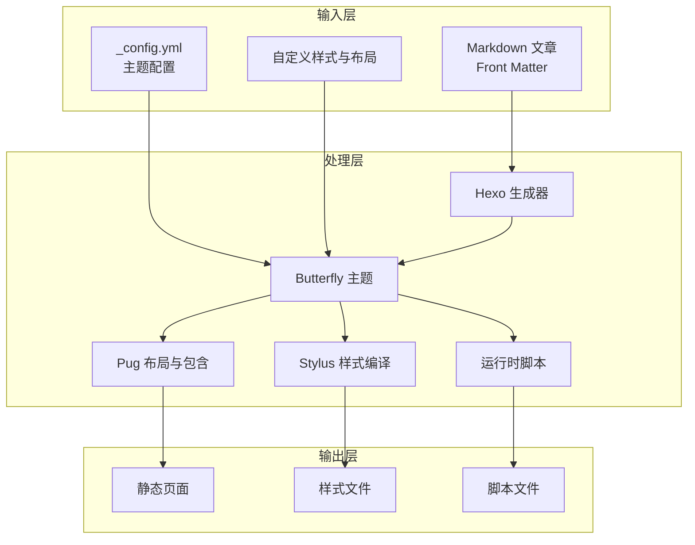
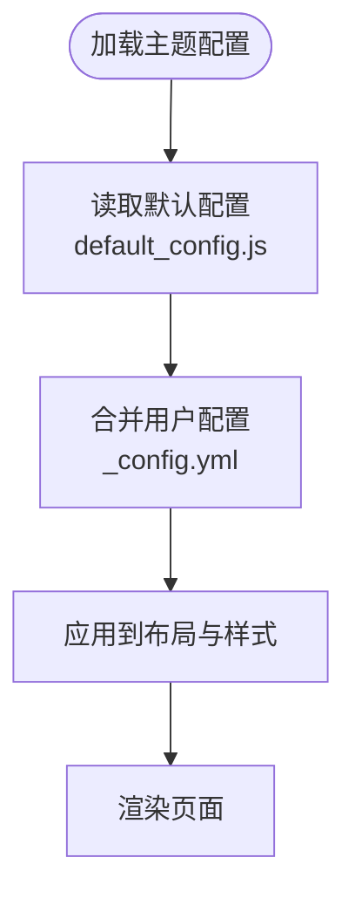
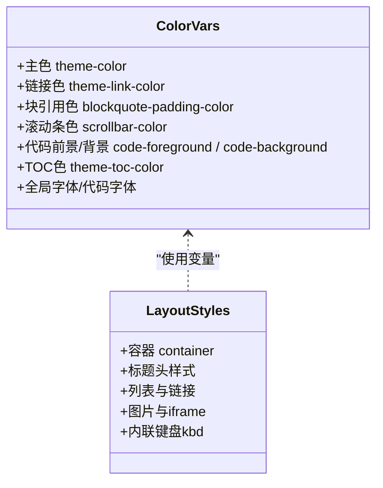
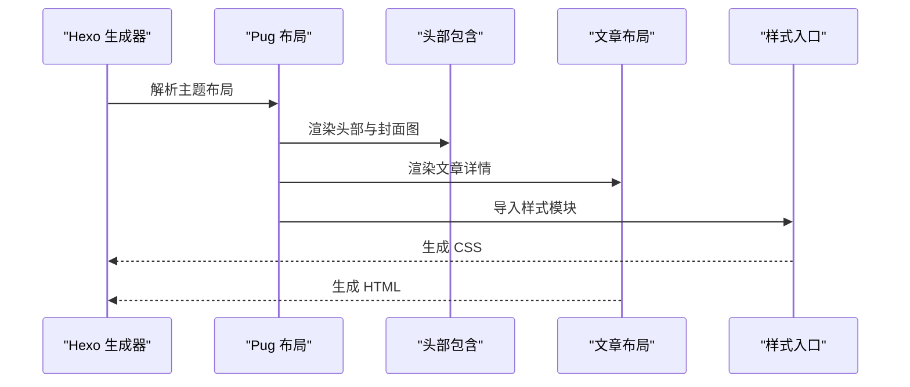
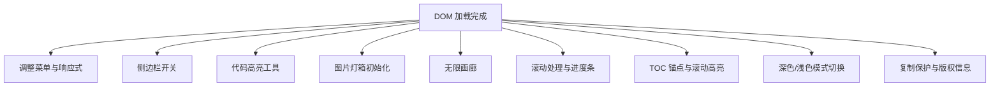
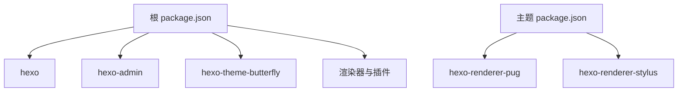

# 项目介绍

<cite>
**本文引用的文件**
- [README.md](file://README.md)
- [_config.yml](file://_config.yml)
- [package.json](file://package.json)
- [themes/butterfly/_config.yml](file://themes/butterfly/_config.yml)
- [themes/butterfly/README_CN.md](file://themes/butterfly/README_CN.md)
- [themes/butterfly/source/css/var.styl](file://themes/butterfly/source/css/var.styl)
- [themes/butterfly/source/css/index.styl](file://themes/butterfly/source/css/index.styl)
- [themes/butterfly/scripts/common/default_config.js](file://themes/butterfly/scripts/common/default_config.js)
- [themes/butterfly/layout/includes/header/index.pug](file://themes/butterfly/layout/includes/header/index.pug)
- [themes/butterfly/layout/post.pug](file://themes/butterfly/layout/post.pug)
- [themes/butterfly/source/css/_layout/post.styl](file://themes/butterfly/source/css/_layout/post.styl)
- [themes/butterfly/package.json](file://themes/butterfly/package.json)
- [source/_posts/hello-world.md](file://source/_posts/hello-world.md)
- [source/about/index.md](file://source/about/index.md)
</cite>

## 目录
1. [引言](#引言)
2. [项目结构](#项目结构)
3. [核心组件](#核心组件)
4. [架构总览](#架构总览)
5. [详细组件分析](#详细组件分析)
6. [依赖关系分析](#依赖关系分析)
7. [性能考量](#性能考量)
8. [故障排查指南](#故障排查指南)
9. [结论](#结论)
10. [附录](#附录)

## 引言
本项目是一个基于 Hexo 的个人博客系统，采用现代化极简风格设计，强调“干净通透、大留白、低饱和度、柔和优雅”的视觉语言。主题选用 Butterfly，具备卡片化布局、响应式设计、深色模式、阅读模式、目录导航、本地搜索、图片懒加载、代码高亮与数学公式支持等丰富功能。项目旨在为不同技术水平的用户提供开箱即用的博客平台，同时保持高度可定制性，满足从入门到进阶用户的多样化需求。

设计理念与核心价值主张
- 设计理念：以“极简高级”为核心，追求视觉上的通透与层次，通过统一圆角、柔和阴影与克制动画，营造优雅而舒适的阅读体验。
- 核心价值主张：在保证美观的同时兼顾性能与易用性，提供开箱即用的功能集（深色/浅色模式、阅读进度、TOC、本地搜索、图片灯箱、懒加载等），并允许通过配置与自定义样式进行个性化定制。
- 目标用户群体：技术爱好者、开发者、内容创作者、学生与教师等，既适合快速上手的初学者，也适合需要深度定制的进阶用户。

主题特色与视觉设计
- 现代化极简风格：干净通透、大留白、低饱和度配色，强调信息密度与留白平衡。
- 优雅紫色主色调：结合中性灰与白色，形成柔和而高级的视觉基调。
- 统一圆角与柔和阴影：所有 UI 元素采用一致的圆角系统与多层次阴影，增强空间层次感。
- 响应式布局：完美适配 PC、平板与手机，移动端采用汉堡菜单与单列布局。
- 交互功能：深色/浅色模式平滑切换、阅读进度条、文章目录固定侧边栏、本地搜索、图片灯箱、图片懒加载、回到顶部等。

差异化优势
- 响应式设计：全端适配，移动端交互优化。
- 交互功能：深色模式记忆、阅读进度、TOC 滚动高亮、图片灯箱与懒加载、回到顶部等。
- 性能优化：图片懒加载、CSS/JS 压缩、Neat 插件优化、IntersectionObserver 与 requestAnimationFrame 等现代 API 的使用。
- 内容生态：支持多种评论系统、分享系统、数学公式、标签插件、系列文章、音乐播放器、图表与流程图等扩展能力。

## 项目结构
项目采用 Hexo 标准目录结构，并引入 Butterfly 主题作为核心渲染引擎。关键目录与文件职责如下：
- 根目录配置：_config.yml（站点与部署配置）、package.json（依赖与脚本）。
- 主题目录：themes/butterfly（主题源码、样式、脚本、布局与国际化）。
- 源内容：source（文章、页面、静态资源与自定义布局）。
- 示例内容：source/_posts（示例文章）、source/about（关于页面）。

**图表来源**
- [_config.yml:1-173](file://_config.yml#L1-L173)
- [package.json:1-42](file://package.json#L1-L42)
- [themes/butterfly/_config.yml:1-1137](file://themes/butterfly/_config.yml#L1-L1137)
- [themes/butterfly/source/css/index.styl:1-15](file://themes/butterfly/source/css/index.styl#L1-L15)

**章节来源**
- [README.md:39-86](file://README.md#L39-L86)
- [_config.yml:1-173](file://_config.yml#L1-L173)
- [package.json:1-42](file://package.json#L1-L42)

## 核心组件
- Hexo 核心：负责内容生成、静态文件构建与部署。
- Butterfly 主题：提供完整的布局、样式、脚本与第三方集成（评论、搜索、分析等）。
- 自定义样式与布局：通过 source/css 与自定义 Pug 布局实现个性化定制。
- 示例内容：示例文章与关于页面用于演示与快速上手。

**章节来源**
- [themes/butterfly/README_CN.md:72-131](file://themes/butterfly/README_CN.md#L72-L131)
- [themes/butterfly/_config.yml:1-1137](file://themes/butterfly/_config.yml#L1-L1137)
- [source/_posts/hello-world.md:1-39](file://source/_posts/hello-world.md#L1-L39)
- [source/about/index.md:1-49](file://source/about/index.md#L1-L49)

## 架构总览
博客系统由 Hexo 生成器驱动，使用 Butterfly 主题完成最终页面渲染。核心数据流如下：
- 输入：Markdown 文章与 Front Matter、主题配置、自定义样式与布局。
- 处理：Hexo 解析内容、应用主题布局与样式、注入脚本与第三方服务。
- 输出：静态 HTML/CSS/JS 文件，可部署至 GitHub Pages 等托管平台。

**图表来源**
- [_config.yml:85-86](file://_config.yml#L85-L86)
- [themes/butterfly/_config.yml:1-1137](file://themes/butterfly/_config.yml#L1-L1137)
- [themes/butterfly/layout/includes/header/index.pug:1-52](file://themes/butterfly/layout/includes/header/index.pug#L1-L52)
- [themes/butterfly/layout/post.pug:1-36](file://themes/butterfly/layout/post.pug#L1-L36)
- [themes/butterfly/source/css/index.styl:1-15](file://themes/butterfly/source/css/index.styl#L1-L15)

## 详细组件分析

### 主题配置与默认行为
Butterfly 提供丰富的配置项，涵盖导航、封面图、文章元信息、目录、深色模式、阅读模式、搜索、评论系统、社交链接、分析与广告等。默认配置集中于 scripts/common/default_config.js，主题配置文件 _config.yml 则用于覆盖默认值与启用功能。

**图表来源**
- [themes/butterfly/scripts/common/default_config.js:1-602](file://themes/butterfly/scripts/common/default_config.js#L1-L602)
- [themes/butterfly/_config.yml:1-1137](file://themes/butterfly/_config.yml#L1-L1137)

**章节来源**
- [themes/butterfly/scripts/common/default_config.js:1-602](file://themes/butterfly/scripts/common/default_config.js#L1-L602)
- [themes/butterfly/_config.yml:1-1137](file://themes/butterfly/_config.yml#L1-L1137)

### 视觉设计与配色系统
主题通过 Stylus 变量集中管理颜色与字体，支持主题色自定义与深浅两套配色。变量文件 var.styl 定义了主色、链接色、块引用色、滚动条色、代码高亮背景等，确保全局一致性。

**图表来源**
- [themes/butterfly/source/css/var.styl:1-233](file://themes/butterfly/source/css/var.styl#L1-L233)
- [themes/butterfly/source/css/_layout/post.styl:1-265](file://themes/butterfly/source/css/_layout/post.styl#L1-L265)

**章节来源**
- [themes/butterfly/source/css/var.styl:1-233](file://themes/butterfly/source/css/var.styl#L1-L233)
- [themes/butterfly/source/css/_layout/post.styl:72-265](file://themes/butterfly/source/css/_layout/post.styl#L72-L265)

### 布局与页面渲染
主题采用 Pug 模板语言组织布局，header/index.pug 负责头部与封面图逻辑，post.pug 负责文章详情页的结构与组件挂载。index.styl 作为样式入口，按模块导入全局、页面、布局、标签与模式相关样式。

**图表来源**
- [themes/butterfly/layout/includes/header/index.pug:1-52](file://themes/butterfly/layout/includes/header/index.pug#L1-L52)
- [themes/butterfly/layout/post.pug:1-36](file://themes/butterfly/layout/post.pug#L1-L36)
- [themes/butterfly/source/css/index.styl:1-15](file://themes/butterfly/source/css/index.styl#L1-L15)

**章节来源**
- [themes/butterfly/layout/includes/header/index.pug:1-52](file://themes/butterfly/layout/includes/header/index.pug#L1-L52)
- [themes/butterfly/layout/post.pug:1-36](file://themes/butterfly/layout/post.pug#L1-L36)
- [themes/butterfly/source/css/index.styl:1-15](file://themes/butterfly/source/css/index.styl#L1-L15)

### 交互与运行时脚本
main.js 提供多项交互能力，包括移动端侧边栏、代码高亮工具、图片灯箱、无限画廊、滚动处理、TOC 锚点与滚动高亮、深色/浅色模式切换、回到顶部、复制保护等。这些功能通过事件监听与 DOM 操作实现，配合主题配置与 SnackBar 提示，提升用户体验。

**图表来源**
- [themes/butterfly/source/js/main.js:1-988](file://themes/butterfly/source/js/main.js#L1-L988)

**章节来源**
- [themes/butterfly/source/js/main.js:1-988](file://themes/butterfly/source/js/main.js#L1-L988)

### 示例内容与页面
示例文章 hello-world.md 展示了基础写作与命令片段；关于页面 about/index.md 提供个人信息与技术栈介绍，便于快速上手与个性化定制。

**章节来源**
- [source/_posts/hello-world.md:1-39](file://source/_posts/hello-world.md#L1-L39)
- [source/about/index.md:1-49](file://source/about/index.md#L1-L49)

## 依赖关系分析
项目依赖由根目录 package.json 管理，包含 Hexo 核心、Butterfly 主题、Admin 管理界面、渲染器与优化插件等。主题自身 package.json 依赖 pug 与 stylus 渲染器，确保模板与样式正确编译。

**图表来源**
- [package.json:16-36](file://package.json#L16-L36)
- [themes/butterfly/package.json:25-30](file://themes/butterfly/package.json#L25-L30)

**章节来源**
- [package.json:1-42](file://package.json#L1-L42)
- [themes/butterfly/package.json:1-35](file://themes/butterfly/package.json#L1-L35)

## 性能考量
- 图片懒加载：通过 lazyload 配置与 IntersectionObserver 优化首屏加载。
- 样式与脚本压缩：Neat 插件对 HTML/CSS/JS 进行压缩与混淆，减少体积。
- 按需加载：运行时脚本仅在需要时加载，避免不必要的资源消耗。
- 现代 API：使用 requestAnimationFrame 优化动画，降低主线程压力。
- 缓存策略：通过 CDN 与浏览器缓存机制提升二次访问速度。

**章节来源**
- [_config.yml:128-173](file://_config.yml#L128-L173)
- [themes/butterfly/_config.yml:794-800](file://themes/butterfly/_config.yml#L794-L800)

## 故障排查指南
- 主题未生效：确认 _config.yml 中 theme 已设置为 butterfly，且渲染器已安装。
- 样式异常：检查主题配置中的主题色与变量覆盖是否正确，确认 Stylus 编译无误。
- 评论/搜索/分析不可用：核对对应配置项（如评论系统、本地搜索、分析服务）是否启用与参数是否正确。
- 深色模式不生效：检查主题配置中的 darkmode 开关与自动切换设置。
- 部署问题：确认部署配置（如 GitHub Pages）与分支设置正确，必要时使用 GitHub Actions 自动化部署。

**章节来源**
- [_config.yml:85-92](file://_config.yml#L85-L92)
- [themes/butterfly/_config.yml:381-410](file://themes/butterfly/_config.yml#L381-L410)
- [themes/butterfly/README_CN.md:161-167](file://themes/butterfly/README_CN.md#L161-L167)

## 结论
本博客系统以 Butterfly 主题为核心，结合 Hexo 的高效生成能力，实现了美观、易用、高性能的个人博客平台。其现代化极简设计、优雅的紫色配色与柔和阴影、完善的响应式布局与交互功能，能够满足从入门到进阶用户的多样化需求。通过合理的配置与自定义，用户可在保持简洁的同时获得强大的内容表达与展示能力。

## 附录
- 快速开始：安装依赖后使用 npm run server 启动本地服务，npm run build 构建静态文件。
- 配置参考：主题配置项覆盖导航、封面图、文章元信息、目录、深色模式、阅读模式、搜索、评论系统、社交链接、分析与广告等。
- 自定义样式：可通过 source/css/modern.css 与自定义 CSS 变量进行主题色与样式的个性化调整。

**章节来源**
- [README.md:62-86](file://README.md#L62-L86)
- [themes/butterfly/README_CN.md:58-71](file://themes/butterfly/README_CN.md#L58-L71)