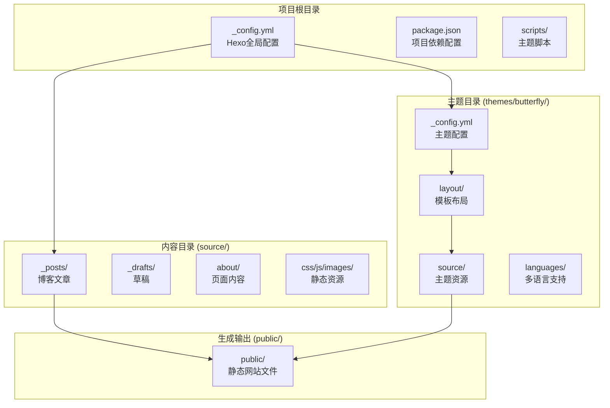
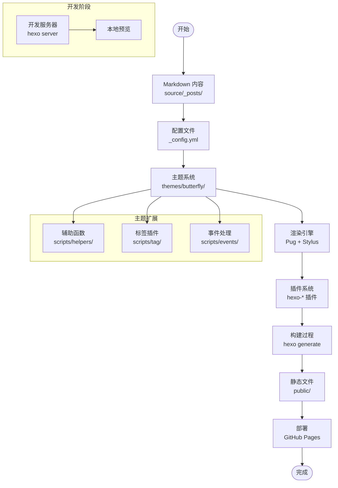
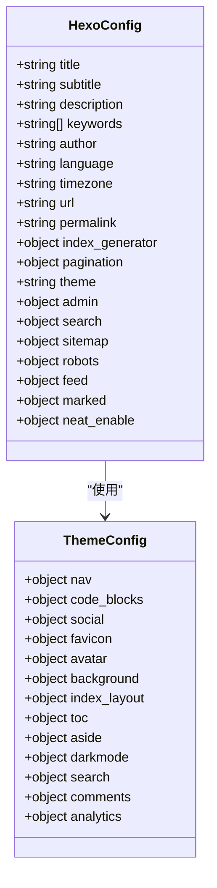
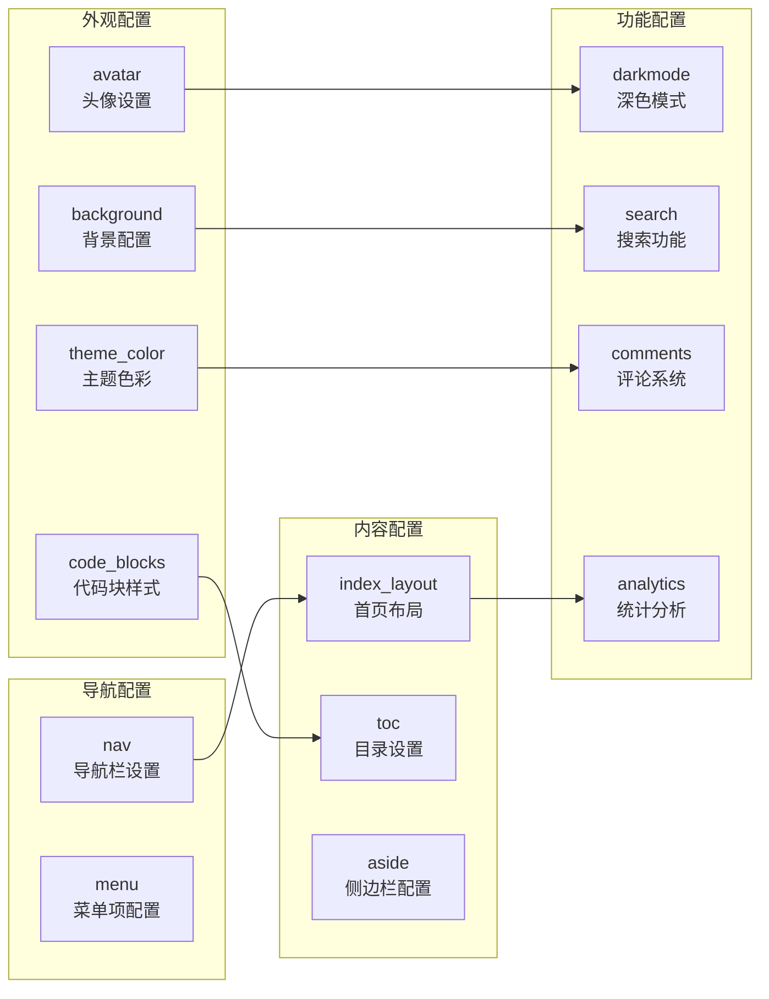
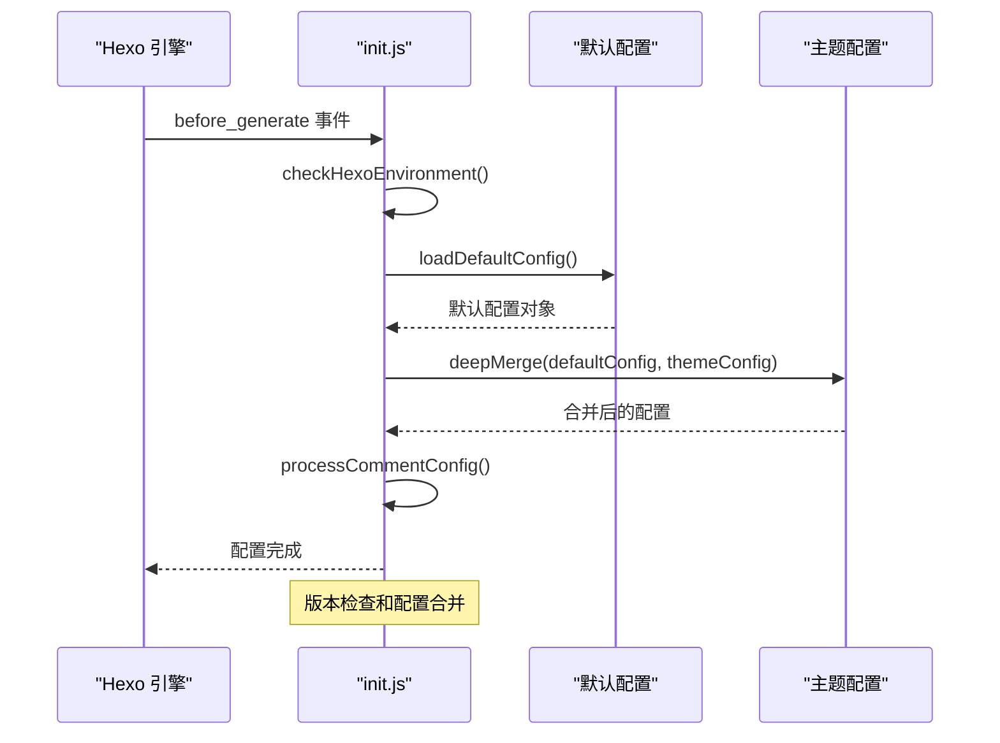
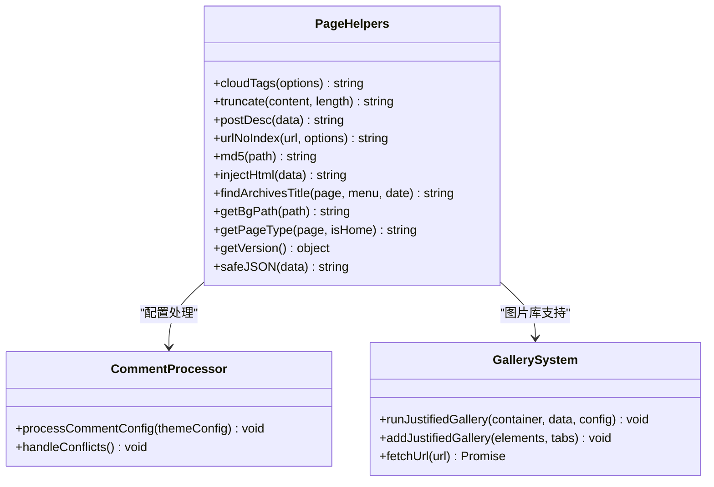
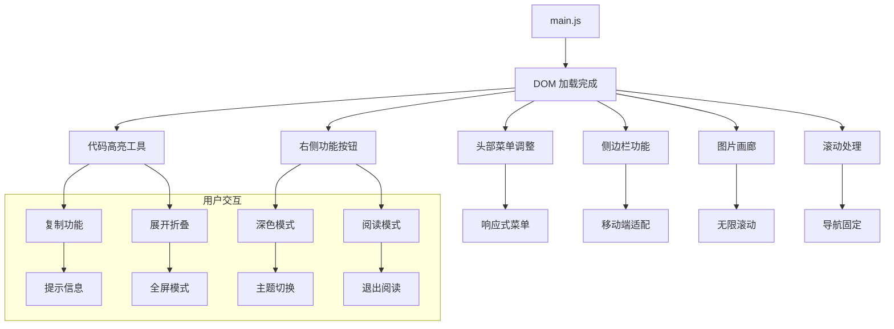
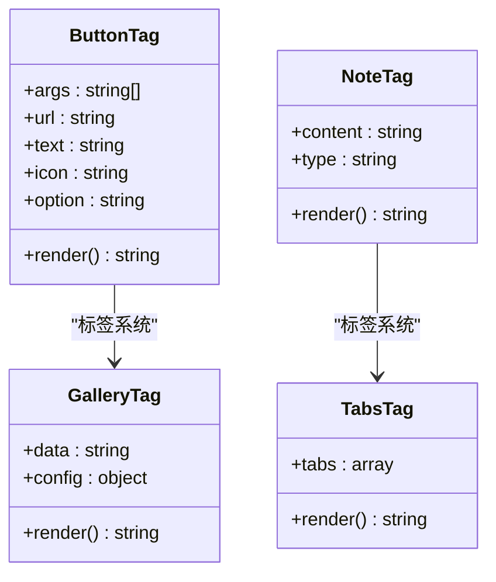
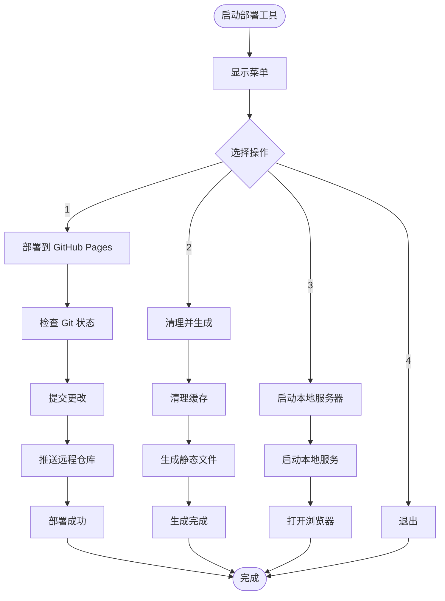
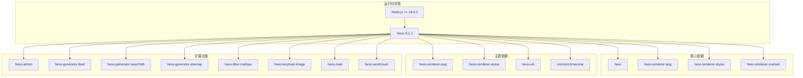

# 项目概述

<cite>
**本文档引用的文件**
- [_config.yml](file://_config.yml)
- [package.json](file://package.json)
- [themes/butterfly/_config.yml](file://themes/butterfly/_config.yml)
- [themes/butterfly/package.json](file://themes/butterfly/package.json)
- [themes/butterfly/README_CN.md](file://themes/butterfly/README_CN.md)
- [themes/butterfly/layout/index.pug](file://themes/butterfly/layout/index.pug)
- [themes/butterfly/scripts/events/init.js](file://themes/butterfly/scripts/events/init.js)
- [themes/butterfly/scripts/helpers/page.js](file://themes/butterfly/scripts/helpers/page.js)
- [themes/butterfly/scripts/tag/button.js](file://themes/butterfly/scripts/tag/button.js)
- [themes/butterfly/source/js/main.js](file://themes/butterfly/source/js/main.js)
- [deploy-actions.bat](file://deploy-actions.bat)
- [source/_posts/hello-world.md](file://source/_posts/hello-world.md)
- [source/about/index.md](file://source/about/index.md)
</cite>

## 目录
1. [引言](#引言)
2. [项目结构](#项目结构)
3. [核心组件](#核心组件)
4. [架构总览](#架构总览)
5. [详细组件分析](#详细组件分析)
6. [依赖关系分析](#依赖关系分析)
7. [性能考虑](#性能考虑)
8. [故障排除指南](#故障排除指南)
9. [结论](#结论)

## 引言

这是一个基于 Hexo 静态站点生成器构建的个人博客系统，采用 Butterfly 主题进行界面设计。项目旨在为用户提供一个现代化、响应式且功能丰富的个人博客平台，支持多种内容展示形式、交互功能和部署方式。

### 项目目标
- 提供简洁美观的个人博客展示平台
- 支持多语言内容管理（简体中文为主）
- 实现高性能的静态站点生成和部署
- 提供丰富的主题定制选项和扩展能力
- 支持现代化的阅读体验和交互功能

### 目标用户群体
- 个人开发者和技术爱好者
- 需要展示技术博客的程序员
- 追求简洁设计的个人品牌建设者
- 对静态站点生成器感兴趣的用户

### 使用场景
- 个人技术博客
- 作品集展示
- 学习笔记整理
- 专业领域知识分享

## 项目结构

该项目采用标准的 Hexo 项目结构，结合 Butterfly 主题的组织方式：

**图表来源**
- [_config.yml:1-173](file://_config.yml#L1-L173)
- [themes/butterfly/_config.yml:1-1137](file://themes/butterfly/_config.yml#L1-L1137)

**章节来源**
- [_config.yml:1-173](file://_config.yml#L1-L173)
- [package.json:1-42](file://package.json#L1-L42)

## 核心组件

### Hexo 核心配置
项目使用 `_config.yml` 进行全局配置，包括：
- 站点基本信息（标题、副标题、描述、关键词）
- URL 和永久链接格式
- 目录结构配置
- 写作设置和分页配置
- 主题选择和扩展插件配置

### Butterfly 主题系统
Butterfly 是一个功能丰富的 Hexo 主题，提供：
- 现代化的卡片式设计
- 响应式布局适配
- 深色模式支持
- 多种导航和菜单选项
- 丰富的视觉效果和动画

### 开发工具链
项目包含完整的开发和部署工具：
- npm 脚本命令
- 批处理部署工具
- GitHub Actions 自动化部署

**章节来源**
- [_config.yml:1-173](file://_config.yml#L1-L173)
- [themes/butterfly/_config.yml:1-1137](file://themes/butterfly/_config.yml#L1-L1137)
- [package.json:1-42](file://package.json#L1-L42)

## 架构总览

Hexo 静态站点生成器的工作流程如下：

**图表来源**
- [_config.yml:85-85](file://_config.yml#L85-L85)
- [themes/butterfly/package.json:25-30](file://themes/butterfly/package.json#L25-L30)
- [package.json:16-37](file://package.json#L16-L37)

## 详细组件分析

### Hexo 配置系统

#### 全局配置分析
项目配置涵盖了多个方面：

**图表来源**
- [_config.yml:4-173](file://_config.yml#L4-L173)
- [themes/butterfly/_config.yml:12-800](file://themes/butterfly/_config.yml#L12-L800)

#### 配置特性详解

**站点配置**：定义了博客的基本信息，包括标题、副标题、描述等元数据信息。

**URL 配置**：设置了永久链接格式和美化 URL 选项，确保友好的链接结构。

**目录配置**：定义了各种内容类型的目录结构，如标签、归档、分类等。

**写作配置**：配置了新文章创建、语法高亮、分页显示等写作相关设置。

**主题集成**：通过 `theme: butterfly` 指定使用 Butterfly 主题，并启用相关的扩展功能。

**章节来源**
- [_config.yml:4-173](file://_config.yml#L4-L173)

### Butterfly 主题架构

#### 主题配置系统
Butterfly 主题提供了丰富的配置选项：

**图表来源**
- [themes/butterfly/_config.yml:12-800](file://themes/butterfly/_config.yml#L12-L800)

#### 主题特性概览

**设计风格**：
- 卡片化设计，现代美观的界面布局
- 圆角/直角设计，支持自定义边框样式
- 响应式设计，完美适配各种屏幕尺寸
- 双栏布局，优化阅读体验

**内容功能**：
- 多级菜单，支持二级导航菜单
- 阅读模式，专注的文章阅读体验
- 目录导航，电脑和手机双端支持 TOC
- 字数统计，显示文章字数和阅读时间
- 相关文章，智能推荐相关内容

**交互功能**：
- 深色模式，护眼的夜间模式
- 简繁转换，支持中文简繁切换
- 标签插件，丰富的标签插件支持
- 图片懒加载，优化页面加载性能

**章节来源**
- [themes/butterfly/README_CN.md:72-131](file://themes/butterfly/README_CN.md#L72-L131)

### 主题脚本系统

#### 初始化事件处理
Butterfly 主题通过事件系统进行初始化配置：

**图表来源**
- [themes/butterfly/scripts/events/init.js:79-87](file://themes/butterfly/scripts/events/init.js#L79-L87)

#### 辅助函数系统
主题提供了丰富的辅助函数：

**图表来源**
- [themes/butterfly/scripts/helpers/page.js:14-194](file://themes/butterfly/scripts/helpers/page.js#L14-L194)
- [themes/butterfly/scripts/events/init.js:47-77](file://themes/butterfly/scripts/events/init.js#L47-L77)

**章节来源**
- [themes/butterfly/scripts/events/init.js:1-87](file://themes/butterfly/scripts/events/init.js#L1-L87)
- [themes/butterfly/scripts/helpers/page.js:1-194](file://themes/butterfly/scripts/helpers/page.js#L1-L194)

### 前端交互系统

#### 主题 JavaScript 功能
Butterfly 主题的前端交互系统提供了丰富的用户体验：

**图表来源**
- [themes/butterfly/source/js/main.js:1-800](file://themes/butterfly/source/js/main.js#L1-L800)

#### 标签插件系统
Butterfly 主题实现了多种实用的标签插件：

**图表来源**
- [themes/butterfly/scripts/tag/button.js:1-22](file://themes/butterfly/scripts/tag/button.js#L1-L22)

**章节来源**
- [themes/butterfly/source/js/main.js:1-800](file://themes/butterfly/source/js/main.js#L1-L800)
- [themes/butterfly/scripts/tag/button.js:1-22](file://themes/butterfly/scripts/tag/button.js#L1-L22)

### 部署和自动化

#### 批处理部署工具
项目提供了便捷的批处理部署工具：

**图表来源**
- [deploy-actions.bat:17-105](file://deploy-actions.bat#L17-L105)

**章节来源**
- [deploy-actions.bat:1-105](file://deploy-actions.bat#L1-L105)

## 依赖关系分析

### 技术栈概览

**图表来源**
- [package.json:16-37](file://package.json#L16-L37)
- [themes/butterfly/package.json:25-30](file://themes/butterfly/package.json#L25-L30)

### 依赖关系特点

**核心依赖**：项目使用了 Hexo 的标准渲染器组合，确保内容正确渲染为静态 HTML。

**主题依赖**：Butterfly 主题依赖 Pug 模板引擎和 Stylus 样式处理器，提供现代化的模板和样式支持。

**功能扩展**：通过各种生成器和过滤器插件，项目实现了 RSS/Atom 订阅、搜索数据库、站点地图等功能。

**开发工具**：包含开发服务器、压缩优化等工具，提升开发体验和生产环境性能。

**章节来源**
- [package.json:16-37](file://package.json#L16-L37)
- [themes/butterfly/package.json:1-35](file://themes/butterfly/package.json#L1-L35)

## 性能考虑

### 静态站点优势
- **加载速度快**：所有内容预先生成为静态文件，无需服务器端处理
- **资源优化**：通过 hexo-neat 插件自动压缩 HTML、CSS、JavaScript 文件
- **CDN 友好**：静态文件适合 CDN 分发，提升全球访问速度
- **成本低廉**：可免费部署在 GitHub Pages 等静态托管服务上

### 主题性能优化
- **图片懒加载**：通过 hexo-lazyload-image 插件优化图片加载
- **代码高亮优化**：支持 Prism.js 和 Highlight.js，提供更好的代码展示体验
- **响应式设计**：适配各种设备，减少不必要的重排重绘
- **CSS 优化**：使用 Stylus 预处理器，支持变量和嵌套，生成高效的 CSS

### 开发体验优化
- **热重载**：开发服务器支持实时刷新
- **调试工具**：内置调试模式，便于开发和问题排查
- **模块化架构**：清晰的文件组织，便于维护和扩展

## 故障排除指南

### 常见问题解决

**主题配置冲突**
- 症状：评论系统配置冲突或主题加载失败
- 解决：检查 `_config.butterfly.yml` 配置，确保评论系统设置正确
- 参考：初始化脚本中的配置处理逻辑

**版本兼容性问题**
- 症状：Hexo 版本过低导致主题无法正常工作
- 解决：升级 Hexo 到 5.3.0 或更高版本
- 参考：初始化脚本中的版本检查机制

**部署失败**
- 症状：GitHub Pages 部署过程中出现错误
- 解决：检查 Git 配置和远程仓库连接，确认权限设置
- 参考：批处理部署工具的错误处理逻辑

**性能问题**
- 症状：页面加载缓慢或资源加载失败
- 解决：检查网络连接，确认 CDN 配置，优化图片大小
- 参考：静态资源管理和懒加载配置

**章节来源**
- [themes/butterfly/scripts/events/init.js:10-32](file://themes/butterfly/scripts/events/init.js#L10-L32)
- [deploy-actions.bat:34-62](file://deploy-actions.bat#L34-L62)

## 结论

这个基于 Hexo 的个人博客系统展现了现代静态站点生成器的最佳实践。通过精心设计的主题架构、完善的配置系统和丰富的功能扩展，项目为用户提供了高质量的博客写作和展示体验。

### 主要优势
- **技术先进**：采用最新的 Hexo 8.x 版本和现代化的开发工具链
- **功能丰富**：内置多种实用功能，满足个人博客的各种需求
- **性能优异**：静态生成确保了出色的加载速度和用户体验
- **易于维护**：清晰的项目结构和配置管理，便于长期维护

### 发展建议
- **持续更新**：定期更新 Hexo 和主题版本，保持技术栈的先进性
- **功能扩展**：根据实际需求添加更多个性化功能
- **性能监控**：建立性能监控机制，持续优化用户体验
- **社区参与**：积极参与 Hexo 和 Butterfly 主题的社区建设

这个项目为个人博客建设提供了一个优秀的参考模板，既适合初学者快速上手，也为有经验的开发者提供了充分的扩展空间。