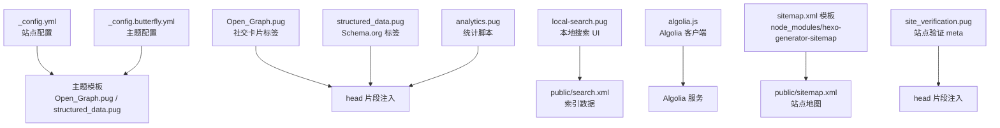
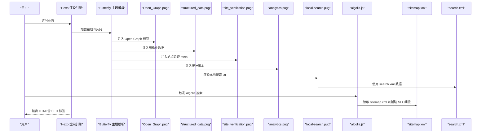
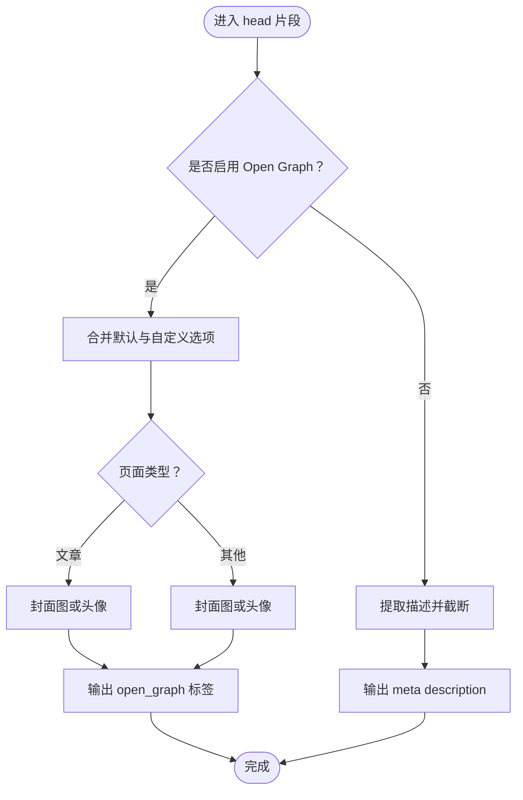
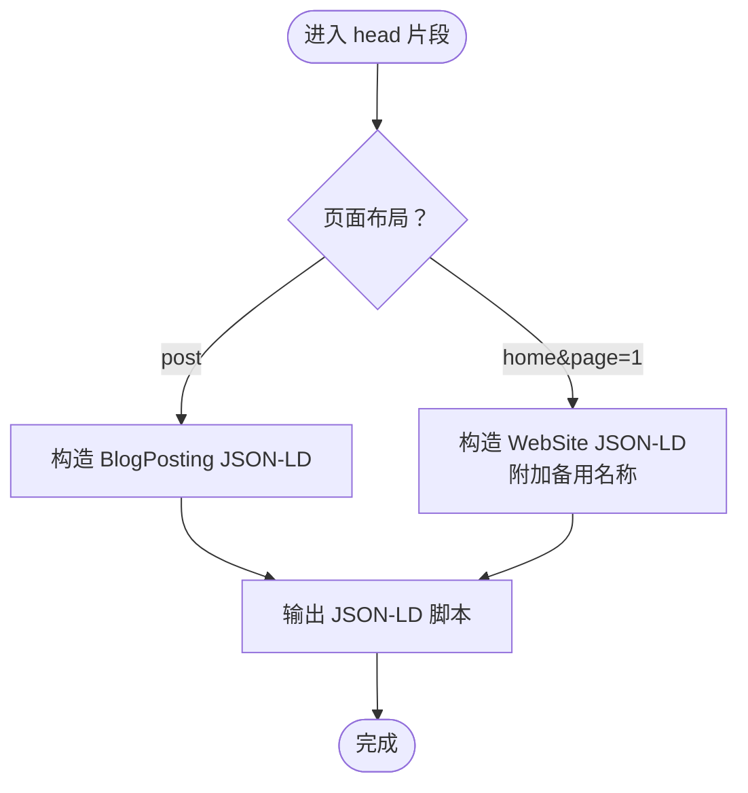
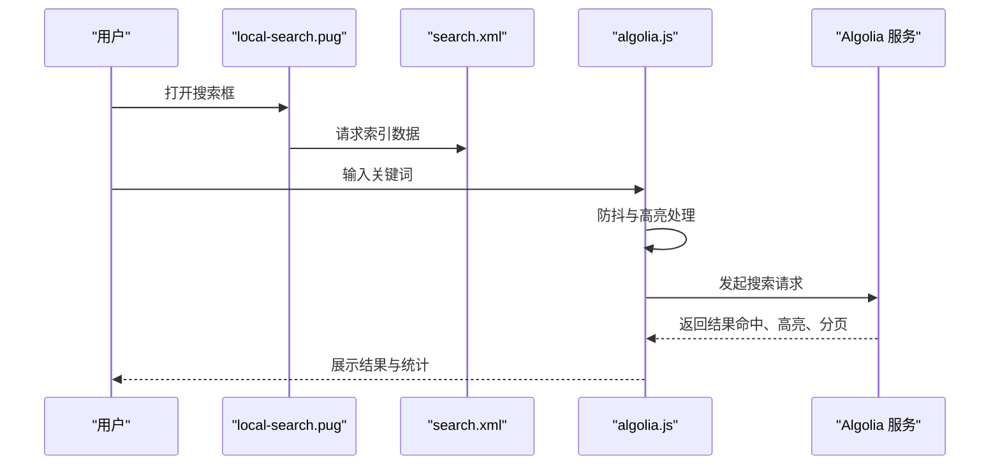
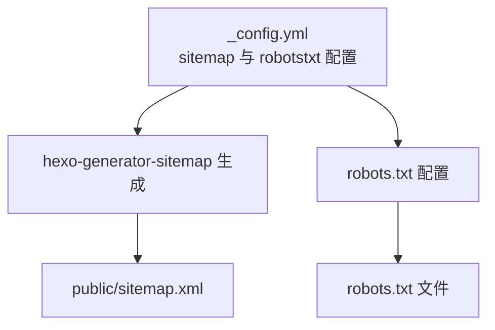
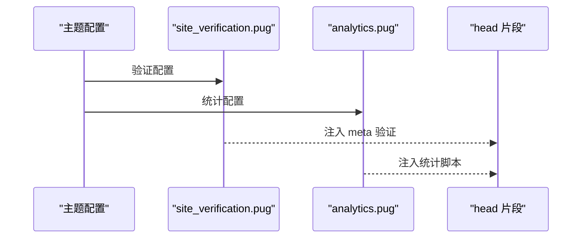

# SEO 优化与搜索引擎优化

<cite>
**本文引用的文件**
- [_config.yml](file://_config.yml)
- [_config.butterfly.yml](file://_config.butterfly.yml)
- [themes/butterfly/layout/includes/head/Open_Graph.pug](file://themes/butterfly/layout/includes/head/Open_Graph.pug)
- [themes/butterfly/layout/includes/head/structured_data.pug](file://themes/butterfly/layout/includes/head/structured_data.pug)
- [themes/butterfly/layout/includes/head/site_verification.pug](file://themes/butterfly/layout/includes/head/site_verification.pug)
- [themes/butterfly/layout/includes/head/analytics.pug](file://themes/butterfly/layout/includes/head/analytics.pug)
- [themes/butterfly/layout/includes/third-party/search/local-search.pug](file://themes/butterfly/layout/includes/third-party/search/local-search.pug)
- [themes/butterfly/source/js/search/algolia.js](file://themes/butterfly/source/js/search/algolia.js)
- [node_modules/hexo-generator-sitemap/sitemap.xml](file://node_modules/hexo-generator-sitemap/sitemap.xml)
- [public/sitemap.xml](file://public/sitemap.xml)
- [public/search.xml](file://public/search.xml)
</cite>

## 目录
1. [简介](#简介)
2. [项目结构](#项目结构)
3. [核心组件](#核心组件)
4. [架构总览](#架构总览)
5. [详细组件分析](#详细组件分析)
6. [依赖关系分析](#依赖关系分析)
7. [性能考量](#性能考量)
8. [故障排查指南](#故障排查指南)
9. [结论](#结论)
10. [附录](#附录)

## 简介
本技术文档面向静态博客的 SEO 优化，结合当前仓库中 Hexo + Butterfly 主题的实现，系统讲解以下主题：
- Open Graph 协议的实现与社交分享卡片定制
- 结构化数据（Schema.org）的集成与使用
- 站内搜索优化：本地搜索与 Algolia 搜索的配置与优化
- robots.txt 与 sitemap.xml 的生成与优化配置
- 关键词、元描述、URL 结构等基础 SEO 实践
- Google Search Console、百度站长平台等工具的集成与使用
- 实战案例与效果对比，帮助开发者快速落地

## 项目结构
该仓库采用 Hexo 静态站点生成器，主题为 Butterfly。与 SEO 相关的关键位置如下：
- 站点配置：_config.yml（全局站点信息、URL、分页、Feed、压缩等）
- 主题配置：_config.butterfly.yml（主题功能开关、Open Graph、结构化数据、搜索、统计等）
- 模板片段：themes/butterfly/layout/includes 下的 head 与第三方组件（Open Graph、结构化数据、站点验证、统计、搜索）
- 生成产物：public/ 下的 sitemap.xml、search.xml；node_modules 中的 sitemap 模板

图表来源
- [_config.yml:1-173](file://_config.yml#L1-L173)
- [_config.butterfly.yml:661-669](file://_config.butterfly.yml#L661-L669)
- [themes/butterfly/layout/includes/head/Open_Graph.pug:1-17](file://themes/butterfly/layout/includes/head/Open_Graph.pug#L1-L17)
- [themes/butterfly/layout/includes/head/structured_data.pug:1-68](file://themes/butterfly/layout/includes/head/structured_data.pug#L1-L68)
- [themes/butterfly/layout/includes/head/site_verification.pug:1-3](file://themes/butterfly/layout/includes/head/site_verification.pug#L1-L3)
- [themes/butterfly/layout/includes/head/analytics.pug:1-45](file://themes/butterfly/layout/includes/head/analytics.pug#L1-L45)
- [themes/butterfly/layout/includes/third-party/search/local-search.pug:1-24](file://themes/butterfly/layout/includes/third-party/search/local-search.pug#L1-L24)
- [themes/butterfly/source/js/search/algolia.js:1-563](file://themes/butterfly/source/js/search/algolia.js#L1-L563)
- [node_modules/hexo-generator-sitemap/sitemap.xml:1-41](file://node_modules/hexo-generator-sitemap/sitemap.xml#L1-L41)
- [public/sitemap.xml:1-107](file://public/sitemap.xml#L1-L107)
- [public/search.xml:1-88](file://public/search.xml#L1-L88)

章节来源
- [_config.yml:1-173](file://_config.yml#L1-L173)
- [_config.butterfly.yml:661-669](file://_config.butterfly.yml#L661-L669)

## 核心组件
- Open Graph 社交卡片
  - 开关与选项：在主题配置中启用 Open Graph，并可传入选项覆盖默认行为
  - 动态生成：根据页面类型（文章或网站）选择不同字段，优先使用文章封面图，否则回退到头像
  - 备选方案：若未启用 Open Graph，则输出标准 meta description（截断至约 150 字）

- 结构化数据（Schema.org）
  - 文章页：输出 BlogPosting 类型，包含标题、URL、图片、发布时间、修改时间、作者信息
  - 首页（第一页）：输出 WebSite 类型，支持备用名称（副标题、域名等），便于搜索结果丰富展示

- 站内搜索
  - 本地搜索：模板提供搜索对话框与输入框，通过 url_for 引入本地脚本资源
  - Algolia 搜索：客户端初始化、查询、高亮、分页、统计展示、响应式处理、错误兜底

- 站点地图与索引
  - sitemap.xml：由 hexo-generator-sitemap 插件生成，包含文章、标签、分类、首页等 URL 及 lastmod、changefreq、priority
  - search.xml：由 hexo-generator-searchdb 插件生成，包含文章标题、URL、正文内容、分类与标签

- 站点验证与统计
  - 站点验证：通过 meta name/content 注入验证标签
  - 统计：支持百度统计、Google Analytics、Cloudflare Insights、Microsoft Clarity、Google Tag Manager

章节来源
- [themes/butterfly/layout/includes/head/Open_Graph.pug:1-17](file://themes/butterfly/layout/includes/head/Open_Graph.pug#L1-L17)
- [themes/butterfly/layout/includes/head/structured_data.pug:1-68](file://themes/butterfly/layout/includes/head/structured_data.pug#L1-L68)
- [themes/butterfly/layout/includes/third-party/search/local-search.pug:1-24](file://themes/butterfly/layout/includes/third-party/search/local-search.pug#L1-L24)
- [themes/butterfly/source/js/search/algolia.js:1-563](file://themes/butterfly/source/js/search/algolia.js#L1-L563)
- [node_modules/hexo-generator-sitemap/sitemap.xml:1-41](file://node_modules/hexo-generator-sitemap/sitemap.xml#L1-L41)
- [public/sitemap.xml:1-107](file://public/sitemap.xml#L1-L107)
- [public/search.xml:1-88](file://public/search.xml#L1-L88)
- [themes/butterfly/layout/includes/head/site_verification.pug:1-3](file://themes/butterfly/layout/includes/head/site_verification.pug#L1-L3)
- [themes/butterfly/layout/includes/head/analytics.pug:1-45](file://themes/butterfly/layout/includes/head/analytics.pug#L1-L45)

## 架构总览
下图展示了从站点配置到页面渲染、再到搜索引擎抓取与用户交互的整体流程。

图表来源
- [themes/butterfly/layout/includes/head/Open_Graph.pug:1-17](file://themes/butterfly/layout/includes/head/Open_Graph.pug#L1-L17)
- [themes/butterfly/layout/includes/head/structured_data.pug:1-68](file://themes/butterfly/layout/includes/head/structured_data.pug#L1-L68)
- [themes/butterfly/layout/includes/head/site_verification.pug:1-3](file://themes/butterfly/layout/includes/head/site_verification.pug#L1-L3)
- [themes/butterfly/layout/includes/head/analytics.pug:1-45](file://themes/butterfly/layout/includes/head/analytics.pug#L1-L45)
- [themes/butterfly/layout/includes/third-party/search/local-search.pug:1-24](file://themes/butterfly/layout/includes/third-party/search/local-search.pug#L1-L24)
- [themes/butterfly/source/js/search/algolia.js:1-563](file://themes/butterfly/source/js/search/algolia.js#L1-L563)
- [node_modules/hexo-generator-sitemap/sitemap.xml:1-41](file://node_modules/hexo-generator-sitemap/sitemap.xml#L1-L41)
- [public/sitemap.xml:1-107](file://public/sitemap.xml#L1-L107)
- [public/search.xml:1-88](file://public/search.xml#L1-L88)

## 详细组件分析

### Open Graph 协议实现与配置
- 启用方式：在主题配置中开启 Open Graph，并可通过 option 扩展参数
- 页面类型判断：文章页输出 article，其他页面输出 website
- 图片来源：优先使用文章封面图，若非图片类型则回退到主题头像
- 备选描述：若未启用 Open Graph，将输出截断后的 meta description，避免过长影响展示

图表来源
- [themes/butterfly/layout/includes/head/Open_Graph.pug:1-17](file://themes/butterfly/layout/includes/head/Open_Graph.pug#L1-L17)

章节来源
- [themes/butterfly/layout/includes/head/Open_Graph.pug:1-17](file://themes/butterfly/layout/includes/head/Open_Graph.pug#L1-L17)
- [_config.butterfly.yml:661-669](file://_config.butterfly.yml#L661-L669)

### 结构化数据（Schema.org）集成
- 文章页（BlogPosting）：包含标题、URL、图片、发布时间、修改时间、作者信息
- 首页（WebSite）：在根路径或子域场景下，可附加备用名称（副标题、域名），增强搜索结果丰富度
- 输出形式：以 application/ld+json 内嵌在页面 head 中

图表来源
- [themes/butterfly/layout/includes/head/structured_data.pug:1-68](file://themes/butterfly/layout/includes/head/structured_data.pug#L1-L68)

章节来源
- [themes/butterfly/layout/includes/head/structured_data.pug:1-68](file://themes/butterfly/layout/includes/head/structured_data.pug#L1-L68)
- [_config.butterfly.yml:665-669](file://_config.butterfly.yml#L665-L669)

### 站内搜索优化：本地搜索与 Algolia
- 本地搜索
  - UI：提供搜索对话框、加载状态、输入框、结果区域、分页与统计
  - 数据：通过 public/search.xml 提供全文索引
  - 体验：预加载、顶部命中条数、可选分页
- Algolia 搜索
  - 初始化：读取全局配置中的 appId、apiKey、indexName、hitsPerPage、语言文案
  - 查询：防抖、高亮、内容裁剪（保持 HTML 标签闭合）、分页、统计
  - 交互：遮罩动画、Esc 关闭、移动端适配、Pjax 刷新
  - 错误处理：客户端不可用、查询异常时的降级提示

图表来源
- [themes/butterfly/layout/includes/third-party/search/local-search.pug:1-24](file://themes/butterfly/layout/includes/third-party/search/local-search.pug#L1-L24)
- [public/search.xml:1-88](file://public/search.xml#L1-L88)
- [themes/butterfly/source/js/search/algolia.js:1-563](file://themes/butterfly/source/js/search/algolia.js#L1-L563)

章节来源
- [themes/butterfly/layout/includes/third-party/search/local-search.pug:1-24](file://themes/butterfly/layout/includes/third-party/search/local-search.pug#L1-L24)
- [public/search.xml:1-88](file://public/search.xml#L1-L88)
- [themes/butterfly/source/js/search/algolia.js:1-563](file://themes/butterfly/source/js/search/algolia.js#L1-L563)
- [_config.yml:103-109](file://_config.yml#L103-L109)

### robots.txt 与 sitemap.xml 的生成与优化
- sitemap.xml
  - 生成器：hexo-generator-sitemap
  - 内容：文章、标签、分类、首页等 URL；lastmod 来源于更新时间或创建时间；changefreq/priority 设定
  - 访问：public/sitemap.xml 对外可访问
- robots.txt
  - 配置：在站点配置中设置 user-agent、允许/禁止路径、指向 sitemap
  - 作用：指导爬虫抓取范围，避免抓取后台目录与静态资源目录

图表来源
- [_config.yml:110-127](file://_config.yml#L110-L127)
- [node_modules/hexo-generator-sitemap/sitemap.xml:1-41](file://node_modules/hexo-generator-sitemap/sitemap.xml#L1-L41)
- [public/sitemap.xml:1-107](file://public/sitemap.xml#L1-L107)

章节来源
- [_config.yml:110-127](file://_config.yml#L110-L127)
- [node_modules/hexo-generator-sitemap/sitemap.xml:1-41](file://node_modules/hexo-generator-sitemap/sitemap.xml#L1-L41)
- [public/sitemap.xml:1-107](file://public/sitemap.xml#L1-L107)

### 站点验证与统计集成
- 站点验证：在主题配置中添加 name/content 对，head 片段会自动注入 meta 标签
- 统计脚本：按需启用百度统计、Google Analytics、Cloudflare Insights、Microsoft Clarity、Google Tag Manager，支持 Pjax 页面路径上报

图表来源
- [themes/butterfly/layout/includes/head/site_verification.pug:1-3](file://themes/butterfly/layout/includes/head/site_verification.pug#L1-L3)
- [themes/butterfly/layout/includes/head/analytics.pug:1-45](file://themes/butterfly/layout/includes/head/analytics.pug#L1-L45)
- [_config.butterfly.yml:439-458](file://_config.butterfly.yml#L439-L458)

章节来源
- [themes/butterfly/layout/includes/head/site_verification.pug:1-3](file://themes/butterfly/layout/includes/head/site_verification.pug#L1-L3)
- [themes/butterfly/layout/includes/head/analytics.pug:1-45](file://themes/butterfly/layout/includes/head/analytics.pug#L1-L45)
- [_config.butterfly.yml:439-458](file://_config.butterfly.yml#L439-L458)

## 依赖关系分析
- 配置耦合
  - 站点配置决定 URL、分页、sitemap、search 等全局行为
  - 主题配置决定 Open Graph、结构化数据、搜索、统计等前端 SEO 行为
- 模板依赖
  - head 片段依赖主题配置中的开关与参数
  - 搜索 UI 依赖 public/search.xml
  - sitemap 依赖 hexo-generator-sitemap 插件
- 外部服务
  - Algolia 作为外部搜索服务，需要正确配置 appId、apiKey、indexName

```mermaid
graph LR
CFG["_config.yml"] --> OG["Open_Graph.pug"]
CFG --> SD["structured_data.pug"]
CFG --> SM["sitemap.xml 模板"]
CFG --> LS["local-search.pug"]
CFG --> AL["algolia.js"]
THEME["_config.butterfly.yml"] --> OG
THEME --> SD
THEME --> LS
THEME --> AN["analytics.pug"]
THEME --> SV["site_verification.pug"]
SM --> PUB_SM["public/sitemap.xml"]
LS --> PUB_SX["public/search.xml"]
AL --> EXT["Algolia 服务"]
```

图表来源
- [_config.yml:1-173](file://_config.yml#L1-L173)
- [_config.butterfly.yml:661-669](file://_config.butterfly.yml#L661-L669)
- [themes/butterfly/layout/includes/head/Open_Graph.pug:1-17](file://themes/butterfly/layout/includes/head/Open_Graph.pug#L1-L17)
- [themes/butterfly/layout/includes/head/structured_data.pug:1-68](file://themes/butterfly/layout/includes/head/structured_data.pug#L1-L68)
- [themes/butterfly/layout/includes/head/analytics.pug:1-45](file://themes/butterfly/layout/includes/head/analytics.pug#L1-L45)
- [themes/butterfly/layout/includes/head/site_verification.pug:1-3](file://themes/butterfly/layout/includes/head/site_verification.pug#L1-L3)
- [themes/butterfly/layout/includes/third-party/search/local-search.pug:1-24](file://themes/butterfly/layout/includes/third-party/search/local-search.pug#L1-L24)
- [themes/butterfly/source/js/search/algolia.js:1-563](file://themes/butterfly/source/js/search/algolia.js#L1-L563)
- [node_modules/hexo-generator-sitemap/sitemap.xml:1-41](file://node_modules/hexo-generator-sitemap/sitemap.xml#L1-L41)
- [public/sitemap.xml:1-107](file://public/sitemap.xml#L1-L107)
- [public/search.xml:1-88](file://public/search.xml#L1-L88)

章节来源
- [_config.yml:1-173](file://_config.yml#L1-L173)
- [_config.butterfly.yml:661-669](file://_config.butterfly.yml#L661-L669)

## 性能考量
- 资源压缩与懒加载
  - 站点配置启用了 HTML/CSS/JS 压缩与懒加载，有助于降低首屏体积与提升加载速度
- 搜索性能
  - 本地搜索建议开启预加载与合理设置 top_n_per_article，减少首次加载压力
  - Algolia 搜索建议合理设置 hitsPerPage，避免单页过多 DOM
- 站点地图与抓取
  - 控制 sitemap 中的 priority 与 changefreq，确保重要页面优先被索引
  - robots.txt 明确抓取范围，避免重复抓取静态资源

章节来源
- [_config.yml:157-173](file://_config.yml#L157-L173)
- [themes/butterfly/layout/includes/third-party/search/local-search.pug:1-24](file://themes/butterfly/layout/includes/third-party/search/local-search.pug#L1-L24)
- [themes/butterfly/source/js/search/algolia.js:1-563](file://themes/butterfly/source/js/search/algolia.js#L1-L563)

## 故障排查指南
- Open Graph 未生效
  - 检查主题配置中是否启用 Open Graph
  - 确认文章封面图路径有效，或提供默认头像
- 结构化数据未显示
  - 确认页面布局为 post 或首页第一页
  - 检查 JSON-LD 是否被压缩工具移除
- 站内搜索无结果
  - 确认 public/search.xml 是否生成且可访问
  - 检查本地搜索模板是否正确引入资源
- Algolia 搜索报错
  - 检查 appId、apiKey、indexName 是否正确
  - 查看浏览器控制台是否存在脚本加载失败
- 站点地图未被收录
  - 确认 public/sitemap.xml 可访问
  - 在搜索引擎后台提交 sitemap 并检查抓取日志

章节来源
- [themes/butterfly/layout/includes/head/Open_Graph.pug:1-17](file://themes/butterfly/layout/includes/head/Open_Graph.pug#L1-L17)
- [themes/butterfly/layout/includes/head/structured_data.pug:1-68](file://themes/butterfly/layout/includes/head/structured_data.pug#L1-L68)
- [themes/butterfly/layout/includes/third-party/search/local-search.pug:1-24](file://themes/butterfly/layout/includes/third-party/search/local-search.pug#L1-L24)
- [themes/butterfly/source/js/search/algolia.js:1-563](file://themes/butterfly/source/js/search/algolia.js#L1-L563)
- [public/search.xml:1-88](file://public/search.xml#L1-L88)
- [public/sitemap.xml:1-107](file://public/sitemap.xml#L1-L107)

## 结论
通过合理配置 Open Graph、结构化数据、站内搜索与 sitemap/robots，静态博客可以在不引入动态后端的情况下，显著提升搜索引擎可见性与用户体验。建议在部署后持续监控搜索引擎控制台数据，迭代优化关键词密度、URL 结构与内容质量，以获得更佳的自然排名与流量增长。

## 附录
- 工具集成建议
  - Google Search Console：提交 sitemap，查看索引覆盖率与抓取错误
  - 百度站长平台：提交 sitemap，查看搜索资源平台数据
- 实用技巧清单
  - 关键词：围绕文章主题自然分布，避免堆砌
  - 元描述：每页独立撰写，突出价值与行动号召
  - URL 结构：简洁、语义化、层级不宜过深
  - 内容质量：深度、原创、可读性强，提升停留时长与回访率