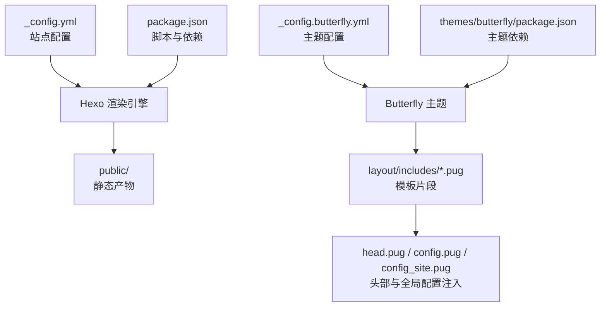
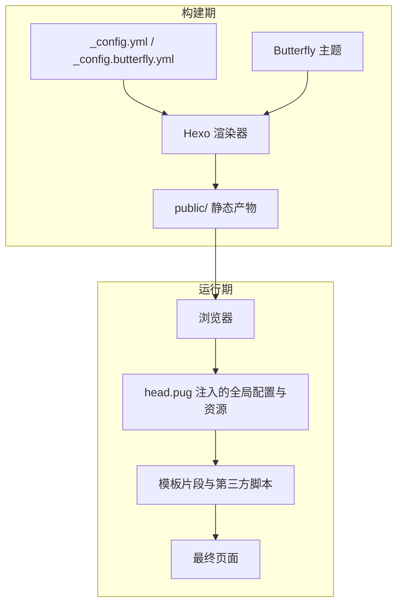
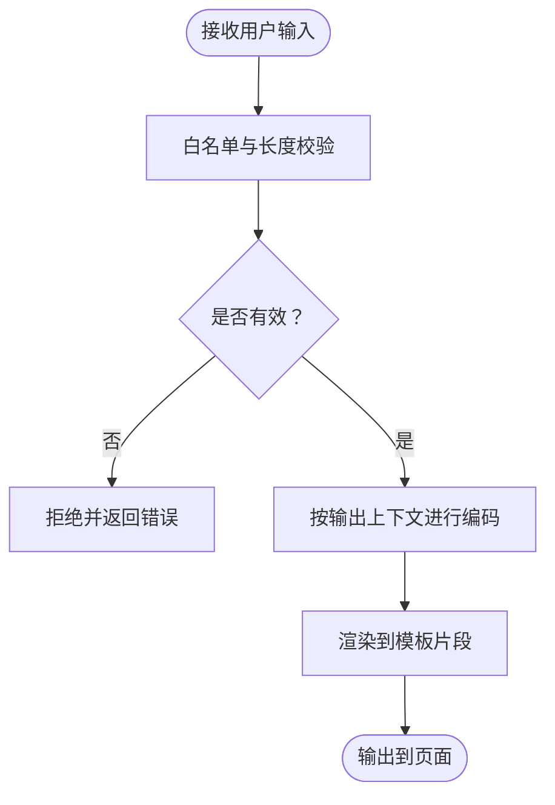
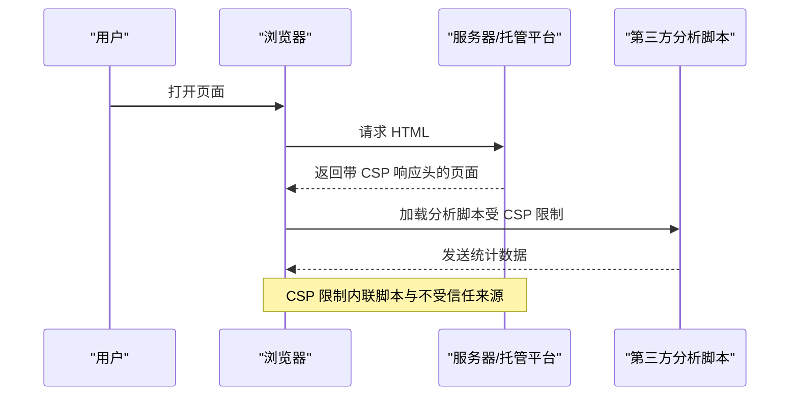
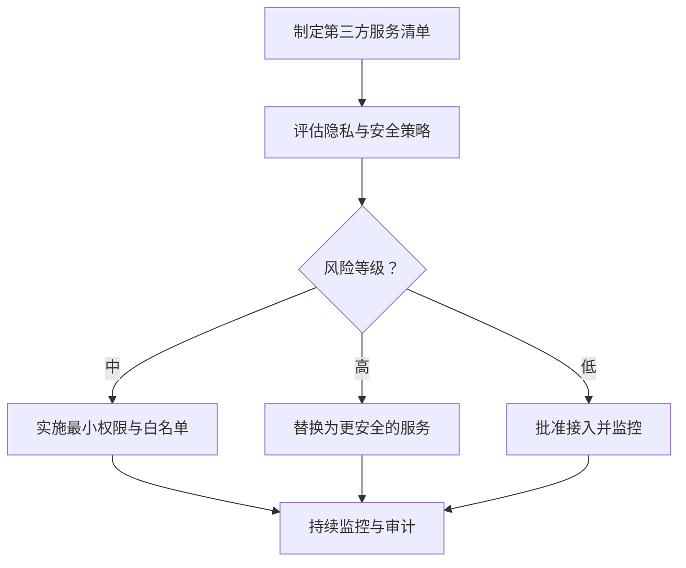
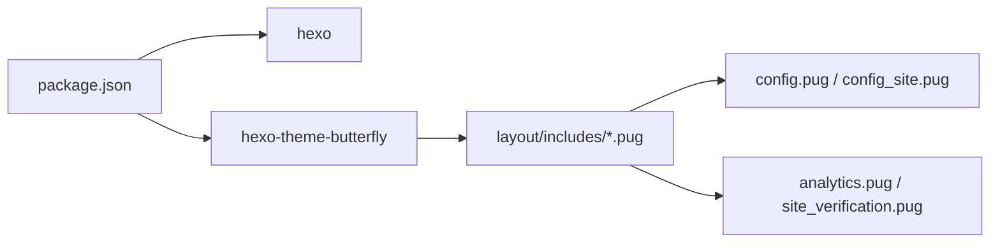

# 安全加固与防护措施

<cite>
**本文引用的文件**
- [_config.yml](file://_config.yml)
- [_config.butterfly.yml](file://_config.butterfly.yml)
- [themes/butterfly/_config.yml](file://themes/butterfly/_config.yml)
- [package.json](file://package.json)
- [themes/butterfly/package.json](file://themes/butterfly/package.json)
- [themes/butterfly/layout/includes/head.pug](file://themes/butterfly/layout/includes/head.pug)
- [themes/butterfly/layout/includes/head/config.pug](file://themes/butterfly/layout/includes/head/config.pug)
- [themes/butterfly/layout/includes/head/config_site.pug](file://themes/butterfly/layout/includes/head/config_site.pug)
- [themes/butterfly/layout/includes/head/site_verification.pug](file://themes/butterfly/layout/includes/head/site_verification.pug)
- [themes/butterfly/layout/includes/footer.pug](file://themes/butterfly/layout/includes/footer.pug)
</cite>

## 目录
1. [简介](#简介)
2. [项目结构](#项目结构)
3. [核心组件](#核心组件)
4. [架构总览](#架构总览)
5. [详细组件分析](#详细组件分析)
6. [依赖关系分析](#依赖关系分析)
7. [性能考量](#性能考量)
8. [故障排查指南](#故障排查指南)
9. [结论](#结论)
10. [附录](#附录)

## 简介
本技术文档面向静态博客系统（基于 Hexo 与 Butterfly 主题），围绕 XSS、CSRF、内容安全策略（CSP）、HTTPS 强制与安全响应头、第三方服务集成与审计、漏洞扫描与常见威胁识别等方面，提供可落地的安全加固方案与最佳实践。文档以仓库现有配置与模板为依据，结合静态站点生成与前端渲染特性，给出针对性建议与实施路径。

## 项目结构
本项目采用 Hexo 静态站点生成器，主题为 Butterfly。核心目录与文件如下：
- 根配置：_config.yml（站点基础配置）、_config.butterfly.yml（主题配置）
- 主题源码：themes/butterfly（Pug 模板、Stylus 样式、注入脚本等）
- 构建与运行：package.json（脚本与依赖）、themes/butterfly/package.json（主题依赖）

图表来源
- [_config.yml:1-173](file://_config.yml#L1-L173)
- [_config.butterfly.yml:1-690](file://_config.butterfly.yml#L1-L690)
- [package.json:1-42](file://package.json#L1-L42)
- [themes/butterfly/package.json:1-35](file://themes/butterfly/package.json#L1-L35)

章节来源
- [_config.yml:1-173](file://_config.yml#L1-L173)
- [_config.butterfly.yml:1-690](file://_config.butterfly.yml#L1-L690)
- [package.json:1-42](file://package.json#L1-L42)
- [themes/butterfly/package.json:1-35](file://themes/butterfly/package.json#L1-L35)

## 核心组件
- 站点配置与部署
  - 站点 URL、Robots、Sitemap、Feed 等由根配置统一管理，便于搜索引擎与订阅客户端正确索引。
- 主题配置与前端注入
  - 主题通过注入机制在页面头部注入全局配置、搜索、复制版权提示等，需关注注入内容的来源与可信度。
- 模板与头部安全元信息
  - 头部模板包含 viewport、theme-color、canonical、预连接、站点验证等，是实施 CSP 与安全响应头的基础。
- 第三方分析与广告
  - 支持百度统计、Google Analytics、Cloudflare Clarity、Google Tag Manager 等，需配合 CSP 与 HTTPS 强制策略。

章节来源
- [_config.yml:117-127](file://_config.yml#L117-L127)
- [_config.butterfly.yml:674-680](file://_config.butterfly.yml#L674-L680)
- [themes/butterfly/layout/includes/head.pug:1-78](file://themes/butterfly/layout/includes/head.pug#L1-L78)
- [themes/butterfly/layout/includes/head/analytics.pug:1-45](file://themes/butterfly/layout/includes/head/analytics.pug#L1-L45)

## 架构总览
静态博客的安全架构由“构建期配置”和“运行期前端”两部分组成：
- 构建期：Hexo 渲染器根据配置生成 HTML/CSS/JS；主题注入全局配置与资源链接。
- 运行期：浏览器加载页面，执行注入脚本与第三方分析脚本；通过 CSP、安全响应头与 HTTPS 强制保障传输与执行安全。

图表来源
- [_config.yml:1-173](file://_config.yml#L1-L173)
- [_config.butterfly.yml:1-690](file://_config.butterfly.yml#L1-L690)
- [themes/butterfly/layout/includes/head.pug:1-78](file://themes/butterfly/layout/includes/head.pug#L1-L78)

## 详细组件分析

### XSS 防护：输入验证与输出编码
- 输入来源与风险
  - 博客系统中用户可控输入主要来自评论系统与富文本内容（如标签、分类、摘要等）。当前项目未启用任何评论系统，默认关闭，降低 XSS 风险面。
- 输出编码与上下文安全
  - 模板中对标题、作者、版权等元数据进行安全处理，避免直接拼接 HTML 属性值导致的注入。
  - 全局配置注入采用 JSON 字符串化方式，避免在 HTML 中直接嵌入未转义的变量。
- 建议
  - 若启用评论系统，务必：
    - 对用户输入进行白名单过滤与长度限制；
    - 在输出到 HTML、JavaScript、CSS、URL 等不同上下文时采用对应的编码函数；
    - 使用 CSP 限制内联脚本与不可信来源脚本执行；
    - 启用 HTTPS 并强制跳转，防止中间人篡改注入。

章节来源
- [themes/butterfly/layout/includes/head/config.pug:86-126](file://themes/butterfly/layout/includes/head/config.pug#L86-L126)
- [themes/butterfly/layout/includes/head.pug:22-30](file://themes/butterfly/layout/includes/head.pug#L22-L30)

### CSRF 防范：表单与 API 请求安全
- 静态站点特性
  - 本项目未内置后端 API 或表单提交入口，无传统意义上的表单 CSRF 风险。
- 第三方服务与潜在风险
  - 若引入外部表单或第三方登录/评论系统，需：
    - 为表单添加隐藏令牌字段并服务端校验；
    - 使用 SameSite Cookie 与 CSRF Token 双重防护；
    - 严格限制第三方域名来源与 CSP。
- 建议
  - 保持默认不启用任何评论系统，避免引入 CSRF 风险；
  - 如确需启用，优先选择支持 CSRF 保护与 HTTPS 的服务，并在 CSP 中明确允许。

章节来源
- [_config.butterfly.yml:334-418](file://_config.butterfly.yml#L334-L418)

### 内容安全策略（CSP）配置与最佳实践
- 当前状态
  - 项目未显式设置 CSP 响应头；头部模板包含站点验证与分析脚本，存在外链依赖。
- CSP 设计原则
  - 采用“最小权限”原则，仅允许必要的来源；
  - 明确禁止内联脚本与 eval，必要时使用哈希或非cesium随机令牌；
  - 对第三方分析脚本，限定域名与版本号，避免使用自动加载脚本。
- 实施步骤
  - 在服务器或托管平台设置 CSP 响应头；
  - 将百度统计、Google Analytics、Clarity、GTM 等脚本域名加入白名单；
  - 对 CDN 资源使用子资源完整性（SRI）或固定版本号；
  - 逐步收紧策略，先宽松后严格，配合报告头观察违规情况。

章节来源
- [themes/butterfly/layout/includes/head/analytics.pug:1-45](file://themes/butterfly/layout/includes/head/analytics.pug#L1-L45)
- [themes/butterfly/layout/includes/head/site_verification.pug:1-3](file://themes/butterfly/layout/includes/head/site_verification.pug#L1-L3)

### HTTPS 强制跳转与安全响应头
- HTTPS 强制
  - 在托管平台或反向代理层开启 HTTPS 强制跳转，确保所有请求走加密通道；
  - 使用 HSTS 响应头增强抗降级与会话劫持能力。
- 安全响应头
  - X-Content-Type-Options: nosniff
  - Referrer-Policy: strict-origin-when-cross-origin
  - Permissions-Policy: 限制不必要的权限（如相机、麦克风等）
  - X-Frame-Options: DENY 或 Content-Security-Policy: frame-ancestors 'none'
- 实施建议
  - 在 GitHub Pages 等托管平台通过配置或重定向规则实现 HTTPS；
  - 对 CDN 与第三方资源使用 HTTPS 版本，避免混合内容。

章节来源
- [_config.yml:14](file://_config.yml#L14)
- [themes/butterfly/layout/includes/head.pug:22-30](file://themes/butterfly/layout/includes/head.pug#L22-L30)

### 第三方服务集成的安全评估与风险控制
- 评估清单
  - 服务提供商的隐私政策与数据留存策略；
  - 是否支持 HTTPS 与安全响应头；
  - 是否允许细粒度的 CSP 白名单配置；
  - 是否提供 SRI 或版本固定能力。
- 风险控制
  - 优先选择支持 CSP 与 HTTPS 的服务；
  - 对分析脚本进行最小权限授权；
  - 定期审计第三方脚本版本与变更记录。

章节来源
- [_config.butterfly.yml:437-458](file://_config.butterfly.yml#L437-L458)
- [themes/butterfly/layout/includes/head/analytics.pug:1-45](file://themes/butterfly/layout/includes/head/analytics.pug#L1-L45)

### 安全审计工具与漏洞扫描
- 工具推荐
  - 静态分析：HTMLHint、Stylelint、ESLint（针对自定义 JS/CSS）；
  - 安全扫描：OWASP ZAP、Burp Suite（本地预览环境）、Snyk（依赖漏洞）；
  - 浏览器 DevTools：检查 CSP 违规、混合内容、第三方脚本加载。
- 扫描流程
  - 本地构建并启动预览，使用 ZAP/Burp 扫描；
  - 检查 CSP 报告头，修正违规；
  - 审核第三方脚本与资源，确认 HTTPS 与版本固定。

章节来源
- [package.json:6-12](file://package.json#L6-L12)

### 常见安全威胁识别与应对
- 威胁类型
  - XSS：通过注入脚本窃取会话或执行恶意操作；
  - CSRF：在用户不知情情况下发起恶意请求；
  - 供应链攻击：第三方脚本被篡改；
  - 混合内容：HTTP 资源在 HTTPS 页面中加载。
- 应对策略
  - 严格输入校验与输出编码；
  - 启用 CSP、HTTPS 强制与安全响应头；
  - 固定第三方脚本版本，启用 SRI；
  - 定期扫描与审计，及时修复漏洞。

章节来源
- [themes/butterfly/layout/includes/head/config.pug:86-126](file://themes/butterfly/layout/includes/head/config.pug#L86-L126)
- [themes/butterfly/layout/includes/footer.pug:19-39](file://themes/butterfly/layout/includes/footer.pug#L19-L39)

## 依赖关系分析
- Hexo 与主题依赖
  - 项目依赖 hexo 与 hexo-theme-butterfly，主题通过 Pug/Stylus 渲染页面，注入全局配置与资源。
- 第三方分析与广告
  - 主题配置支持多类分析与广告脚本，需配合 CSP 与 HTTPS 策略统一管理。

图表来源
- [package.json:16-36](file://package.json#L16-L36)
- [themes/butterfly/package.json:25-30](file://themes/butterfly/package.json#L25-L30)
- [themes/butterfly/layout/includes/head/config.pug:1-126](file://themes/butterfly/layout/includes/head/config.pug#L1-L126)
- [themes/butterfly/layout/includes/head/analytics.pug:1-45](file://themes/butterfly/layout/includes/head/analytics.pug#L1-L45)
- [themes/butterfly/layout/includes/head/site_verification.pug:1-3](file://themes/butterfly/layout/includes/head/site_verification.pug#L1-L3)

章节来源
- [package.json:16-36](file://package.json#L16-L36)
- [themes/butterfly/package.json:25-30](file://themes/butterfly/package.json#L25-L30)

## 性能考量
- 资源压缩与懒加载
  - 项目启用了 HTML/CSS/JS 压缩与图片懒加载，有助于减少传输体积与首屏渲染时间。
- 第三方脚本影响
  - 分析与广告脚本可能阻塞渲染，建议延迟加载或使用异步加载策略，并配合 CSP 限制来源。

章节来源
- [_config.yml:157-173](file://_config.yml#L157-L173)
- [_config.butterfly.yml:646-651](file://_config.butterfly.yml#L646-L651)

## 故障排查指南
- CSP 违规
  - 现象：控制台报错、脚本未执行；
  - 排查：检查响应头与页面中的 CSP 设置，确认第三方脚本域名是否在白名单内。
- 混合内容
  - 现象：浏览器警告或资源加载失败；
  - 排查：确保所有资源使用 HTTPS，检查模板中的链接与注入脚本。
- 第三方脚本异常
  - 现象：统计或分析数据缺失；
  - 排查：确认脚本域名可用性、CSP 白名单、HTTPS 强制与版本固定。

章节来源
- [themes/butterfly/layout/includes/head/analytics.pug:1-45](file://themes/butterfly/layout/includes/head/analytics.pug#L1-L45)
- [themes/butterfly/layout/includes/head/site_verification.pug:1-3](file://themes/butterfly/layout/includes/head/site_verification.pug#L1-L3)

## 结论
本项目作为静态博客系统，在默认不启用评论与第三方服务的前提下，具备较低的攻击面。建议在后续扩展中坚持“最小权限、HTTPS 强制、CSP 限制、版本固定”的安全基线，配合定期审计与漏洞扫描，构建完善的静态站点安全防护体系。

## 附录
- 配置参考
  - 站点 URL、Robots、Sitemap、Feed：[_config.yml:14,117-L127](file://_config.yml#L14,L117-L127)
  - 主题注入与全局配置：[_config.butterfly.yml:674-680](file://_config.butterfly.yml#L674-L680)
  - 头部安全元信息：[themes/butterfly/layout/includes/head.pug:22-30](file://themes/butterfly/layout/includes/head.pug#L22-L30)
  - 分析与广告脚本：[themes/butterfly/layout/includes/head/analytics.pug:1-45](file://themes/butterfly/layout/includes/head/analytics.pug#L1-L45)
  - 站点验证：[themes/butterfly/layout/includes/head/site_verification.pug:1-3](file://themes/butterfly/layout/includes/head/site_verification.pug#L1-L3)
  - 构建与运行脚本：[package.json:6-12](file://package.json#L6-L12)