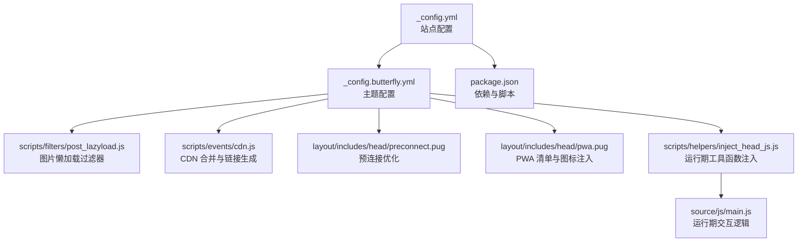
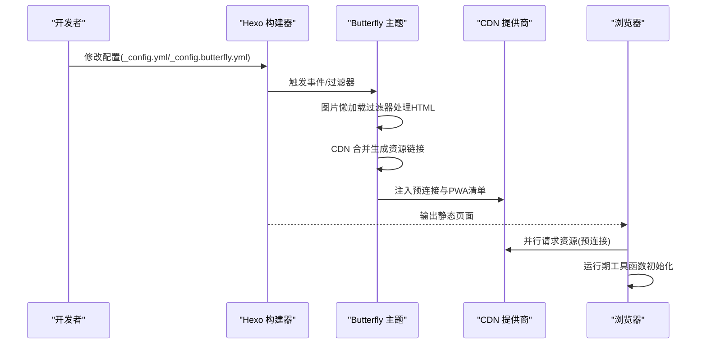
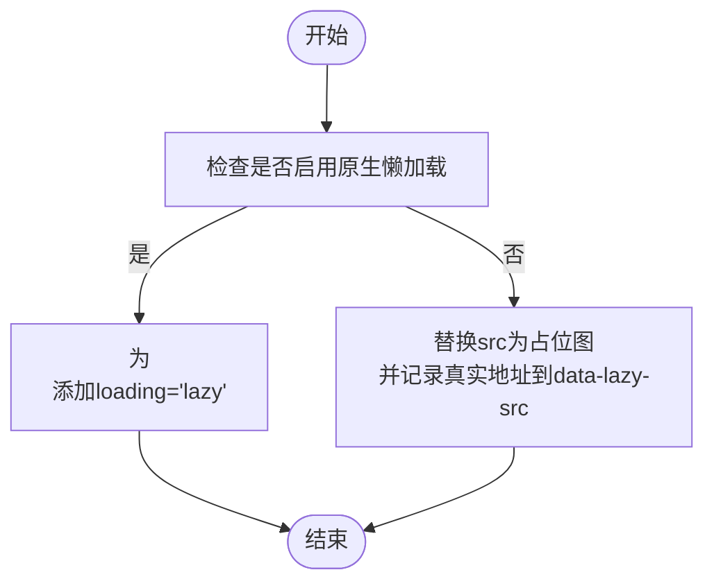
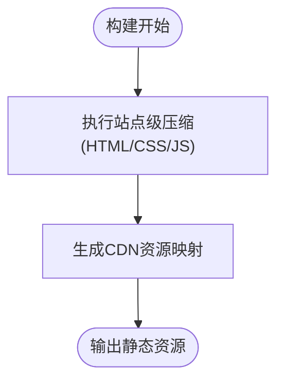
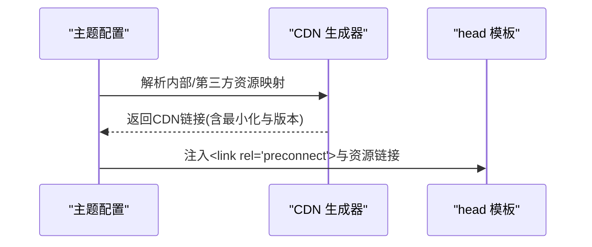
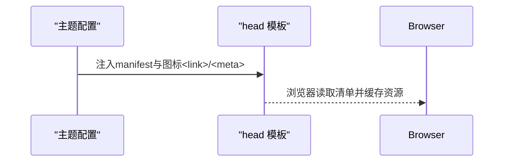
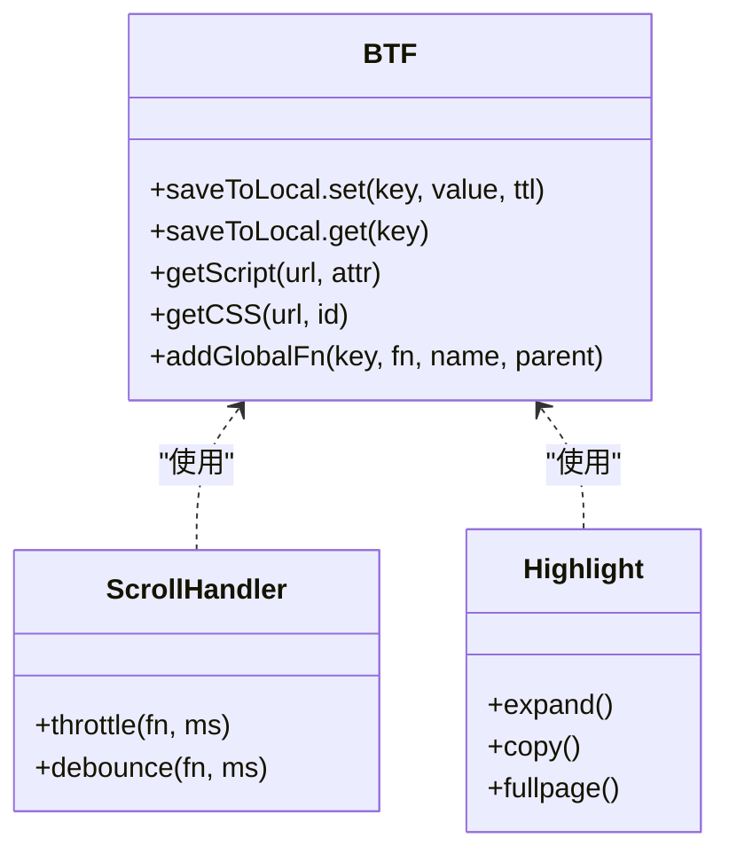
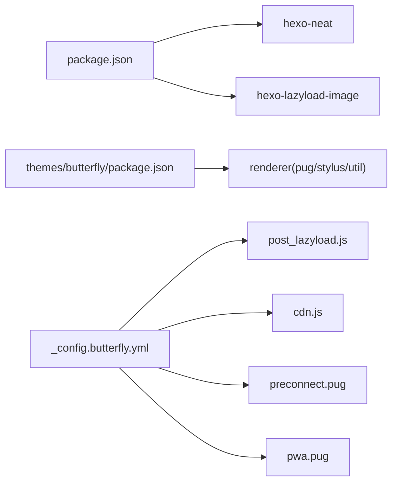

# 性能调优与优化策略

<cite>
**本文引用的文件**   
- [_config.yml](file://_config.yml)
- [_config.butterfly.yml](file://_config.butterfly.yml)
- [package.json](file://package.json)
- [themes/butterfly/scripts/filters/post_lazyload.js](file://themes/butterfly/scripts/filters/post_lazyload.js)
- [themes/butterfly/scripts/events/cdn.js](file://themes/butterfly/scripts/events/cdn.js)
- [themes/butterfly/layout/includes/head/preconnect.pug](file://themes/butterfly/layout/includes/head/preconnect.pug)
- [themes/butterfly/layout/includes/head/pwa.pug](file://themes/butterfly/layout/includes/head/pwa.pug)
- [themes/butterfly/scripts/helpers/inject_head_js.js](file://themes/butterfly/scripts/helpers/inject_head_js.js)
- [themes/butterfly/source/js/main.js](file://themes/butterfly/source/js/main.js)
</cite>

## 目录
1. [引言](#引言)
2. [项目结构](#项目结构)
3. [核心组件](#核心组件)
4. [架构总览](#架构总览)
5. [详细组件分析](#详细组件分析)
6. [依赖关系分析](#依赖关系分析)
7. [性能考量](#性能考量)
8. [故障排查指南](#故障排查指南)
9. [结论](#结论)
10. [附录](#附录)

## 引言
本文件面向性能优化专家，系统梳理该静态博客在构建期与运行期的性能优化策略，覆盖图片懒加载、代码分割与资源压缩、CDN 集成、PWA 实现、内存与渲染优化、网络请求优化以及性能监控建议，并结合仓库中的实际配置与脚本进行落地说明。

## 项目结构
该项目基于 Hexo + Butterfly 主题，采用主题内插件与过滤器机制完成构建期优化与运行期交互增强；前端资源通过主题注入与 CDN 合并策略进行分发；配置层同时支持站点级与主题级参数控制。

**图表来源**
- [_config.yml:1-173](file://_config.yml#L1-L173)
- [_config.butterfly.yml:1-690](file://_config.butterfly.yml#L1-L690)
- [package.json:1-42](file://package.json#L1-L42)
- [themes/butterfly/scripts/filters/post_lazyload.js:1-41](file://themes/butterfly/scripts/filters/post_lazyload.js#L1-L41)
- [themes/butterfly/scripts/events/cdn.js:1-96](file://themes/butterfly/scripts/events/cdn.js#L1-L96)
- [themes/butterfly/layout/includes/head/preconnect.pug:1-35](file://themes/butterfly/layout/includes/head/preconnect.pug#L1-L35)
- [themes/butterfly/layout/includes/head/pwa.pug:1-14](file://themes/butterfly/layout/includes/head/pwa.pug#L1-L14)
- [themes/butterfly/scripts/helpers/inject_head_js.js:1-156](file://themes/butterfly/scripts/helpers/inject_head_js.js#L1-L156)
- [themes/butterfly/source/js/main.js:1-800](file://themes/butterfly/source/js/main.js#L1-L800)

**章节来源**
- [_config.yml:1-173](file://_config.yml#L1-L173)
- [_config.butterfly.yml:1-690](file://_config.butterfly.yml#L1-L690)
- [package.json:1-42](file://package.json#L1-L42)

## 核心组件
- 图片懒加载：主题过滤器在 HTML 渲染后替换 img 标签属性，支持原生 loading=lazy 与占位图延迟加载两种模式。
- CDN 合并：构建前根据主题配置选择内部或第三方 CDN 提供商，生成资源链接并注入模板。
- 预连接：在 head 中对主要域名进行 preconnect，降低外部资源首包延迟。
- 运行期工具：注入通用工具函数（异步加载脚本/样式、本地存储 TTL、全局回调注册），支撑主题交互与暗色模式等特性。
- PWA：通过清单与图标注入，开启离线与安装体验（当前配置为关闭状态）。

**章节来源**
- [themes/butterfly/scripts/filters/post_lazyload.js:1-41](file://themes/butterfly/scripts/filters/post_lazyload.js#L1-L41)
- [themes/butterfly/scripts/events/cdn.js:1-96](file://themes/butterfly/scripts/events/cdn.js#L1-L96)
- [themes/butterfly/layout/includes/head/preconnect.pug:1-35](file://themes/butterfly/layout/includes/head/preconnect.pug#L1-L35)
- [themes/butterfly/scripts/helpers/inject_head_js.js:1-156](file://themes/butterfly/scripts/helpers/inject_head_js.js#L1-L156)
- [themes/butterfly/layout/includes/head/pwa.pug:1-14](file://themes/butterfly/layout/includes/head/pwa.pug#L1-L14)

## 架构总览
从“配置 → 构建 → 注入 → 运行”四个阶段描述性能优化链路：

**图表来源**
- [_config.yml:128-173](file://_config.yml#L128-L173)
- [_config.butterfly.yml:646-690](file://_config.butterfly.yml#L646-L690)
- [themes/butterfly/scripts/filters/post_lazyload.js:11-41](file://themes/butterfly/scripts/filters/post_lazyload.js#L11-L41)
- [themes/butterfly/scripts/events/cdn.js:11-96](file://themes/butterfly/scripts/events/cdn.js#L11-L96)
- [themes/butterfly/layout/includes/head/preconnect.pug:1-35](file://themes/butterfly/layout/includes/head/preconnect.pug#L1-L35)
- [themes/butterfly/layout/includes/head/pwa.pug:1-14](file://themes/butterfly/layout/includes/head/pwa.pug#L1-L14)

## 详细组件分析

### 图片懒加载实现与配置
- 原生懒加载：当启用原生模式时，过滤器会为 img 标签追加 loading="lazy"，由浏览器负责按需解码与渲染，减少主线程压力。
- 占位图延迟加载：在非原生模式下，将 src 替换为占位图与 data-lazy-src，配合运行期逻辑在进入视口时再替换真实地址，降低初始渲染阻塞。
- 配置入口：
  - 站点级开关与占位图路径：见站点配置中的懒加载段落。
  - 主题级开关、字段范围（站点/文章）、原生与模糊策略：见主题配置中的 lazyload 段落。
- 过滤器注册：
  - HTML 完成渲染后对整站生效。
  - 文章渲染完成后仅对文章内容生效。

**图表来源**
- [themes/butterfly/scripts/filters/post_lazyload.js:11-41](file://themes/butterfly/scripts/filters/post_lazyload.js#L11-L41)
- [_config.yml:128-133](file://_config.yml#L128-L133)
- [_config.butterfly.yml:646-652](file://_config.butterfly.yml#L646-L652)

**章节来源**
- [themes/butterfly/scripts/filters/post_lazyload.js:1-41](file://themes/butterfly/scripts/filters/post_lazyload.js#L1-L41)
- [_config.yml:128-133](file://_config.yml#L128-L133)
- [_config.butterfly.yml:646-652](file://_config.butterfly.yml#L646-L652)

### 代码分割与资源压缩
- 站点级压缩：
  - HTML 压缩、CSS 压缩、JS 压缩均在站点配置中开启，且对 min 文件进行排除，避免重复压缩。
  - JS 压缩包含混淆与输出选项，便于生产环境体积优化。
- 主题级资源：
  - 主题内部 JS/CSS 与第三方库通过 CDN 合并策略统一管理，可选择本地或 CDN 提供商，自动拼接最小化文件名。
- 建议：
  - 对大体量第三方库采用按需引入与动态导入，减少首屏 JS 体积。
  - 使用 Tree Shaking 与模块化打包策略，确保未使用代码被剔除。

**图表来源**
- [_config.yml:157-173](file://_config.yml#L157-L173)
- [themes/butterfly/scripts/events/cdn.js:44-95](file://themes/butterfly/scripts/events/cdn.js#L44-L95)

**章节来源**
- [_config.yml:157-173](file://_config.yml#L157-L173)
- [themes/butterfly/scripts/events/cdn.js:1-96](file://themes/butterfly/scripts/events/cdn.js#L1-L96)

### CDN 集成最佳实践
- 内部与第三方提供商切换：根据主题配置选择内部或第三方（如 jsDelivr、unpkg、CDNJS），并自动生成最小化文件路径。
- 版本附加：可按包版本或语义化版本追加版本号，便于缓存失效与回滚。
- 预连接：在 head 中对主域名进行 preconnect，减少 DNS 与握手开销。
- 适配策略：
  - 将高频静态资源（如搜索、工具函数）走 CDN，降低自有服务器负载。
  - 对字体与分析脚本域名单独 preconnect，避免跨域阻塞。

**图表来源**
- [_config.butterfly.yml:682-690](file://_config.butterfly.yml#L682-L690)
- [themes/butterfly/scripts/events/cdn.js:11-95](file://themes/butterfly/scripts/events/cdn.js#L11-L95)
- [themes/butterfly/layout/includes/head/preconnect.pug:1-35](file://themes/butterfly/layout/includes/head/preconnect.pug#L1-L35)

**章节来源**
- [_config.butterfly.yml:682-690](file://_config.butterfly.yml#L682-L690)
- [themes/butterfly/scripts/events/cdn.js:1-96](file://themes/butterfly/scripts/events/cdn.js#L1-L96)
- [themes/butterfly/layout/includes/head/preconnect.pug:1-35](file://themes/butterfly/layout/includes/head/preconnect.pug#L1-L35)

### PWA 实现与配置
- 当前配置为关闭状态，可通过主题配置启用 manifest、图标与主题色元信息。
- 清单与图标注入由 head 模板完成，浏览器可据此缓存资源并支持安装提示。
- 建议：
  - 开启后配合 Service Worker 缓存策略，优先缓存关键静态资源与页面骨架。
  - 使用 Workbox 或主题内置 SW 生成器，确保离线回退与更新机制稳定。

**图表来源**
- [_config.butterfly.yml:653-660](file://_config.butterfly.yml#L653-L660)
- [themes/butterfly/layout/includes/head/pwa.pug:1-14](file://themes/butterfly/layout/includes/head/pwa.pug#L1-L14)

**章节来源**
- [_config.butterfly.yml:653-660](file://_config.butterfly.yml#L653-L660)
- [themes/butterfly/layout/includes/head/pwa.pug:1-14](file://themes/butterfly/layout/includes/head/pwa.pug#L1-L14)

### 运行期交互与内存优化
- 工具函数注入：提供异步加载脚本/样式、带 TTL 的本地存储、全局回调注册等能力，减少重复加载与全局变量污染。
- 事件节流与防抖：滚动、窗口尺寸变化等高频事件采用节流/防抖，降低主线程压力。
- DOM 操作优化：批量插入节点、隐藏元素计算真实高度后再显示，避免强制同步布局。
- 代码块增强：按需展开、复制按钮、全屏查看等功能，均在需要时才绑定事件，避免常驻监听。

**图表来源**
- [themes/butterfly/scripts/helpers/inject_head_js.js:11-62](file://themes/butterfly/scripts/helpers/inject_head_js.js#L11-L62)
- [themes/butterfly/source/js/main.js:468-503](file://themes/butterfly/source/js/main.js#L468-L503)
- [themes/butterfly/source/js/main.js:157-163](file://themes/butterfly/source/js/main.js#L157-L163)

**章节来源**
- [themes/butterfly/scripts/helpers/inject_head_js.js:1-156](file://themes/butterfly/scripts/helpers/inject_head_js.js#L1-L156)
- [themes/butterfly/source/js/main.js:1-800](file://themes/butterfly/source/js/main.js#L1-L800)

## 依赖关系分析
- 站点依赖：
  - hexo-neat：提供 HTML/CSS/JS 压缩能力。
  - hexo-lazyload-image：与主题懒加载策略互补，可作为额外保障。
- 主题依赖：
  - hexo-renderer-pug/stylus/util：用于模板与样式编译。
  - moment-timezone：时间处理（用于统计/计时）。
- 关键耦合点：
  - 主题配置与过滤器/事件紧密耦合，确保构建期与运行期行为一致。
  - CDN 生成器依赖 plugins.yml 与主题包版本，保证资源路径与版本号正确。

**图表来源**
- [package.json:16-36](file://package.json#L16-L36)
- [themes/butterfly/package.json:25-30](file://themes/butterfly/package.json#L25-L30)
- [_config.butterfly.yml:646-690](file://_config.butterfly.yml#L646-L690)
- [themes/butterfly/scripts/filters/post_lazyload.js:1-41](file://themes/butterfly/scripts/filters/post_lazyload.js#L1-L41)
- [themes/butterfly/scripts/events/cdn.js:1-96](file://themes/butterfly/scripts/events/cdn.js#L1-L96)
- [themes/butterfly/layout/includes/head/preconnect.pug:1-35](file://themes/butterfly/layout/includes/head/preconnect.pug#L1-L35)
- [themes/butterfly/layout/includes/head/pwa.pug:1-14](file://themes/butterfly/layout/includes/head/pwa.pug#L1-L14)

**章节来源**
- [package.json:1-42](file://package.json#L1-L42)
- [themes/butterfly/package.json:1-35](file://themes/butterfly/package.json#L1-L35)

## 性能考量
- 图片懒加载
  - 原生模式优先，减少运行期 JS 干预；非原生模式配合占位图，避免空白闪烁。
  - 建议：为关键首屏图片移除懒加载，或使用占位图+渐显过渡。
- 资源压缩与合并
  - 启用站点级压缩，避免对已压缩文件重复处理；CDN 选择最小化文件，减少体积。
  - 建议：对第三方库采用按需加载与动态导入，拆分首屏与次屏资源。
- 预连接与缓存
  - 对分析、字体、CDN 域名进行预连接；合理设置 Cache-Control 与 ETag。
  - 建议：静态资源使用长缓存，版本化文件名，结合 CDN 回源刷新策略。
- 运行期优化
  - 滚动与窗口事件节流；DOM 查询与操作批量进行；代码块功能按需启用。
  - 建议：使用 IntersectionObserver 替代频繁 scroll 计算；避免强制同步布局。
- PWA
  - 启用后结合 Service Worker 缓存策略，提供离线访问与快速回刷。
  - 建议：缓存关键页面与静态资源，实现 App Shell 模型。

[本节为通用指导，不直接分析具体文件]

## 故障排查指南
- 图片未懒加载
  - 检查站点与主题的懒加载开关与字段范围配置。
  - 确认过滤器是否在渲染阶段生效（HTML 完成后与文章渲染后分别注册）。
- CDN 链接异常
  - 核对主题 CDN provider 与版本开关；确认 plugins.yml 中第三方资源映射存在。
  - 检查最小化文件命名规则与路径拼接逻辑。
- 预连接未生效
  - 确认域名解析与 HTTPS；检查 head 模板是否注入了对应 link 标签。
- PWA 未触发
  - 检查主题 pwa 配置与清单路径；确认浏览器支持与 HTTPS 环境。
- 运行期卡顿
  - 检查滚动与 resize 事件是否过度绑定；确认代码块与图库初始化是否按需执行。

**章节来源**
- [themes/butterfly/scripts/filters/post_lazyload.js:29-41](file://themes/butterfly/scripts/filters/post_lazyload.js#L29-L41)
- [themes/butterfly/scripts/events/cdn.js:48-95](file://themes/butterfly/scripts/events/cdn.js#L48-L95)
- [themes/butterfly/layout/includes/head/preconnect.pug:1-35](file://themes/butterfly/layout/includes/head/preconnect.pug#L1-L35)
- [themes/butterfly/layout/includes/head/pwa.pug:1-14](file://themes/butterfly/layout/includes/head/pwa.pug#L1-L14)
- [themes/butterfly/scripts/helpers/inject_head_js.js:54-62](file://themes/butterfly/scripts/helpers/inject_head_js.js#L54-L62)
- [themes/butterfly/source/js/main.js:468-503](file://themes/butterfly/source/js/main.js#L468-L503)

## 结论
该静态博客在构建期通过站点级压缩与主题 CDN 合并策略，在运行期通过懒加载、预连接与工具函数注入实现多维性能优化。建议进一步完善 PWA、按需加载与缓存策略，并结合 Lighthouse/WebPageTest 等工具持续度量与迭代，以达成更优的首屏与交互体验。

[本节为总结性内容，不直接分析具体文件]

## 附录
- 性能监控工具
  - Lighthouse：评估性能、可访问性、SEO 与最佳实践。
  - WebPageTest：跨地域、跨设备的端到端性能测试。
  - Chrome DevTools：Network/Performance/Rendering 面板深度分析。
- 优化案例思路
  - 案例A：启用 PWA + Service Worker 缓存首页与关键资源，对比前后 LCP/FID/CLS 指标。
  - 案例B：引入按需加载与动态导入，拆分 vendor 与业务代码，观察 TTI 与首屏 JS 体积变化。
  - 案例C：调整 CDN provider 与预连接策略，对比 DNS 与握手耗时差异。

[本节为通用指导，不直接分析具体文件]