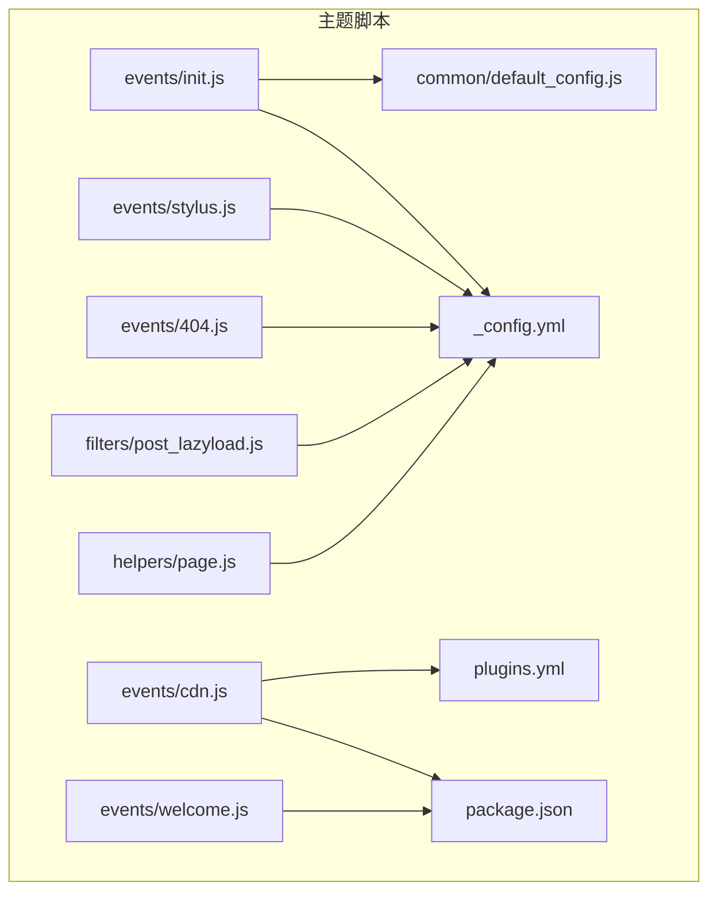
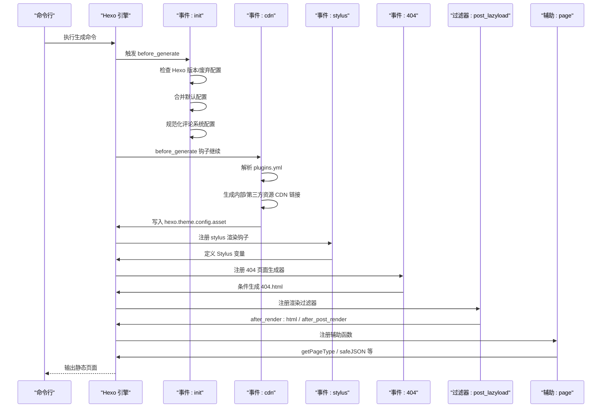
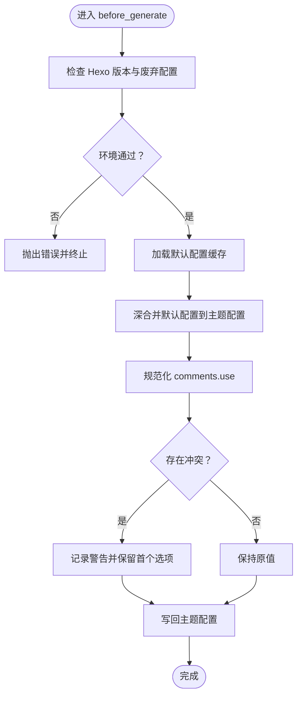
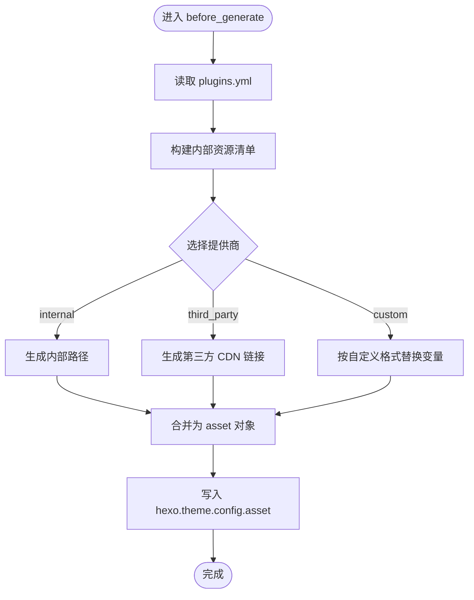
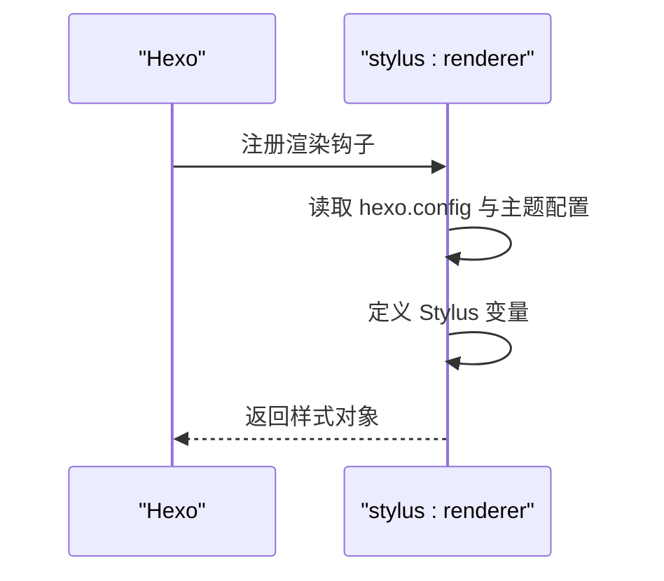
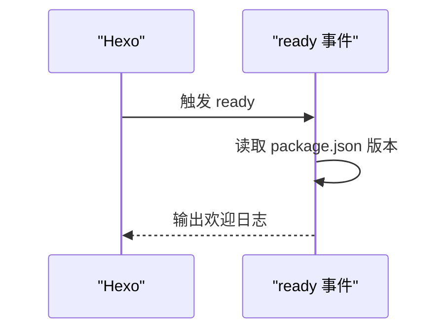
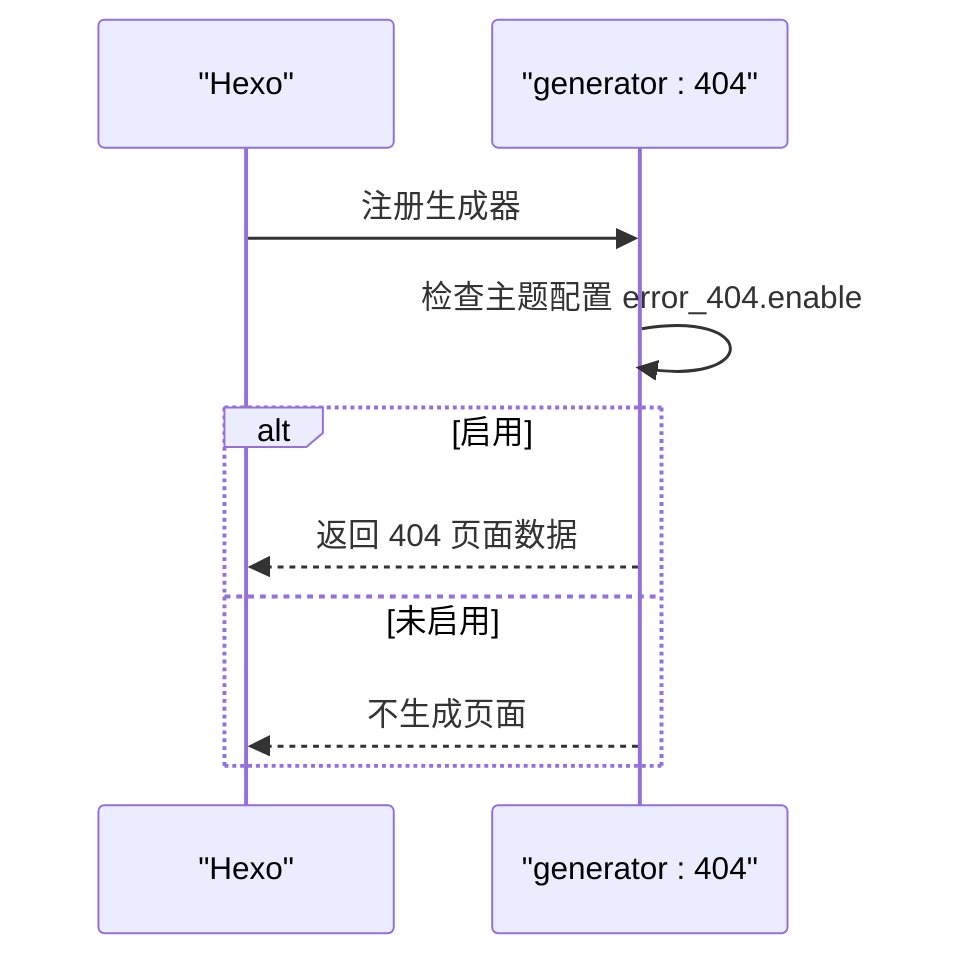
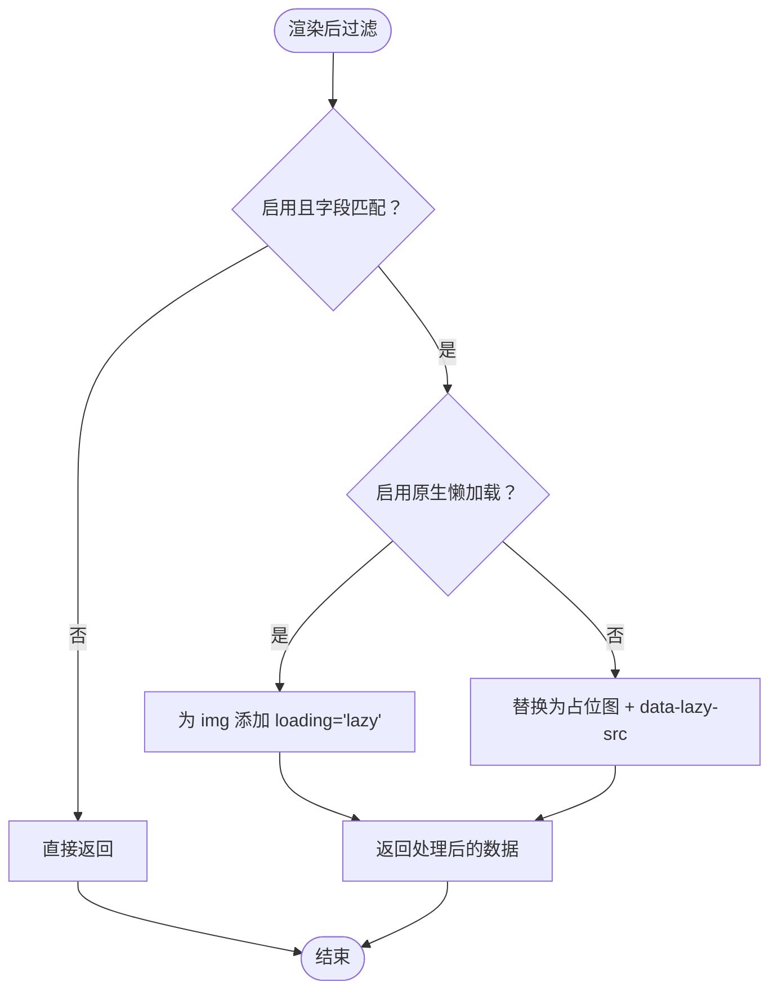
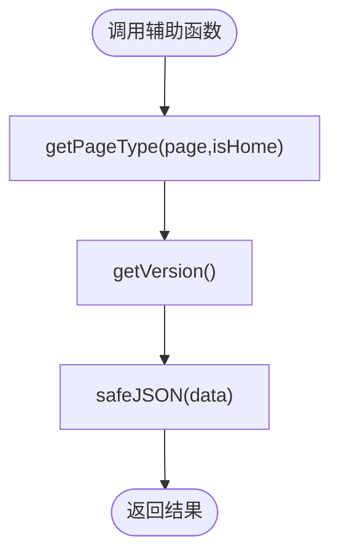
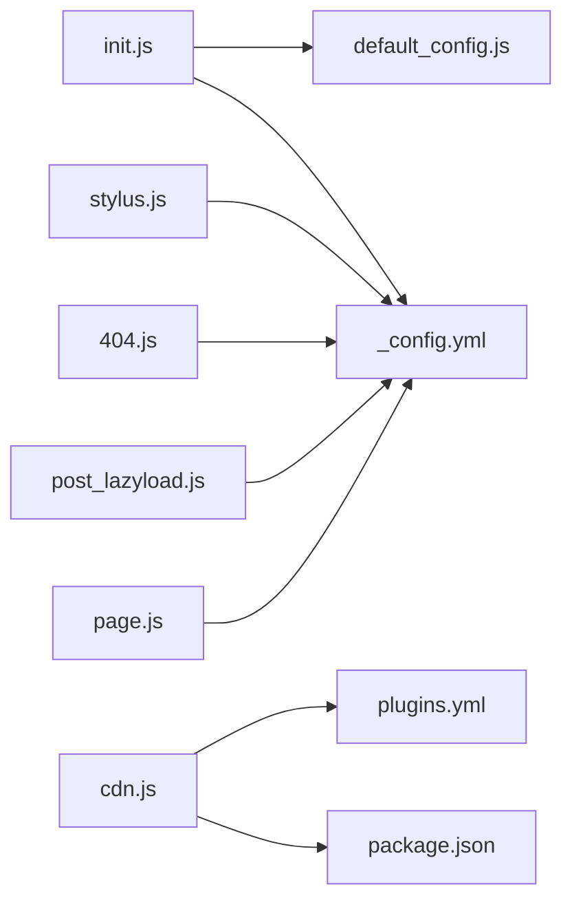

# 事件处理机制

<cite>
**本文引用的文件**   
- [init.js](file://themes/butterfly/scripts/events/init.js)
- [cdn.js](file://themes/butterfly/scripts/events/cdn.js)
- [stylus.js](file://themes/butterfly/scripts/events/stylus.js)
- [welcome.js](file://themes/butterfly/scripts/events/welcome.js)
- [404.js](file://themes/butterfly/scripts/events/404.js)
- [default_config.js](file://themes/butterfly/scripts/common/default_config.js)
- [plugins.yml](file://themes/butterfly/plugins.yml)
- [_config.yml](file://themes/butterfly/_config.yml)
- [package.json](file://themes/butterfly/package.json)
- [post_lazyload.js](file://themes/butterfly/scripts/filters/post_lazyload.js)
- [page.js](file://themes/butterfly/scripts/helpers/page.js)
</cite>

## 目录
1. [引言](#引言)
2. [项目结构](#项目结构)
3. [核心组件](#核心组件)
4. [架构总览](#架构总览)
5. [详细组件分析](#详细组件分析)
6. [依赖关系分析](#依赖关系分析)
7. [性能考量](#性能考量)
8. [故障排查指南](#故障排查指南)
9. [结论](#结论)
10. [附录](#附录)

## 引言
本文件系统性阐述 Hexo 主题事件处理机制在 Butterfly 主题中的实现与应用，覆盖事件注册、生命周期管理、异步处理、过滤器与生成器等关键环节。通过对 init、cdn、stylus、welcome、404 等事件处理器的逐项解析，帮助开发者掌握主题初始化与运行时事件处理的完整流程，并提供事件开发的最佳实践与调试方法。

## 项目结构
Butterfly 主题将事件处理集中于 scripts/events 目录，配合 scripts/common 默认配置、plugins.yml 第三方资源清单、以及 scripts/filters 与 scripts/helpers 中的渲染与辅助扩展，形成“事件驱动 + 渲染过滤 + 辅助工具”的整体架构。

**图表来源**
- [init.js:1-87](file://themes/butterfly/scripts/events/init.js#L1-L87)
- [cdn.js:1-96](file://themes/butterfly/scripts/events/cdn.js#L1-L96)
- [stylus.js:1-25](file://themes/butterfly/scripts/events/stylus.js#L1-L25)
- [welcome.js:1-14](file://themes/butterfly/scripts/events/welcome.js#L1-L14)
- [404.js:1-21](file://themes/butterfly/scripts/events/404.js#L1-L21)
- [default_config.js:1-602](file://themes/butterfly/scripts/common/default_config.js#L1-L602)
- [plugins.yml:1-208](file://themes/butterfly/plugins.yml#L1-L208)
- [_config.yml:1-1137](file://themes/butterfly/_config.yml#L1-L1137)
- [package.json:1-35](file://themes/butterfly/package.json#L1-L35)

**章节来源**
- [init.js:1-87](file://themes/butterfly/scripts/events/init.js#L1-L87)
- [cdn.js:1-96](file://themes/butterfly/scripts/events/cdn.js#L1-L96)
- [stylus.js:1-25](file://themes/butterfly/scripts/events/stylus.js#L1-L25)
- [welcome.js:1-14](file://themes/butterfly/scripts/events/welcome.js#L1-L14)
- [404.js:1-21](file://themes/butterfly/scripts/events/404.js#L1-L21)
- [default_config.js:1-602](file://themes/butterfly/scripts/common/default_config.js#L1-L602)
- [plugins.yml:1-208](file://themes/butterfly/plugins.yml#L1-L208)
- [_config.yml:1-1137](file://themes/butterfly/_config.yml#L1-L1137)
- [package.json:1-35](file://themes/butterfly/package.json#L1-L35)

## 核心组件
- 事件注册与生命周期
  - before_generate：在站点生成前执行，用于环境检查、默认配置合并、评论系统配置规范化等。
  - ready：主题就绪后触发，用于输出欢迎信息。
  - generator：注册页面生成器，如 404 页面。
  - filter：注册渲染过滤器，如 HTML 后处理（延迟加载）。
  - helper：注册模板辅助函数，如页面类型判断、安全 JSON 序列化等。
- 数据与配置
  - 默认配置：common/default_config.js 提供主题默认配置，避免重复读取。
  - 第三方资源：plugins.yml 定义第三方库名称、文件路径与版本，供 CDN 合并使用。
  - 主题配置：_config.yml 与用户配置共同决定运行行为。
- 关键模块
  - hexo.extend.filter：用于注册渲染阶段的过滤器。
  - hexo.extend.generator：用于注册页面生成器。
  - hexo.extend.helper：用于注册模板辅助函数。
  - hexo.on：用于监听主题生命周期事件。

**章节来源**
- [init.js:1-87](file://themes/butterfly/scripts/events/init.js#L1-L87)
- [cdn.js:1-96](file://themes/butterfly/scripts/events/cdn.js#L1-L96)
- [stylus.js:1-25](file://themes/butterfly/scripts/events/stylus.js#L1-L25)
- [welcome.js:1-14](file://themes/butterfly/scripts/events/welcome.js#L1-L14)
- [404.js:1-21](file://themes/butterfly/scripts/events/404.js#L1-L21)
- [post_lazyload.js:1-41](file://themes/butterfly/scripts/filters/post_lazyload.js#L1-L41)
- [page.js:1-194](file://themes/butterfly/scripts/helpers/page.js#L1-L194)

## 架构总览
下图展示事件处理在 Hexo 生命周期中的位置与交互：

**图表来源**
- [init.js:79-86](file://themes/butterfly/scripts/events/init.js#L79-L86)
- [cdn.js:11-95](file://themes/butterfly/scripts/events/cdn.js#L11-L95)
- [stylus.js:7-24](file://themes/butterfly/scripts/events/stylus.js#L7-L24)
- [404.js:8-20](file://themes/butterfly/scripts/events/404.js#L8-L20)
- [post_lazyload.js:29-40](file://themes/butterfly/scripts/filters/post_lazyload.js#L29-L40)
- [page.js:167-193](file://themes/butterfly/scripts/helpers/page.js#L167-L193)

## 详细组件分析

### 初始化事件（init）
职责与流程
- 环境检查：校验 Hexo 版本是否满足最低要求；检测废弃配置文件并报错。
- 默认配置合并：从 common/default_config.js 加载默认配置，使用深合并覆盖用户配置。
- 评论系统配置规范化：统一 comments.use 的格式，处理大小写与去重，避免冲突（如 Disqus 与 Disqusjs 同时启用时仅保留第一个）。

**图表来源**
- [init.js:10-86](file://themes/butterfly/scripts/events/init.js#L10-L86)
- [default_config.js:1-602](file://themes/butterfly/scripts/common/default_config.js#L1-L602)

**章节来源**
- [init.js:1-87](file://themes/butterfly/scripts/events/init.js#L1-L87)
- [default_config.js:1-602](file://themes/butterfly/scripts/common/default_config.js#L1-L602)

### CDN 合并事件（cdn）
职责与流程
- 读取 plugins.yml，解析第三方库的名称、文件与版本。
- 定义内部资源清单（如主 JS、工具 JS、翻译脚本、搜索脚本等），并根据主题版本生成带版本号或不带版本号的链接。
- 根据配置选择 CDN 提供商（local/jsdelivr/unpkg/cdnjs/custom），生成最终资源链接。
- 将结果写入 hexo.theme.config.asset，供模板渲染时使用。

**图表来源**
- [cdn.js:11-95](file://themes/butterfly/scripts/events/cdn.js#L11-L95)
- [plugins.yml:1-208](file://themes/butterfly/plugins.yml#L1-L208)
- [package.json:1-35](file://themes/butterfly/package.json#L1-L35)

**章节来源**
- [cdn.js:1-96](file://themes/butterfly/scripts/events/cdn.js#L1-L96)
- [plugins.yml:1-208](file://themes/butterfly/plugins.yml#L1-L208)
- [package.json:1-35](file://themes/butterfly/package.json#L1-L35)

### Stylus 渲染事件（stylus）
职责与流程
- 在 Stylus 渲染阶段注入变量，如高亮开关、行号开关、语言设置等。
- 兼容新旧语法高亮配置（highlight.js 与 prismjs）。

**图表来源**
- [stylus.js:7-24](file://themes/butterfly/scripts/events/stylus.js#L7-L24)
- [_config.yml:1-1137](file://themes/butterfly/_config.yml#L1-L1137)

**章节来源**
- [stylus.js:1-25](file://themes/butterfly/scripts/events/stylus.js#L1-L25)
- [_config.yml:1-1137](file://themes/butterfly/_config.yml#L1-L1137)

### 主题就绪事件（welcome）
职责与流程
- 监听 ready 事件，在主题加载完成后输出欢迎信息（含主题版本）。

**图表来源**
- [welcome.js:1-13](file://themes/butterfly/scripts/events/welcome.js#L1-L13)
- [package.json:1-35](file://themes/butterfly/package.json#L1-L35)

**章节来源**
- [welcome.js:1-14](file://themes/butterfly/scripts/events/welcome.js#L1-L14)
- [package.json:1-35](file://themes/butterfly/package.json#L1-L35)

### 404 页面生成事件（404）
职责与流程
- 注册名为 “404” 的生成器，当主题配置启用时，生成 404.html，禁用顶部图、评论与侧边栏，仅使用 page 布局。

**图表来源**
- [404.js:8-20](file://themes/butterfly/scripts/events/404.js#L8-L20)
- [_config.yml:112-117](file://themes/butterfly/_config.yml#L112-L117)

**章节来源**
- [404.js:1-21](file://themes/butterfly/scripts/events/404.js#L1-L21)
- [_config.yml:112-117](file://themes/butterfly/_config.yml#L112-L117)

### 渲染过滤器示例（post_lazyload）
职责与流程
- 在 HTML 渲染后或文章内容渲染后，对图片标签进行懒加载处理：
  - 若启用原生懒加载，则为 img 标签添加 loading 属性。
  - 否则，将 src 替换为占位图与 data-lazy-src，结合模板中的懒加载脚本实现延迟加载。
- 支持按站点或文章级别开启。

**图表来源**
- [post_lazyload.js:11-40](file://themes/butterfly/scripts/filters/post_lazyload.js#L11-L40)

**章节来源**
- [post_lazyload.js:1-41](file://themes/butterfly/scripts/filters/post_lazyload.js#L1-L41)

### 辅助函数示例（page）
职责与流程
- getPageType：根据页面属性判断布局类型（home/tag/category/archive/page/post/tags/categories）。
- getVersion：返回 Hexo 与主题版本信息。
- safeJSON：安全序列化 JSON，避免在 <script> 中出现非法字符。

**图表来源**
- [page.js:167-193](file://themes/butterfly/scripts/helpers/page.js#L167-L193)

**章节来源**
- [page.js:1-194](file://themes/butterfly/scripts/helpers/page.js#L1-L194)

## 依赖关系分析
- 事件与配置
  - init 依赖 default_config.js 与 _config.yml，确保主题配置在生成前已合并与规范化。
  - cdn 依赖 plugins.yml 与 package.json，确保第三方库与主题版本信息准确。
  - 404 依赖 _config.yml 的 error_404.enable 开关。
- 事件与渲染
  - stylus 与 post_lazyload 分别在不同阶段影响渲染输出，前者注入变量，后者修改 HTML 结构。
- 事件与生命周期
  - init 在 before_generate 最早阶段执行，保证后续事件与渲染器能基于已合并配置工作。
  - welcome 在 ready 阶段输出信息，便于确认主题加载成功。

**图表来源**
- [init.js:1-87](file://themes/butterfly/scripts/events/init.js#L1-L87)
- [cdn.js:1-96](file://themes/butterfly/scripts/events/cdn.js#L1-L96)
- [stylus.js:1-25](file://themes/butterfly/scripts/events/stylus.js#L1-L25)
- [404.js:1-21](file://themes/butterfly/scripts/events/404.js#L1-L21)
- [post_lazyload.js:1-41](file://themes/butterfly/scripts/filters/post_lazyload.js#L1-L41)
- [page.js:1-194](file://themes/butterfly/scripts/helpers/page.js#L1-L194)
- [default_config.js:1-602](file://themes/butterfly/scripts/common/default_config.js#L1-L602)
- [plugins.yml:1-208](file://themes/butterfly/plugins.yml#L1-L208)
- [_config.yml:1-1137](file://themes/butterfly/_config.yml#L1-L1137)
- [package.json:1-35](file://themes/butterfly/package.json#L1-L35)

**章节来源**
- [init.js:1-87](file://themes/butterfly/scripts/events/init.js#L1-L87)
- [cdn.js:1-96](file://themes/butterfly/scripts/events/cdn.js#L1-L96)
- [stylus.js:1-25](file://themes/butterfly/scripts/events/stylus.js#L1-L25)
- [404.js:1-21](file://themes/butterfly/scripts/events/404.js#L1-L21)
- [post_lazyload.js:1-41](file://themes/butterfly/scripts/filters/post_lazyload.js#L1-L41)
- [page.js:1-194](file://themes/butterfly/scripts/helpers/page.js#L1-L194)

## 性能考量
- 配置缓存
  - init 使用缓存避免重复读取默认配置，降低 I/O 开销。
- 资源最小化与版本控制
  - cdn 通过正则替换生成 .min 文件名，并支持按版本追加查询参数，利于浏览器缓存与 CDN 加速。
- 渲染阶段优化
  - post_lazyload 在合适阶段进行替换，减少不必要的 DOM 修改；原生懒加载可进一步降低脚本开销。
- 生成器条件化
  - 404 仅在启用时生成，避免无用页面输出。

**章节来源**
- [init.js:4-6](file://themes/butterfly/scripts/events/init.js#L4-L6)
- [cdn.js:44-78](file://themes/butterfly/scripts/events/cdn.js#L44-L78)
- [post_lazyload.js:11-27](file://themes/butterfly/scripts/filters/post_lazyload.js#L11-L27)
- [404.js:9-19](file://themes/butterfly/scripts/events/404.js#L9-L19)

## 故障排查指南
- 版本不兼容
  - 症状：启动时报错提示需要更新 Hexo。
  - 排查：检查 init 中的版本校验逻辑与实际 Hexo 版本。
  - 处理：升级 Hexo 至 V5.3.0 或更高版本。
  - 参考
    - [init.js:13-21](file://themes/butterfly/scripts/events/init.js#L13-L21)
- 废弃配置文件
  - 症状：提示使用废弃的配置文件。
  - 排查：确认是否仍使用 butterfly.yml。
  - 处理：迁移到 _config.butterfly.yml。
  - 参考
    - [init.js:23-31](file://themes/butterfly/scripts/events/init.js#L23-L31)
- 评论系统冲突
  - 症状：Disqus 与 Disqusjs 同时启用导致冲突。
  - 排查：检查 comments.use 配置。
  - 处理：仅保留一个选项。
  - 参考
    - [init.js:69-76](file://themes/butterfly/scripts/events/init.js#L69-L76)
- CDN 链接异常
  - 症状：外部资源无法加载。
  - 排查：核对 plugins.yml 字段与主题配置的提供商选择。
  - 处理：切换至可用提供商或自定义格式。
  - 参考
    - [cdn.js:48-78](file://themes/butterfly/scripts/events/cdn.js#L48-L78)
    - [plugins.yml:1-208](file://themes/butterfly/plugins.yml#L1-L208)
- 404 页面未生成
  - 症状：访问 /404 无页面。
  - 排查：确认 error_404.enable 是否启用。
  - 处理：启用该开关并重新生成。
  - 参考
    - [404.js:9-19](file://themes/butterfly/scripts/events/404.js#L9-L19)
    - [_config.yml:112-117](file://themes/butterfly/_config.yml#L112-L117)
- 懒加载无效
  - 症状：图片未延迟加载。
  - 排查：确认 lazyload.enable 与 field 设置；若启用原生懒加载，需确保浏览器支持。
  - 处理：调整配置或引入相应脚本。
  - 参考
    - [post_lazyload.js:11-27](file://themes/butterfly/scripts/filters/post_lazyload.js#L11-L27)

**章节来源**
- [init.js:10-86](file://themes/butterfly/scripts/events/init.js#L10-L86)
- [cdn.js:48-78](file://themes/butterfly/scripts/events/cdn.js#L48-L78)
- [404.js:9-19](file://themes/butterfly/scripts/events/404.js#L9-L19)
- [post_lazyload.js:11-40](file://themes/butterfly/scripts/filters/post_lazyload.js#L11-L40)
- [_config.yml:112-117](file://themes/butterfly/_config.yml#L112-L117)

## 结论
Butterfly 主题通过事件驱动的方式在 Hexo 生命周期的关键节点完成初始化、资源合并、渲染变量注入与页面生成等工作。init 作为入口负责环境与配置准备，cdn 负责资源链路构建，stylus 与 post_lazyload 影响渲染输出，404 生成器提供错误页支持。借助这些机制，主题实现了可配置、可扩展、可维护的事件处理体系。

## 附录
- 事件开发最佳实践
  - 事件注册顺序：优先在 before_generate 完成配置合并与环境检查。
  - 错误处理：在关键步骤记录日志并尽早抛错，避免后续流程失败。
  - 配置健壮性：对用户输入进行归一化与冲突检测。
  - 渲染阶段：尽量在合适的过滤器阶段进行处理，避免重复计算。
  - 调试方法：利用日志输出关键变量状态，逐步缩小问题范围。
- 事件开发流程
  - 明确生命周期点：before_generate、ready、generator、filter、helper。
  - 设计回调：确保幂等、无副作用、可测试。
  - 编写配置：提供合理的默认值与清晰的说明。
  - 集成验证：本地生成站点验证事件效果。
  - 文档与发布：完善变更说明与迁移指引。