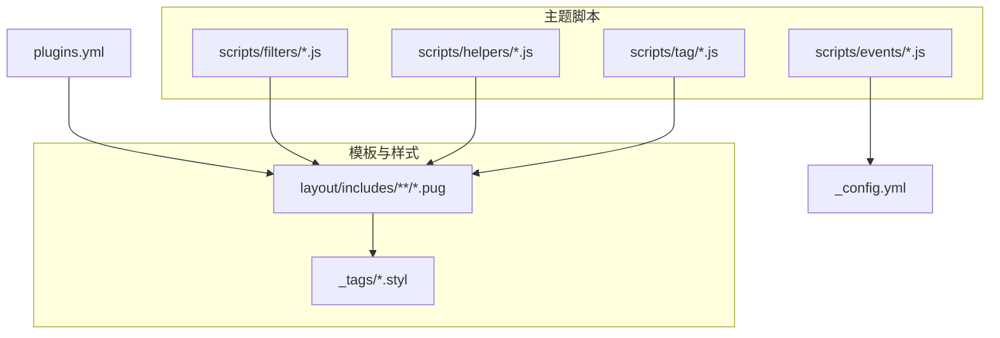
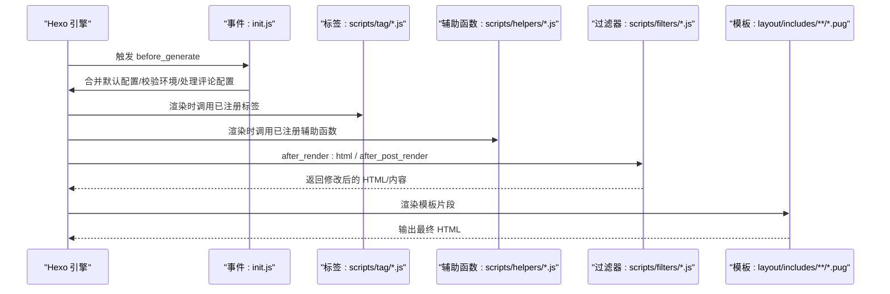
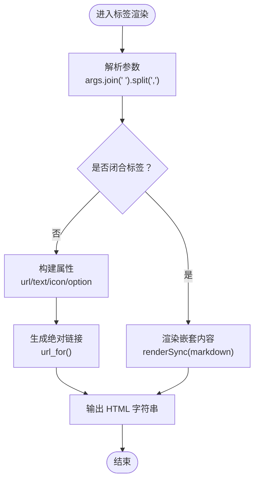
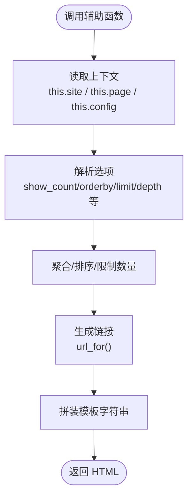
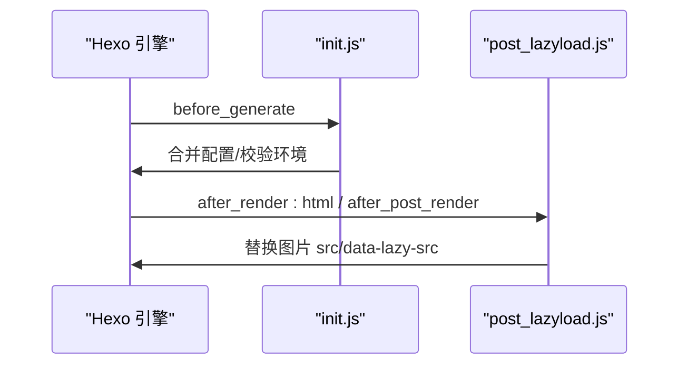
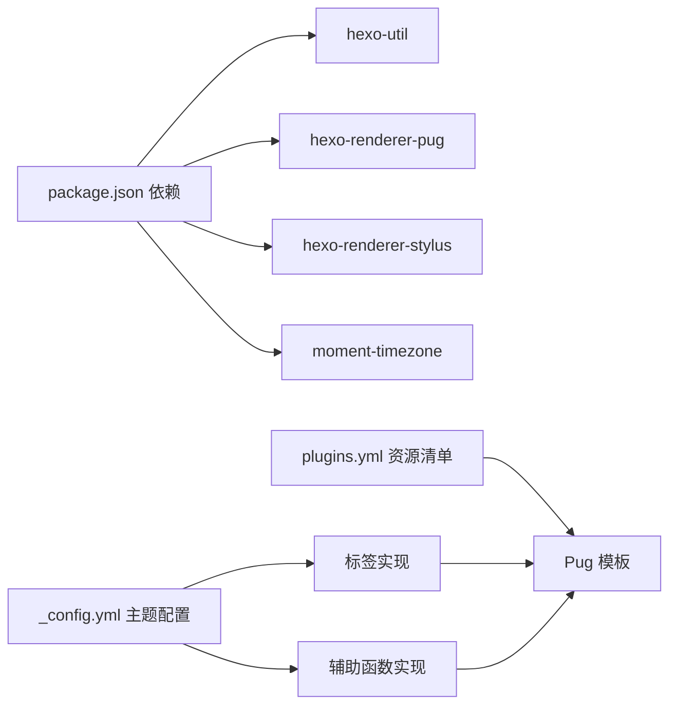

# 插件开发与扩展

<cite>
**本文引用的文件**
- [themes/butterfly/_config.yml](file://themes/butterfly/_config.yml)
- [themes/butterfly/package.json](file://themes/butterfly/package.json)
- [themes/butterfly/plugins.yml](file://themes/butterfly/plugins.yml)
- [themes/butterfly/scripts/tag/button.js](file://themes/butterfly/scripts/tag/button.js)
- [themes/butterfly/scripts/tag/tabs.js](file://themes/butterfly/scripts/tag/tabs.js)
- [themes/butterfly/scripts/tag/gallery.js](file://themes/butterfly/scripts/tag/gallery.js)
- [themes/butterfly/scripts/tag/note.js](file://themes/butterfly/scripts/tag/note.js)
- [themes/butterfly/scripts/tag/series.js](file://themes/butterfly/scripts/tag/series.js)
- [themes/butterfly/scripts/helpers/aside_categories.js](file://themes/butterfly/scripts/helpers/aside_categories.js)
- [themes/butterfly/scripts/helpers/aside_archives.js](file://themes/butterfly/scripts/helpers/aside_archives.js)
- [themes/butterfly/scripts/events/init.js](file://themes/butterfly/scripts/events/init.js)
- [themes/butterfly/scripts/filters/post_lazyload.js](file://themes/butterfly/scripts/filters/post_lazyload.js)
- [themes/butterfly/layout/includes/widget/index.pug](file://themes/butterfly/layout/includes/widget/index.pug)
- [themes/butterfly/layout/includes/mixins/indexPostUI.pug](file://themes/butterfly/layout/includes/mixins/indexPostUI.pug)
- [themes/butterfly/source/css/_tags/button.styl](file://themes/butterfly/source/css/_tags/button.styl)
- [themes/butterfly/source/css/_tags/tabs.styl](file://themes/butterfly/source/css/_tags/tabs.styl)
</cite>

## 目录
1. [简介](#简介)
2. [项目结构](#项目结构)
3. [核心组件](#核心组件)
4. [架构总览](#架构总览)
5. [组件详解](#组件详解)
6. [依赖关系分析](#依赖关系分析)
7. [性能考量](#性能考量)
8. [故障排查指南](#故障排查指南)
9. [结论](#结论)
10. [附录](#附录)

## 简介
本文件面向插件开发者，系统讲解 Butterfly 主题的扩展机制与开发流程，重点覆盖：
- 自定义标签（tag）的开发方法：按钮、标签页、图库、提示块、系列导航等
- 辅助函数（helper）的实现原理：侧栏分类、归档等
- 事件与过滤器（events/filters）的集成点：初始化校验、懒加载等
- 在 Pug 模板中的正确使用方式
- 完整开发流程：从需求分析到测试部署
- 实战示例路径与调试技巧

## 项目结构
Butterfly 主题采用“脚本 + 模板 + 样式”的分层组织：
- scripts/tag：自定义标签注册目录
- scripts/helpers：辅助函数注册目录
- scripts/events：主题生命周期事件处理
- scripts/filters：渲染前后过滤器
- layout/includes：Pug 模板片段
- source/css/_tags：对应标签的样式资源
- plugins.yml：第三方静态资源清单
- _config.yml：主题配置入口

图表来源
- [themes/butterfly/scripts/tag/button.js:1-22](file://themes/butterfly/scripts/tag/button.js#L1-L22)
- [themes/butterfly/scripts/helpers/aside_categories.js:1-101](file://themes/butterfly/scripts/helpers/aside_categories.js#L1-L101)
- [themes/butterfly/scripts/events/init.js:1-87](file://themes/butterfly/scripts/events/init.js#L1-L87)
- [themes/butterfly/scripts/filters/post_lazyload.js:1-41](file://themes/butterfly/scripts/filters/post_lazyload.js#L1-L41)
- [themes/butterfly/layout/includes/widget/index.pug:1-36](file://themes/butterfly/layout/includes/widget/index.pug#L1-L36)
- [themes/butterfly/source/css/_tags/button.styl:1-64](file://themes/butterfly/source/css/_tags/button.styl#L1-L64)
- [themes/butterfly/plugins.yml:1-208](file://themes/butterfly/plugins.yml#L1-L208)
- [themes/butterfly/_config.yml:1-1137](file://themes/butterfly/_config.yml#L1-L1137)

章节来源
- [themes/butterfly/package.json:1-35](file://themes/butterfly/package.json#L1-L35)
- [themes/butterfly/_config.yml:1-1137](file://themes/butterfly/_config.yml#L1-L1137)
- [themes/butterfly/plugins.yml:1-208](file://themes/butterfly/plugins.yml#L1-L208)

## 核心组件
- 自定义标签（Tag）
  - 注册方式：通过 hexo.extend.tag.register 将函数注册为模板指令
  - 支持单标签与闭合标签两种模式
  - 典型实现：按钮、标签页、图库、提示块、系列导航
- 辅助函数（Helper）
  - 注册方式：通过 hexo.extend.helper.register 提供可在模板中调用的工具函数
  - 典型实现：侧栏分类、侧栏归档
- 事件与过滤器（Events/Filters）
  - 生命周期钩子：before_generate、after_render:html、after_post_render
  - 典型用途：环境检查、默认配置合并、懒加载替换
- 模板与样式
  - Pug 片段组合 UI 组件
  - Stylus 样式按标签模块化管理

章节来源
- [themes/butterfly/scripts/tag/button.js:1-22](file://themes/butterfly/scripts/tag/button.js#L1-L22)
- [themes/butterfly/scripts/tag/tabs.js:1-52](file://themes/butterfly/scripts/tag/tabs.js#L1-L52)
- [themes/butterfly/scripts/tag/gallery.js:1-77](file://themes/butterfly/scripts/tag/gallery.js#L1-L77)
- [themes/butterfly/scripts/tag/note.js:1-28](file://themes/butterfly/scripts/tag/note.js#L1-L28)
- [themes/butterfly/scripts/tag/series.js:1-64](file://themes/butterfly/scripts/tag/series.js#L1-L64)
- [themes/butterfly/scripts/helpers/aside_categories.js:1-101](file://themes/butterfly/scripts/helpers/aside_categories.js#L1-L101)
- [themes/butterfly/scripts/helpers/aside_archives.js:1-114](file://themes/butterfly/scripts/helpers/aside_archives.js#L1-L114)
- [themes/butterfly/scripts/events/init.js:1-87](file://themes/butterfly/scripts/events/init.js#L1-L87)
- [themes/butterfly/scripts/filters/post_lazyload.js:1-41](file://themes/butterfly/scripts/filters/post_lazyload.js#L1-L41)

## 架构总览
Butterfly 的扩展体系围绕 Hexo 扩展点构建，形成“配置驱动 + 脚本扩展 + 模板渲染”的闭环。

图表来源
- [themes/butterfly/scripts/events/init.js:79-87](file://themes/butterfly/scripts/events/init.js#L79-L87)
- [themes/butterfly/scripts/filters/post_lazyload.js:29-41](file://themes/butterfly/scripts/filters/post_lazyload.js#L29-L41)
- [themes/butterfly/scripts/tag/button.js:21-22](file://themes/butterfly/scripts/tag/button.js#L21-L22)
- [themes/butterfly/scripts/helpers/aside_categories.js:3-101](file://themes/butterfly/scripts/helpers/aside_categories.js#L3-L101)
- [themes/butterfly/layout/includes/widget/index.pug:1-36](file://themes/butterfly/layout/includes/widget/index.pug#L1-L36)

## 组件详解

### 自定义标签（Tag）开发指南
- 注册语法
  - 单标签：ends=false
  - 闭合标签：ends=true
- 常见模式
  - 参数解析：将 args 拆分为数组，按需 trim
  - 内容渲染：对嵌套 Markdown 使用 hexo.render.renderSync
  - 链接生成：使用 hexo-util 的 url_for
  - DOM 结构：以语义化类名组织，便于样式覆盖
- 示例路径
  - 按钮标签：[scripts/tag/button.js:1-22](file://themes/butterfly/scripts/tag/button.js#L1-L22)
  - 标签页标签：[scripts/tag/tabs.js:1-52](file://themes/butterfly/scripts/tag/tabs.js#L1-L52)
  - 图库标签：[scripts/tag/gallery.js:1-77](file://themes/butterfly/scripts/tag/gallery.js#L1-L77)
  - 提示块标签：[scripts/tag/note.js:1-28](file://themes/butterfly/scripts/tag/note.js#L1-L28)
  - 系列导航标签：[scripts/tag/series.js:1-64](file://themes/butterfly/scripts/tag/series.js#L1-L64)

图表来源
- [themes/butterfly/scripts/tag/button.js:12-21](file://themes/butterfly/scripts/tag/button.js#L12-L21)
- [themes/butterfly/scripts/tag/tabs.js:9-49](file://themes/butterfly/scripts/tag/tabs.js#L9-L49)
- [themes/butterfly/scripts/tag/gallery.js:48-77](file://themes/butterfly/scripts/tag/gallery.js#L48-L77)

章节来源
- [themes/butterfly/scripts/tag/button.js:1-22](file://themes/butterfly/scripts/tag/button.js#L1-L22)
- [themes/butterfly/scripts/tag/tabs.js:1-52](file://themes/butterfly/scripts/tag/tabs.js#L1-L52)
- [themes/butterfly/scripts/tag/gallery.js:1-77](file://themes/butterfly/scripts/tag/gallery.js#L1-L77)
- [themes/butterfly/scripts/tag/note.js:1-28](file://themes/butterfly/scripts/tag/note.js#L1-L28)
- [themes/butterfly/scripts/tag/series.js:1-64](file://themes/butterfly/scripts/tag/series.js#L1-L64)

### 辅助函数（Helper）工作原理
- 注册方式：hexo.extend.helper.register('名称', function(...){})
- 数据来源：this、this.site、this.page、this.config 等上下文对象
- 常见职责：列表排序、层级构建、链接生成、本地化文本
- 示例路径
  - 侧栏分类：[scripts/helpers/aside_categories.js:1-101](file://themes/butterfly/scripts/helpers/aside_categories.js#L1-L101)
  - 侧栏归档：[scripts/helpers/aside_archives.js:1-114](file://themes/butterfly/scripts/helpers/aside_archives.js#L1-L114)

图表来源
- [themes/butterfly/scripts/helpers/aside_categories.js:3-101](file://themes/butterfly/scripts/helpers/aside_categories.js#L3-L101)
- [themes/butterfly/scripts/helpers/aside_archives.js:3-114](file://themes/butterfly/scripts/helpers/aside_archives.js#L3-L114)

章节来源
- [themes/butterfly/scripts/helpers/aside_categories.js:1-101](file://themes/butterfly/scripts/helpers/aside_categories.js#L1-L101)
- [themes/butterfly/scripts/helpers/aside_archives.js:1-114](file://themes/butterfly/scripts/helpers/aside_archives.js#L1-L114)

### 事件与过滤器（Events/Filters）
- 初始化事件
  - before_generate：校验 Hexo 版本、合并默认配置、处理评论系统冲突
  - 参考：[scripts/events/init.js:79-87](file://themes/butterfly/scripts/events/init.js#L79-L87)
- 过滤器
  - after_render:html：站点级懒加载替换
  - after_post_render：文章级懒加载替换
  - 参考：[scripts/filters/post_lazyload.js:29-41](file://themes/butterfly/scripts/filters/post_lazyload.js#L29-L41)

图表来源
- [themes/butterfly/scripts/events/init.js:79-87](file://themes/butterfly/scripts/events/init.js#L79-L87)
- [themes/butterfly/scripts/filters/post_lazyload.js:29-41](file://themes/butterfly/scripts/filters/post_lazyload.js#L29-L41)

章节来源
- [themes/butterfly/scripts/events/init.js:1-87](file://themes/butterfly/scripts/events/init.js#L1-L87)
- [themes/butterfly/scripts/filters/post_lazyload.js:1-41](file://themes/butterfly/scripts/filters/post_lazyload.js#L1-L41)

### 在 Pug 模板中使用扩展
- 调用辅助函数
  - 例如在侧边栏中调用 aside_categories、aside_archives
  - 参考：[layout/includes/widget/index.pug:1-36](file://themes/butterfly/layout/includes/widget/index.pug#L1-L36)
- 混入与片段
  - 使用 mixin 组织首页文章列表 UI
  - 参考：[layout/includes/mixins/indexPostUI.pug:1-119](file://themes/butterfly/layout/includes/mixins/indexPostUI.pug#L1-L119)
- 样式适配
  - 标签样式按模块化存放，如按钮、标签页
  - 参考：[source/css/_tags/button.styl:1-64](file://themes/butterfly/source/css/_tags/button.styl#L1-L64)、[source/css/_tags/tabs.styl:1-78](file://themes/butterfly/source/css/_tags/tabs.styl#L1-L78)

章节来源
- [themes/butterfly/layout/includes/widget/index.pug:1-36](file://themes/butterfly/layout/includes/widget/index.pug#L1-L36)
- [themes/butterfly/layout/includes/mixins/indexPostUI.pug:1-119](file://themes/butterfly/layout/includes/mixins/indexPostUI.pug#L1-L119)
- [themes/butterfly/source/css/_tags/button.styl:1-64](file://themes/butterfly/source/css/_tags/button.styl#L1-L64)
- [themes/butterfly/source/css/_tags/tabs.styl:1-78](file://themes/butterfly/source/css/_tags/tabs.styl#L1-L78)

## 依赖关系分析
- 外部依赖
  - hexo-renderer-pug、hexo-renderer-stylus、hexo-util、moment-timezone
  - 参考：[themes/butterfly/package.json:25-30](file://themes/butterfly/package.json#L25-L30)
- 第三方资源清单
  - plugins.yml 统一声明外部 JS/CSS 资源及其版本
  - 参考：[themes/butterfly/plugins.yml:1-208](file://themes/butterfly/plugins.yml#L1-L208)
- 配置与扩展
  - _config.yml 提供主题开关与行为控制，影响标签与辅助函数的行为
  - 参考：[themes/butterfly/_config.yml:1-1137](file://themes/butterfly/_config.yml#L1-L1137)

图表来源
- [themes/butterfly/package.json:25-30](file://themes/butterfly/package.json#L25-L30)
- [themes/butterfly/plugins.yml:1-208](file://themes/butterfly/plugins.yml#L1-L208)
- [themes/butterfly/_config.yml:1-1137](file://themes/butterfly/_config.yml#L1-L1137)

章节来源
- [themes/butterfly/package.json:1-35](file://themes/butterfly/package.json#L1-L35)
- [themes/butterfly/plugins.yml:1-208](file://themes/butterfly/plugins.yml#L1-L208)
- [themes/butterfly/_config.yml:1-1137](file://themes/butterfly/_config.yml#L1-L1137)

## 性能考量
- 懒加载策略
  - native 模式直接注入 loading=lazy
  - 非 native 模式替换为 data-lazy-src 并设置占位背景
  - 仅在启用且字段匹配时生效
  - 参考：[scripts/filters/post_lazyload.js:11-27](file://themes/butterfly/scripts/filters/post_lazyload.js#L11-L27)
- 渲染优化
  - 使用 renderSync 渲染嵌套 Markdown，避免重复解析
  - 对大列表进行 limit 控制，减少 DOM 节点
  - 参考：[scripts/helpers/aside_archives.js:67-69](file://themes/butterfly/scripts/helpers/aside_archives.js#L67-L69)、[scripts/helpers/aside_categories.js:16-18](file://themes/butterfly/scripts/helpers/aside_categories.js#L16-L18)
- 样式体积
  - 模块化样式按需引入，避免全局污染
  - 参考：[source/css/_tags/button.styl:1-64](file://themes/butterfly/source/css/_tags/button.styl#L1-L64)、[source/css/_tags/tabs.styl:1-78](file://themes/butterfly/source/css/_tags/tabs.styl#L1-L78)

## 故障排查指南
- 版本不兼容
  - 现象：启动时报错要求升级 Hexo 至 V5.3.0+
  - 排查：检查 Hexo 版本与日志输出
  - 参考：[scripts/events/init.js:10-32](file://themes/butterfly/scripts/events/init.js#L10-L32)
- 配置文件弃用
  - 现象：检测到旧配置文件 butterfly.yml
  - 排查：迁移至 _config.butterfly.yml
  - 参考：[scripts/events/init.js:23-32](file://themes/butterfly/scripts/events/init.js#L23-L32)
- 评论系统冲突
  - 现象：同时启用 Disqus 与 Disqusjs
  - 排查：自动保留第一个，避免重复加载
  - 参考：[scripts/events/init.js:69-77](file://themes/butterfly/scripts/events/init.js#L69-L77)
- 懒加载未生效
  - 现象：图片未延迟加载
  - 排查：确认配置项 enable 与 field 设置
  - 参考：[scripts/filters/post_lazyload.js:29-41](file://themes/butterfly/scripts/filters/post_lazyload.js#L29-L41)
- 标签页无默认激活
  - 现象：无默认激活标签页
  - 排查：检查 args 中的激活索引或内容匹配
  - 参考：[scripts/tag/tabs.js:12-40](file://themes/butterfly/scripts/tag/tabs.js#L12-L40)

章节来源
- [themes/butterfly/scripts/events/init.js:1-87](file://themes/butterfly/scripts/events/init.js#L1-L87)
- [themes/butterfly/scripts/filters/post_lazyload.js:1-41](file://themes/butterfly/scripts/filters/post_lazyload.js#L1-L41)
- [themes/butterfly/scripts/tag/tabs.js:1-52](file://themes/butterfly/scripts/tag/tabs.js#L1-L52)

## 结论
Butterfly 的扩展体系以 Hexo 扩展点为核心，通过标签、辅助函数、事件与过滤器实现强大的功能定制能力。开发者可遵循现有模式快速实现新组件，并结合 Pug 模板与 Stylus 样式完成端到端交付。建议在开发过程中关注配置驱动、性能优化与兼容性校验，确保扩展稳定可靠。

## 附录

### 开发流程（从需求到上线）
- 需求分析
  - 明确交互与数据来源（如需要列表、链接、Markdown 内容）
- 设计标签/辅助函数
  - 选择注册类型（tag/helper），设计参数与返回结构
  - 参考现有实现：[scripts/tag/button.js:1-22](file://themes/butterfly/scripts/tag/button.js#L1-L22)、[scripts/helpers/aside_categories.js:1-101](file://themes/butterfly/scripts/helpers/aside_categories.js#L1-L101)
- 编写实现
  - 使用 url_for 生成链接，必要时使用 renderSync 渲染 Markdown
  - 参考：[scripts/tag/tabs.js:29-39](file://themes/butterfly/scripts/tag/tabs.js#L29-L39)
- 模板集成
  - 在 Pug 中调用辅助函数或在文章中使用标签
  - 参考：[layout/includes/widget/index.pug:1-36](file://themes/butterfly/layout/includes/widget/index.pug#L1-L36)
- 样式适配
  - 在 _tags 下新增样式文件，保持命名一致
  - 参考：[source/css/_tags/button.styl:1-64](file://themes/butterfly/source/css/_tags/button.styl#L1-L64)
- 测试验证
  - 本地预览，检查不同配置下的表现
  - 关注懒加载、多语言、评论系统等边界场景
- 部署与回滚
  - 更新 plugins.yml（如引入第三方资源）
  - 参考：[themes/butterfly/plugins.yml:1-208](file://themes/butterfly/plugins.yml#L1-L208)

### 最佳实践
- 参数健壮性：对缺失参数提供默认值
- 链接安全：统一使用 url_for 生成绝对链接
- 内容安全：对用户输入进行最小必要转义
- 性能优先：避免在模板中做重型计算，尽量在脚本阶段完成
- 样式隔离：使用语义化类名，避免全局污染
- 文档与注释：为复杂逻辑添加注释，便于后续维护