# 自定义标签开发

<cite>
**本文引用的文件**
- [button.js](file://themes/butterfly/scripts/tag/button.js)
- [tabs.js](file://themes/butterfly/scripts/tag/tabs.js)
- [gallery.js](file://themes/butterfly/scripts/tag/gallery.js)
- [note.js](file://themes/butterfly/scripts/tag/note.js)
- [mermaid.js](file://themes/butterfly/scripts/tag/mermaid.js)
- [timeline.js](file://themes/butterfly/scripts/tag/timeline.js)
- [chartjs.js](file://themes/butterfly/scripts/tag/chartjs.js)
- [flink.js](file://themes/butterfly/scripts/tag/flink.js)
- [hide.js](file://themes/butterfly/scripts/tag/hide.js)
- [inlineImg.js](file://themes/butterfly/scripts/tag/inlineImg.js)
- [label.js](file://themes/butterfly/scripts/tag/label.js)
- [score.js](file://themes/butterfly/scripts/tag/score.js)
- [_config.yml（主题）](file://themes/butterfly/_config.yml)
- [_config.butterfly.yml（站点）](file://_config.butterfly.yml)
</cite>

## 目录
1. [简介](#简介)
2. [项目结构](#项目结构)
3. [核心组件](#核心组件)
4. [架构总览](#架构总览)
5. [组件详解](#组件详解)
6. [依赖关系分析](#依赖关系分析)
7. [性能考量](#性能考量)
8. [故障排查指南](#故障排查指南)
9. [结论](#结论)
10. [附录：开发流程与最佳实践](#附录开发流程与最佳实践)

## 简介
本文件面向希望在 Hexo 中开发自定义标签的工程师与内容作者，系统梳理了标签注册、参数解析、渲染管线与样式集成等关键环节，并结合 Butterfly 主题中的 button、tabs、gallery、note、mermaid、timeline 等标签实现进行深入剖析。文档同时给出可复用的开发流程、参数校验与错误处理建议、性能优化策略以及调试技巧，帮助你快速构建高质量的自定义标签组件。

## 项目结构
Hexo 的标签扩展位于主题的 scripts/tag 目录下，每个标签是一个独立的 JavaScript 文件，通过注册函数向 Hexo 注册一个或多个标签名。标签文件通常包含：
- 参数解析与默认值设置
- 内容渲染（必要时调用 Markdown 渲染器）
- HTML 结构拼装与样式类名注入
- 可选的工具函数与正则匹配
- 在主题配置中启用相关功能（如 mermaid、chartjs）

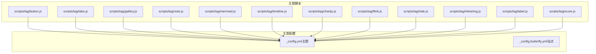

图表来源
- [button.js:1-22](file://themes/butterfly/scripts/tag/button.js#L1-L22)
- [tabs.js:1-52](file://themes/butterfly/scripts/tag/tabs.js#L1-L52)
- [gallery.js:1-77](file://themes/butterfly/scripts/tag/gallery.js#L1-L77)
- [note.js:1-28](file://themes/butterfly/scripts/tag/note.js#L1-L28)
- [mermaid.js:1-19](file://themes/butterfly/scripts/tag/mermaid.js#L1-L19)
- [timeline.js:1-51](file://themes/butterfly/scripts/tag/timeline.js#L1-L51)
- [chartjs.js:1-50](file://themes/butterfly/scripts/tag/chartjs.js#L1-L50)
- [flink.js:1-35](file://themes/butterfly/scripts/tag/flink.js#L1-L35)
- [hide.js:1-53](file://themes/butterfly/scripts/tag/hide.js#L1-L53)
- [inlineImg.js:1-20](file://themes/butterfly/scripts/tag/inlineImg.js#L1-L20)
- [label.js:1-15](file://themes/butterfly/scripts/tag/label.js#L1-L15)
- [score.js:1-51](file://themes/butterfly/scripts/tag/score.js#L1-L51)
- [_config.yml（主题）:600-626](file://themes/butterfly/_config.yml#L600-L626)
- [_config.butterfly.yml（站点）:600-626](file://_config.butterfly.yml#L600-L626)

章节来源
- [button.js:1-22](file://themes/butterfly/scripts/tag/button.js#L1-L22)
- [tabs.js:1-52](file://themes/butterfly/scripts/tag/tabs.js#L1-L52)
- [gallery.js:1-77](file://themes/butterfly/scripts/tag/gallery.js#L1-L77)
- [note.js:1-28](file://themes/butterfly/scripts/tag/note.js#L1-L28)
- [mermaid.js:1-19](file://themes/butterfly/scripts/tag/mermaid.js#L1-L19)
- [timeline.js:1-51](file://themes/butterfly/scripts/tag/timeline.js#L1-L51)
- [chartjs.js:1-50](file://themes/butterfly/scripts/tag/chartjs.js#L1-L50)
- [flink.js:1-35](file://themes/butterfly/scripts/tag/flink.js#L1-L35)
- [hide.js:1-53](file://themes/butterfly/scripts/tag/hide.js#L1-L53)
- [inlineImg.js:1-20](file://themes/butterfly/scripts/tag/inlineImg.js#L1-L20)
- [label.js:1-15](file://themes/butterfly/scripts/tag/label.js#L1-L15)
- [score.js:1-51](file://themes/butterfly/scripts/tag/score.js#L1-L51)
- [_config.yml（主题）:600-626](file://themes/butterfly/_config.yml#L600-L626)
- [_config.butterfly.yml（站点）:600-626](file://_config.butterfly.yml#L600-L626)

## 核心组件
- 标签注册
  - 所有标签均通过 hexo.extend.tag.register(...) 注册，支持单标签与结束标签两种模式（ends: true/false）。
  - 单标签：仅接收参数，不处理子内容；结束标签：接收 args 与 content，常用于包裹式容器。
- 参数处理
  - 将传入的 args 数组合并为字符串后按逗号拆分，再进行 trim 与默认值填充。
  - 对于需要多段内容的标签，使用正则匹配块级内容（如 tabs、timeline、chartjs）。
- 渲染逻辑
  - 使用 hexo.render.renderSync 将 Markdown 内容渲染为 HTML。
  - 使用 hexo-util 的 url_for 对资源路径进行规范化。
  - 对用户输入进行必要的 HTML 转义，避免 XSS。
- 样式与数据属性
  - 通过 class 名与 data-* 属性传递配置，便于前端 JS 或样式读取。

章节来源
- [button.js:10-21](file://themes/butterfly/scripts/tag/button.js#L10-L21)
- [tabs.js:9-49](file://themes/butterfly/scripts/tag/tabs.js#L9-L49)
- [gallery.js:18-59](file://themes/butterfly/scripts/tag/gallery.js#L18-L59)
- [note.js:9-27](file://themes/butterfly/scripts/tag/note.js#L9-L27)
- [mermaid.js:9-18](file://themes/butterfly/scripts/tag/mermaid.js#L9-L18)
- [timeline.js:16-50](file://themes/butterfly/scripts/tag/timeline.js#L16-L50)
- [chartjs.js:17-49](file://themes/butterfly/scripts/tag/chartjs.js#L17-L49)
- [flink.js:9-34](file://themes/butterfly/scripts/tag/flink.js#L9-L34)
- [hide.js:19-52](file://themes/butterfly/scripts/tag/hide.js#L19-L52)
- [inlineImg.js:11-19](file://themes/butterfly/scripts/tag/inlineImg.js#L11-L19)
- [label.js:9-14](file://themes/butterfly/scripts/tag/label.js#L9-L14)
- [score.js:8-50](file://themes/butterfly/scripts/tag/score.js#L8-L50)

## 架构总览
下图展示了标签从“语法解析”到“HTML 输出”的整体流程，以及与主题配置的关系。

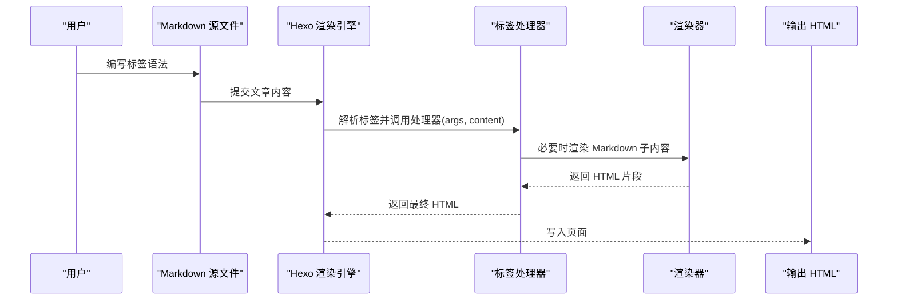

图表来源
- [tabs.js:9-49](file://themes/butterfly/scripts/tag/tabs.js#L9-L49)
- [note.js:9-27](file://themes/butterfly/scripts/tag/note.js#L9-L27)
- [timeline.js:16-50](file://themes/butterfly/scripts/tag/timeline.js#L16-L50)
- [chartjs.js:17-49](file://themes/butterfly/scripts/tag/chartjs.js#L17-L49)
- [flink.js:9-34](file://themes/butterfly/scripts/tag/flink.js#L9-L34)
- [hide.js:19-52](file://themes/butterfly/scripts/tag/hide.js#L19-L52)
- [gallery.js:18-59](file://themes/butterfly/scripts/tag/gallery.js#L18-L59)
- [mermaid.js:9-18](file://themes/butterfly/scripts/tag/mermaid.js#L9-L18)
- [button.js:10-21](file://themes/butterfly/scripts/tag/button.js#L10-L21)
- [inlineImg.js:11-19](file://themes/butterfly/scripts/tag/inlineImg.js#L11-L19)
- [label.js:9-14](file://themes/butterfly/scripts/tag/label.js#L9-L14)
- [score.js:8-50](file://themes/butterfly/scripts/tag/score.js#L8-L50)

## 组件详解

### 按钮标签（button）
- 功能：生成带图标与样式的按钮链接。
- 参数解析：将 args 合并后按逗号拆分，得到 url、text、icon、option。
- 渲染：使用 url_for 规范化链接，拼装 a 标签并注入选项类名。
- 典型用法：

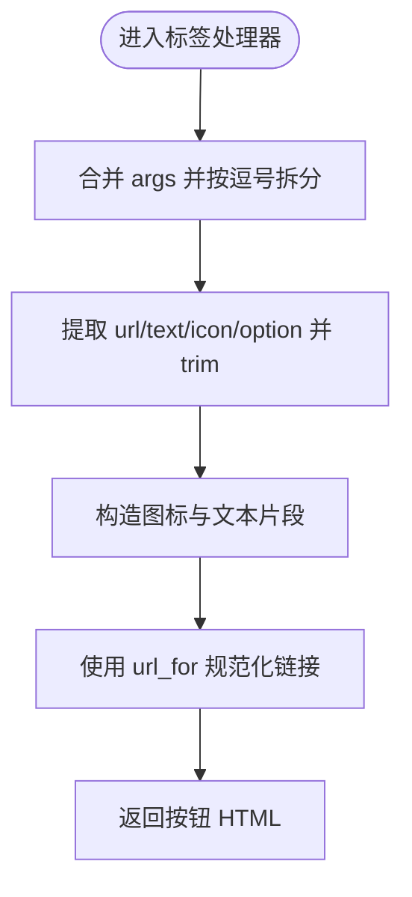

图表来源
- [button.js:12-19](file://themes/butterfly/scripts/tag/button.js#L12-L19)

章节来源
- [button.js:1-22](file://themes/butterfly/scripts/tag/button.js#L1-L22)

### 标签页（tabs）与子标签（subtabs/subsubtabs）
- 功能：将内容分割为多个标签页，支持图标与默认激活项。
- 参数解析：args 合并后拆分为 tabName 与 tabActive。
- 内容解析：使用正则匹配 <!-- tab ... --> ... <!-- endtab --> 块，逐个渲染为 Markdown。
- 渲染：生成导航按钮与内容面板，支持“回到顶部”按钮。
- 典型用法：<!-- tab icon@标题 -->...<!-- endtab -->

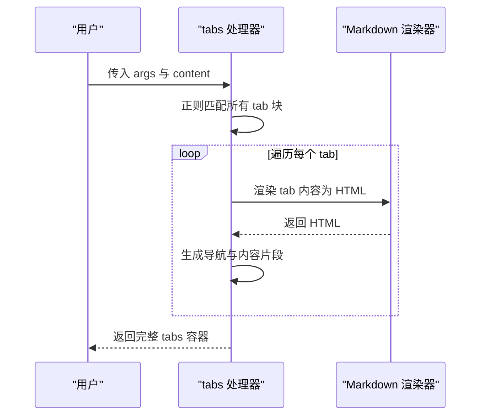

图表来源
- [tabs.js:9-49](file://themes/butterfly/scripts/tag/tabs.js#L9-L49)

章节来源
- [tabs.js:1-52](file://themes/butterfly/scripts/tag/tabs.js#L1-L52)

### 图库（gallery/galleryGroup）
- 功能：展示图片集合，支持 URL 模式与内容内图片解析。
- 参数解析：区分 url 模式与内容模式；默认分页参数与按钮开关。
- 内容解析：使用正则提取 Markdown 图片信息，或直接使用 url_for 规范化链接。
- 渲染：通过 data-* 属性传递配置，前端据此加载与分页。
- 典型用法： 或 

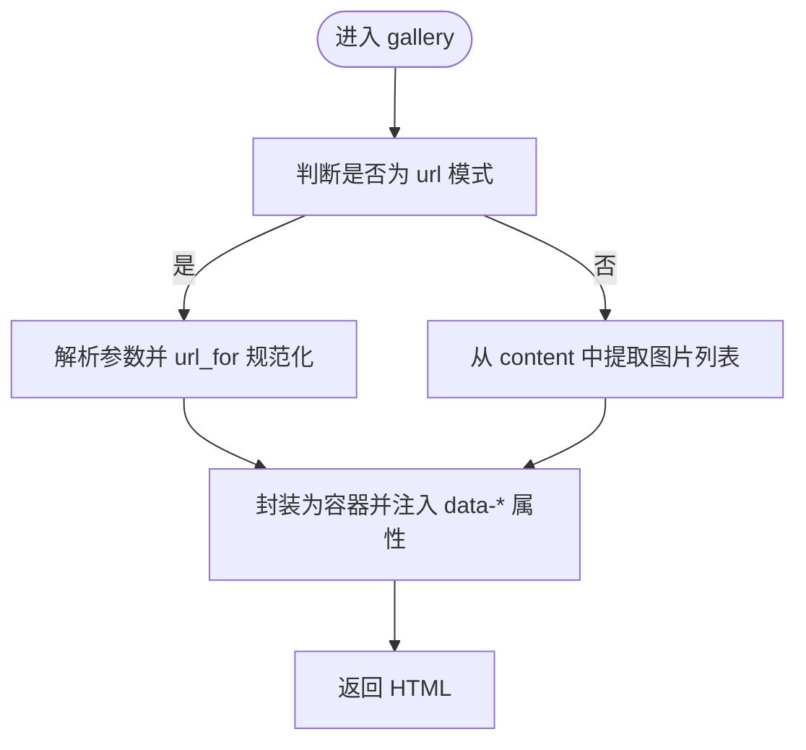

图表来源
- [gallery.js:48-76](file://themes/butterfly/scripts/tag/gallery.js#L48-L76)

章节来源
- [gallery.js:1-77](file://themes/butterfly/scripts/tag/gallery.js#L1-L77)

### 提示框（note/subnote）
- 功能：根据主题配置选择样式风格，支持图标与 Markdown 内容。
- 参数解析：若末尾参数不在允许列表，则追加主题配置中的默认风格。
- 渲染：将内容渲染为 HTML 并包裹在指定样式类的 div 中。
- 典型用法：内容

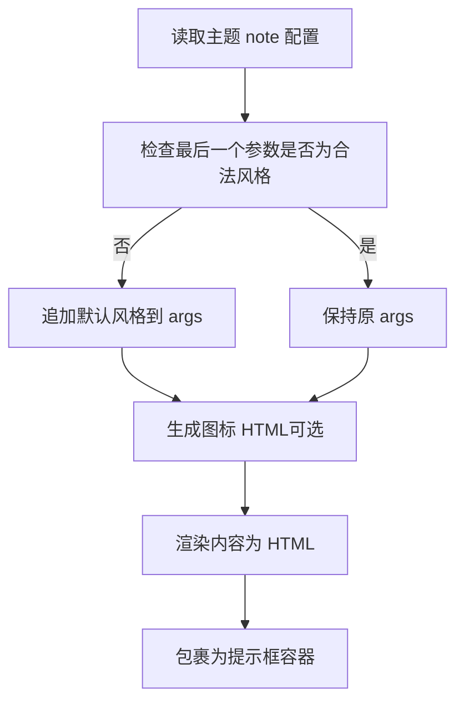

图表来源
- [note.js:9-27](file://themes/butterfly/scripts/tag/note.js#L9-L27)

章节来源
- [note.js:1-28](file://themes/butterfly/scripts/tag/note.js#L1-L28)

### 流程图（mermaid）
- 功能：将 mermaid 代码以受控方式注入页面，供前端初始化渲染。
- 参数解析：第一个参数作为配置 JSON 字符串。
- 渲染：对配置与源码进行 HTML 转义，放入隐藏的 pre 标签，配合 data-config。
- 典型用法：mermaid 源码

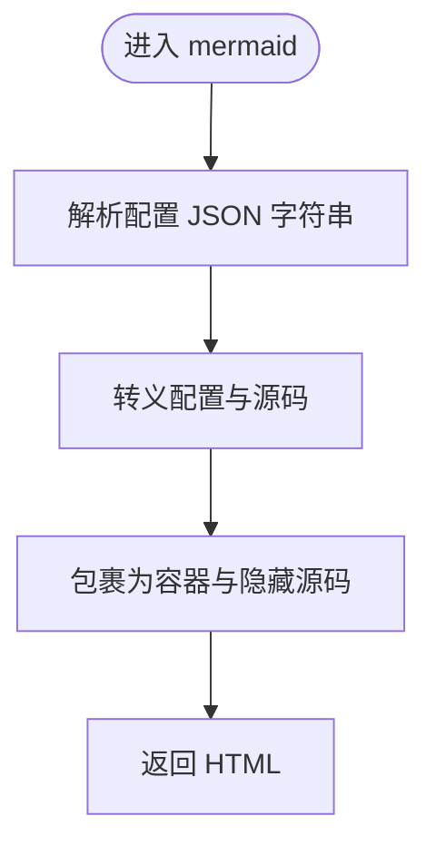

图表来源
- [mermaid.js:11-18](file://themes/butterfly/scripts/tag/mermaid.js#L11-L18)

章节来源
- [mermaid.js:1-19](file://themes/butterfly/scripts/tag/mermaid.js#L1-L19)

### 时间线（timeline）
- 功能：将多个时间条目组织为时间轴，支持标题与颜色。
- 参数解析：以逗号分隔 headline 与 color。
- 内容解析：使用命名捕获组匹配 <!-- timeline ... --> ... <!-- endtimeline -->。
- 渲染：将每个条目渲染为 Markdown，并拼接为完整时间轴。
- 典型用法：<!-- timeline 标题 -->内容<!-- endtimeline -->

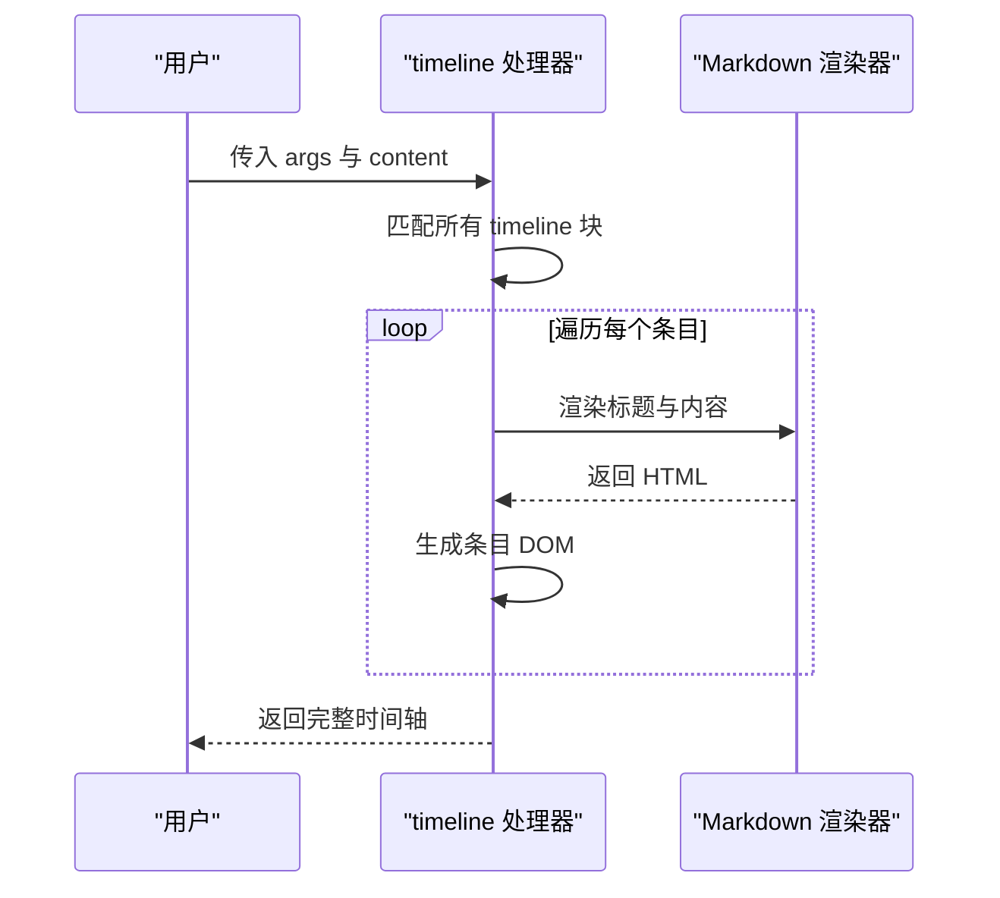

图表来源
- [timeline.js:16-50](file://themes/butterfly/scripts/tag/timeline.js#L16-L50)

章节来源
- [timeline.js:1-51](file://themes/butterfly/scripts/tag/timeline.js#L1-L51)

### 图表（chartjs）
- 功能：在页面中嵌入 Chart.js 配置与描述，支持横向排列与宽度控制。
- 参数解析：selfConfig 按逗号拆分为 width、layout、chartId。
- 内容解析：使用 <!-- chart --> 与 <!-- desc --> 块分别提取配置与说明。
- 错误处理：若缺少 chart 块，记录警告并返回空。
- 典型用法：<!-- chart -->...<!-- endchart -->[<!-- desc -->...<!-- enddesc -->]

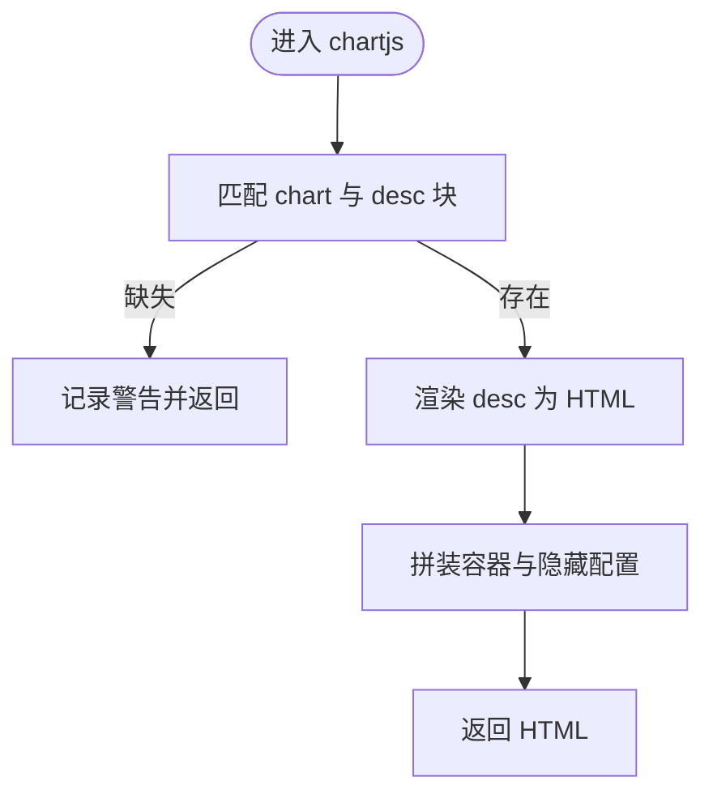

图表来源
- [chartjs.js:17-49](file://themes/butterfly/scripts/tag/chartjs.js#L17-L49)

章节来源
- [chartjs.js:1-50](file://themes/butterfly/scripts/tag/chartjs.js#L1-L50)

### 友情链接（flink）
- 功能：将 YAML 格式的数据渲染为链接卡片列表。
- 数据解析：使用 YAML 渲染器解析 content，遍历 class_name/class_desc/link_list。
- 渲染：为每条链接生成卡片，头像加载失败时回退至主题配置的错误图。
- 典型用法：YAML 数据

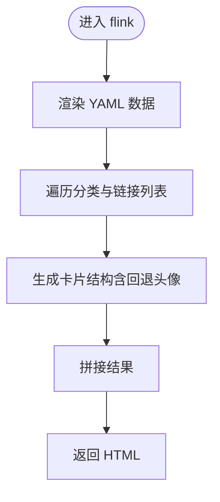

图表来源
- [flink.js:9-34](file://themes/butterfly/scripts/tag/flink.js#L9-L34)

章节来源
- [flink.js:1-35](file://themes/butterfly/scripts/tag/flink.js#L1-L35)

### 隐藏内容（hideInline/hideBlock/hideToggle）
- 功能：提供多种交互方式展示隐藏内容，支持背景色与文字颜色。
- 参数解析：统一按逗号拆分，支持 display、bg、color。
- 渲染：hideBlock/hideToggle 会渲染子内容为 Markdown；toggle 使用 details/summary。
- 典型用法： 或 ...

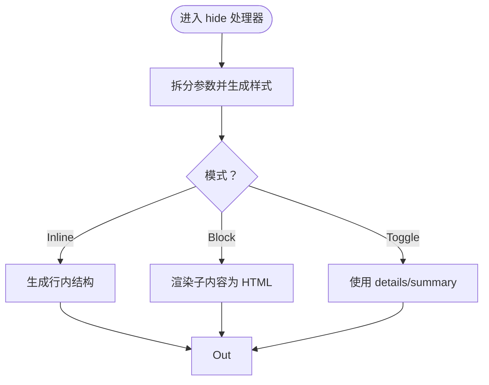

图表来源
- [hide.js:29-52](file://themes/butterfly/scripts/tag/hide.js#L29-L52)

章节来源
- [hide.js:1-53](file://themes/butterfly/scripts/tag/hide.js#L1-L53)

### 行内图片（inlineImg）
- 功能：插入指定高度的行内图片，自动 url_for 规范化。
- 参数解析：img 与可选 height。
- 典型用法：

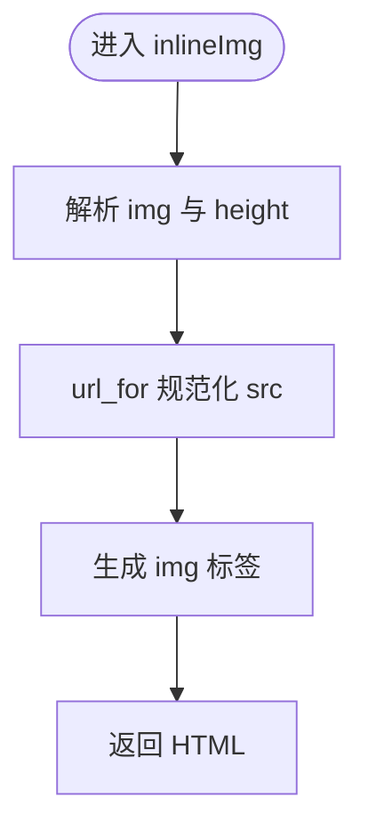

图表来源
- [inlineImg.js:13-17](file://themes/butterfly/scripts/tag/inlineImg.js#L13-L17)

章节来源
- [inlineImg.js:1-20](file://themes/butterfly/scripts/tag/inlineImg.js#L1-L20)

### 高亮标签（label）
- 功能：生成带样式的高亮标记。
- 参数解析：text 与可选 className。
- 典型用法：

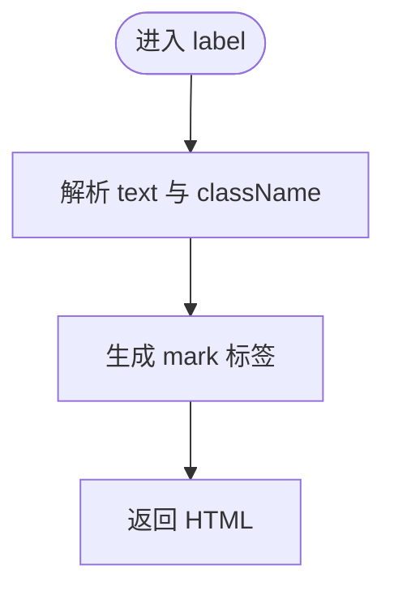

图表来源
- [label.js:9-12](file://themes/butterfly/scripts/tag/label.js#L9-L12)

章节来源
- [label.js:1-15](file://themes/butterfly/scripts/tag/label.js#L1-L15)

### 乐谱（score）
- 功能：解析 ABC 格式的乐谱，支持参数块与内容块分离。
- 参数解析：以六道短横线分隔参数与内容；参数需为合法 JSON。
- 渲染：对参数与内容进行 HTML 转义，放入容器与 data-params。
- 典型用法：参数 JSON------内容------

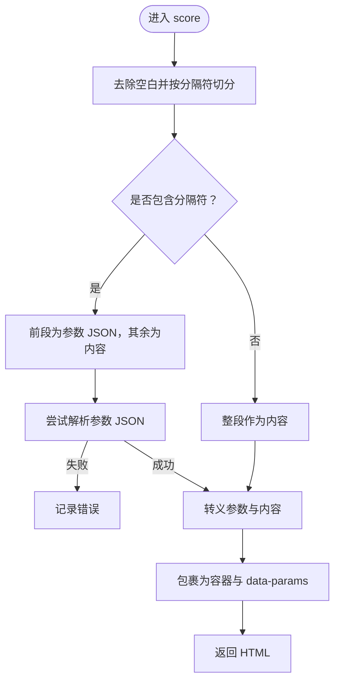

图表来源
- [score.js:8-50](file://themes/butterfly/scripts/tag/score.js#L8-L50)

章节来源
- [score.js:1-51](file://themes/butterfly/scripts/tag/score.js#L1-L51)

## 依赖关系分析
- 标签间无直接耦合，均通过 Hexo 的标签注册机制独立工作。
- 共同依赖：
  - hexo.extend.tag.register：注册标签
  - hexo.render.renderSync：渲染 Markdown 子内容
  - hexo-util.url_for：资源路径规范化
  - hexo-util.escapeHTML：HTML 转义（mermaid、chartjs、score）
- 主题配置影响：
  - note.style、mermaid.*、chartjs.* 等在主题配置中开启与定制。
  - flink 错误图回退路径来自主题配置。

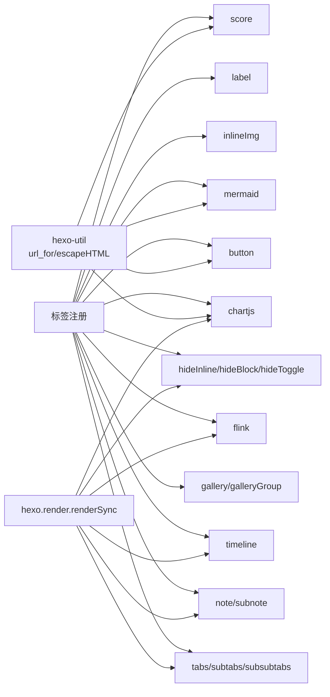

图表来源
- [button.js:10](file://themes/butterfly/scripts/tag/button.js#L10)
- [tabs.js:29](file://themes/butterfly/scripts/tag/tabs.js#L29)
- [note.js:23](file://themes/butterfly/scripts/tag/note.js#L23)
- [mermaid.js:9](file://themes/butterfly/scripts/tag/mermaid.js#L9)
- [timeline.js:21](file://themes/butterfly/scripts/tag/timeline.js#L21)
- [chartjs.js:15](file://themes/butterfly/scripts/tag/chartjs.js#L15)
- [flink.js:10](file://themes/butterfly/scripts/tag/flink.js#L10)
- [hide.js:38](file://themes/butterfly/scripts/tag/hide.js#L38)
- [inlineImg.js:11](file://themes/butterfly/scripts/tag/inlineImg.js#L11)
- [label.js:9](file://themes/butterfly/scripts/tag/label.js#L9)
- [score.js:9](file://themes/butterfly/scripts/tag/score.js#L9)

章节来源
- [button.js:10](file://themes/butterfly/scripts/tag/button.js#L10)
- [tabs.js:29](file://themes/butterfly/scripts/tag/tabs.js#L29)
- [note.js:23](file://themes/butterfly/scripts/tag/note.js#L23)
- [mermaid.js:9](file://themes/butterfly/scripts/tag/mermaid.js#L9)
- [timeline.js:21](file://themes/butterfly/scripts/tag/timeline.js#L21)
- [chartjs.js:15](file://themes/butterfly/scripts/tag/chartjs.js#L15)
- [flink.js:10](file://themes/butterfly/scripts/tag/flink.js#L10)
- [hide.js:38](file://themes/butterfly/scripts/tag/hide.js#L38)
- [inlineImg.js:11](file://themes/butterfly/scripts/tag/inlineImg.js#L11)
- [label.js:9](file://themes/butterfly/scripts/tag/label.js#L9)
- [score.js:9](file://themes/butterfly/scripts/tag/score.js#L9)

## 性能考量
- 减少重复渲染
  - 对于需要多次渲染的内容（如 tabs、timeline），尽量一次性渲染并缓存中间结果，避免在循环中重复调用渲染器。
- 正则匹配优化
  - 使用预编译正则（如 timeline 中的命名捕获组）减少重复编译开销。
- 数据序列化
  - gallery 与 score 在注入 data-* 时进行 JSON 序列化与转义，注意避免大对象频繁 stringify。
- 资源路径
  - 统一使用 url_for 规范化静态资源路径，减少无效请求与 404。
- 日志与告警
  - chartjs 在缺失必要块时记录警告，有助于快速定位问题，避免产生空容器导致的额外 DOM。

## 故障排查指南
- 标签未生效
  - 检查标签是否正确注册（ends: true/false 是否与语法匹配）。
  - 确认主题配置中相关功能已启用（如 mermaid、chartjs）。
- 内容未渲染为 HTML
  - 确保使用了 renderSync 并指定了正确的引擎（如 markdown）。
- 图片或资源路径异常
  - 使用 url_for 规范化路径，确认静态资源存在于 source 目录或 CDN 配置正确。
- 配置 JSON 解析失败
  - score 标签对参数 JSON 进行 try/catch，检查参数块是否为合法 JSON。
- chartjs 缺少必要块
  - 若未提供 chart 块，将记录警告并返回空；请检查标签语法与块内容。

章节来源
- [score.js:37-41](file://themes/butterfly/scripts/tag/score.js#L37-L41)
- [chartjs.js:29-32](file://themes/butterfly/scripts/tag/chartjs.js#L29-L32)

## 结论
通过分析 Butterfly 主题中的标签实现，可以总结出一套通用的自定义标签开发范式：清晰的参数解析、稳健的内容渲染、合理的错误处理与性能优化。遵循本文提供的流程与最佳实践，你可以快速实现高质量的 Hexo 自定义标签，并与主题配置无缝衔接。

## 附录：开发流程与最佳实践
- 开发流程
  - 明确标签语义与语法（单标签/结束标签）
  - 设计参数规范与默认值
  - 实现参数解析与内容渲染（必要时）
  - 生成 HTML 并注入样式类与 data-* 属性
  - 编写样式与前端逻辑（如需）
  - 在主题配置中启用并测试
- 参数验证与错误处理
  - 对必填参数进行存在性检查与类型校验
  - 对用户输入进行 HTML 转义，防止 XSS
  - 对 JSON/正则等进行 try/catch 包裹
  - 记录日志或返回空，避免破坏页面
- 性能优化
  - 避免在循环中重复渲染
  - 预编译正则表达式
  - 控制 data-* 数据体积
  - 使用 url_for 规范化资源路径
- 调试技巧
  - 在本地站点中逐步验证标签语法
  - 利用浏览器开发者工具检查生成的 HTML 与 data-* 属性
  - 查看 Hexo 日志，关注标签处理过程中的警告与错误