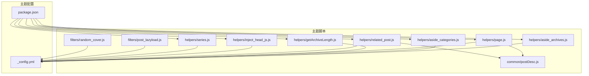
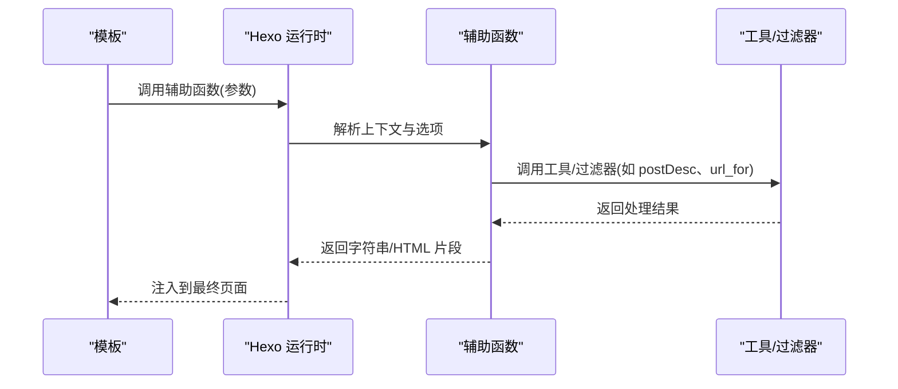
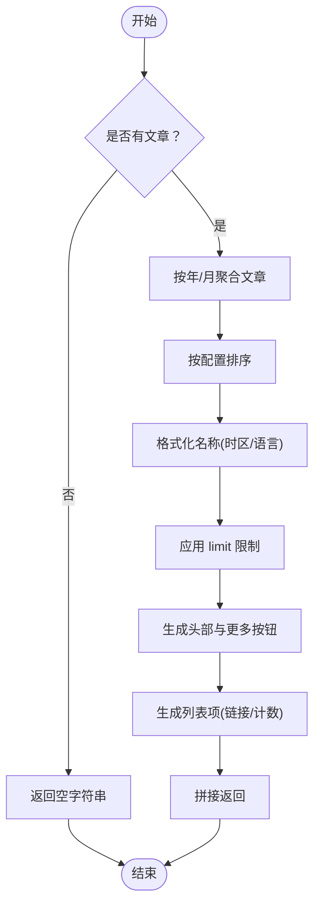
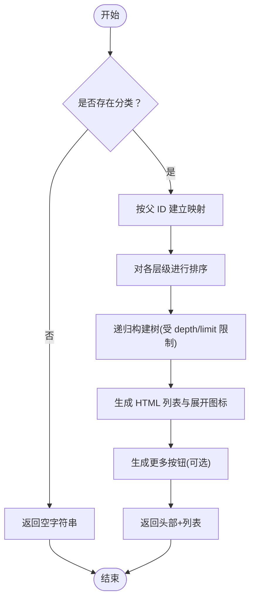
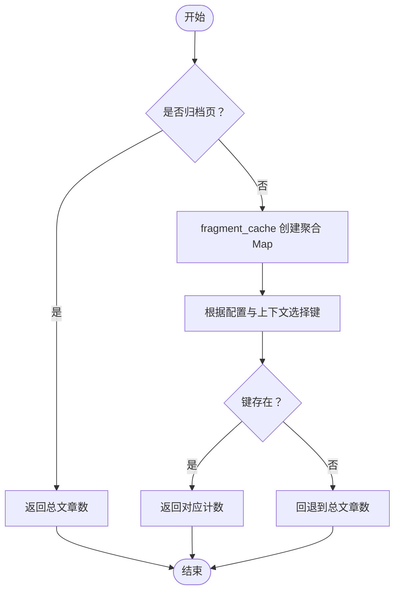
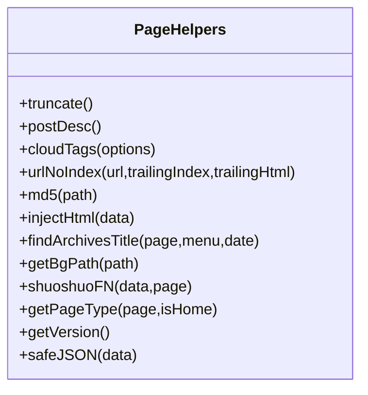
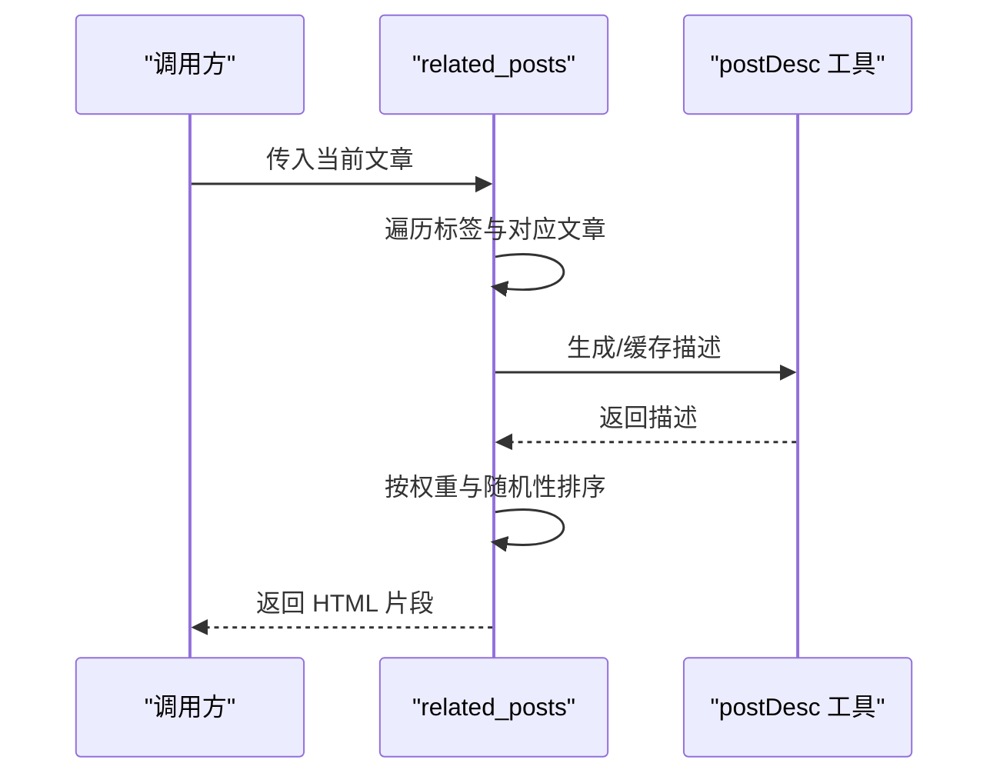
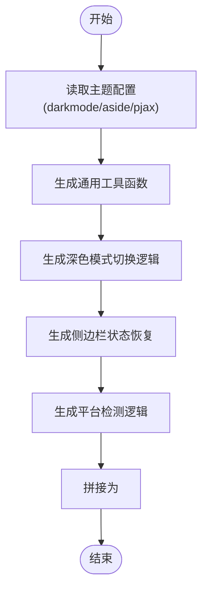
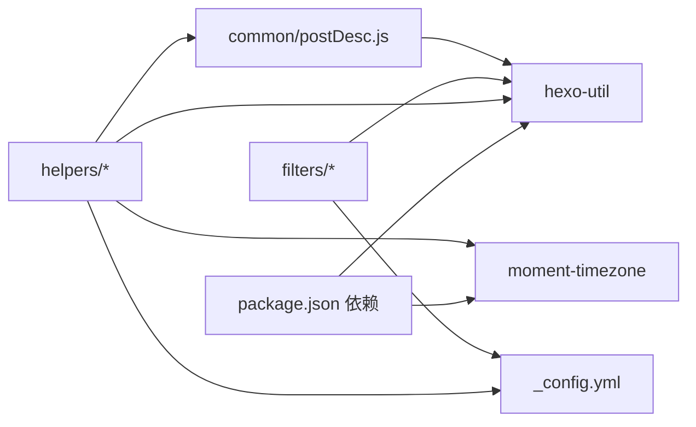

# 辅助函数实现

<cite>
**本文引用的文件**
- [themes/butterfly/scripts/helpers/aside_archives.js](file://themes/butterfly/scripts/helpers/aside_archives.js)
- [themes/butterfly/scripts/helpers/aside_categories.js](file://themes/butterfly/scripts/helpers/aside_categories.js)
- [themes/butterfly/scripts/helpers/getArchiveLength.js](file://themes/butterfly/scripts/helpers/getArchiveLength.js)
- [themes/butterfly/scripts/helpers/page.js](file://themes/butterfly/scripts/helpers/page.js)
- [themes/butterfly/scripts/helpers/related_post.js](file://themes/butterfly/scripts/helpers/related_post.js)
- [themes/butterfly/scripts/helpers/inject_head_js.js](file://themes/butterfly/scripts/helpers/inject_head_js.js)
- [themes/butterfly/scripts/helpers/series.js](file://themes/butterfly/scripts/helpers/series.js)
- [themes/butterfly/scripts/common/postDesc.js](file://themes/butterfly/scripts/common/postDesc.js)
- [themes/butterfly/scripts/filters/post_lazyload.js](file://themes/butterfly/scripts/filters/post_lazyload.js)
- [themes/butterfly/scripts/filters/random_cover.js](file://themes/butterfly/scripts/filters/random_cover.js)
- [themes/butterfly/_config.yml](file://themes/butterfly/_config.yml)
- [themes/butterfly/package.json](file://themes/butterfly/package.json)
</cite>

## 目录
1. [引言](#引言)
2. [项目结构](#项目结构)
3. [核心组件](#核心组件)
4. [架构总览](#架构总览)
5. [详细组件分析](#详细组件分析)
6. [依赖关系分析](#依赖关系分析)
7. [性能考量](#性能考量)
8. [故障排查指南](#故障排查指南)
9. [结论](#结论)
10. [附录](#附录)

## 引言
本技术指南围绕 Hexo Butterfly 主题中的辅助函数（Helpers）展开，系统讲解其在数据聚合、页面渲染与内容过滤方面的职责与实现原理，并以 aside_archives、aside_categories、getArchiveLength 等函数为例，剖析设计模式与最佳实践。文档同时提供开发框架、参数与返回值约定、错误处理策略、性能优化技巧以及可复用的实现范式，帮助开发者高效构建高质量的辅助函数。

## 项目结构
Hexo 的辅助函数集中于主题目录下的 scripts/helpers 子目录，配合 scripts/common、scripts/filters 以及主题配置文件 _config.yml 使用。下图展示与辅助函数相关的关键模块及其交互关系：

图表来源
- [themes/butterfly/scripts/helpers/aside_archives.js:1-114](file://themes/butterfly/scripts/helpers/aside_archives.js#L1-L114)
- [themes/butterfly/scripts/helpers/aside_categories.js:1-101](file://themes/butterfly/scripts/helpers/aside_categories.js#L1-L101)
- [themes/butterfly/scripts/helpers/getArchiveLength.js:1-47](file://themes/butterfly/scripts/helpers/getArchiveLength.js#L1-L47)
- [themes/butterfly/scripts/helpers/page.js:1-194](file://themes/butterfly/scripts/helpers/page.js#L1-L194)
- [themes/butterfly/scripts/helpers/related_post.js:1-92](file://themes/butterfly/scripts/helpers/related_post.js#L1-L92)
- [themes/butterfly/scripts/helpers/inject_head_js.js:1-156](file://themes/butterfly/scripts/helpers/inject_head_js.js#L1-L156)
- [themes/butterfly/scripts/helpers/series.js:1-23](file://themes/butterfly/scripts/helpers/series.js#L1-L23)
- [themes/butterfly/scripts/common/postDesc.js:1-38](file://themes/butterfly/scripts/common/postDesc.js#L1-L38)
- [themes/butterfly/scripts/filters/post_lazyload.js:1-41](file://themes/butterfly/scripts/filters/post_lazyload.js#L1-L41)
- [themes/butterfly/scripts/filters/random_cover.js:1-91](file://themes/butterfly/scripts/filters/random_cover.js#L1-L91)
- [themes/butterfly/_config.yml:1-1137](file://themes/butterfly/_config.yml#L1-L1137)
- [themes/butterfly/package.json:1-35](file://themes/butterfly/package.json#L1-L35)

章节来源
- [themes/butterfly/scripts/helpers/aside_archives.js:1-114](file://themes/butterfly/scripts/helpers/aside_archives.js#L1-L114)
- [themes/butterfly/scripts/helpers/aside_categories.js:1-101](file://themes/butterfly/scripts/helpers/aside_categories.js#L1-L101)
- [themes/butterfly/scripts/helpers/getArchiveLength.js:1-47](file://themes/butterfly/scripts/helpers/getArchiveLength.js#L1-L47)
- [themes/butterfly/scripts/helpers/page.js:1-194](file://themes/butterfly/scripts/helpers/page.js#L1-L194)
- [themes/butterfly/scripts/helpers/related_post.js:1-92](file://themes/butterfly/scripts/helpers/related_post.js#L1-L92)
- [themes/butterfly/scripts/helpers/inject_head_js.js:1-156](file://themes/butterfly/scripts/helpers/inject_head_js.js#L1-L156)
- [themes/butterfly/scripts/helpers/series.js:1-23](file://themes/butterfly/scripts/helpers/series.js#L1-L23)
- [themes/butterfly/scripts/common/postDesc.js:1-38](file://themes/butterfly/scripts/common/postDesc.js#L1-L38)
- [themes/butterfly/scripts/filters/post_lazyload.js:1-41](file://themes/butterfly/scripts/filters/post_lazyload.js#L1-L41)
- [themes/butterfly/scripts/filters/random_cover.js:1-91](file://themes/butterfly/scripts/filters/random_cover.js#L1-L91)
- [themes/butterfly/_config.yml:1-1137](file://themes/butterfly/_config.yml#L1-L1137)
- [themes/butterfly/package.json:1-35](file://themes/butterfly/package.json#L1-L35)

## 核心组件
本节聚焦于与“数据处理、页面渲染、内容过滤”直接相关的辅助函数，说明其职责边界与典型调用方式。

- aside_archives：按年/月维度聚合文章，生成侧边栏归档列表，支持格式化、排序、计数与链接生成。
- aside_categories：递归构建分类树，支持层级限制、排序、展开/折叠与计数显示。
- getArchiveLength：根据当前页上下文与站点归档配置，计算指定周期的文章数量。
- page.js 中的多个助手：截断摘要、生成标签云、URL 规范化、MD5、注入 HTML、查找归档标题、背景样式解析、说说内容处理、页面类型判定、版本信息、安全 JSON 输出等。
- related_post：基于标签权重推荐相关文章，支持随机打散与描述生成。
- inject_head_js：动态注入客户端工具函数、深色模式切换与侧边栏状态恢复等初始化脚本。
- series：按系列分组文章，支持按日期或标题排序。
- postDesc：统一生成首页摘要，支持多种策略与缓存。
- filters：post_lazyload 与 random_cover 展示了内容过滤与生成器的扩展点。

章节来源
- [themes/butterfly/scripts/helpers/aside_archives.js:1-114](file://themes/butterfly/scripts/helpers/aside_archives.js#L1-L114)
- [themes/butterfly/scripts/helpers/aside_categories.js:1-101](file://themes/butterfly/scripts/helpers/aside_categories.js#L1-L101)
- [themes/butterfly/scripts/helpers/getArchiveLength.js:1-47](file://themes/butterfly/scripts/helpers/getArchiveLength.js#L1-L47)
- [themes/butterfly/scripts/helpers/page.js:1-194](file://themes/butterfly/scripts/helpers/page.js#L1-L194)
- [themes/butterfly/scripts/helpers/related_post.js:1-92](file://themes/butterfly/scripts/helpers/related_post.js#L1-L92)
- [themes/butterfly/scripts/helpers/inject_head_js.js:1-156](file://themes/butterfly/scripts/helpers/inject_head_js.js#L1-L156)
- [themes/butterfly/scripts/helpers/series.js:1-23](file://themes/butterfly/scripts/helpers/series.js#L1-L23)
- [themes/butterfly/scripts/common/postDesc.js:1-38](file://themes/butterfly/scripts/common/postDesc.js#L1-L38)
- [themes/butterfly/scripts/filters/post_lazyload.js:1-41](file://themes/butterfly/scripts/filters/post_lazyload.js#L1-L41)
- [themes/butterfly/scripts/filters/random_cover.js:1-91](file://themes/butterfly/scripts/filters/random_cover.js#L1-L91)

## 架构总览
辅助函数通过 Hexo 的扩展机制注册，运行时可访问 this 上下文（包含 config、site、page、url_for、_p 等），并在模板中以同名函数形式调用。整体流程如下：

图表来源
- [themes/butterfly/scripts/helpers/page.js:1-194](file://themes/butterfly/scripts/helpers/page.js#L1-L194)
- [themes/butterfly/scripts/helpers/related_post.js:1-92](file://themes/butterfly/scripts/helpers/related_post.js#L1-L92)
- [themes/butterfly/scripts/helpers/aside_archives.js:1-114](file://themes/butterfly/scripts/helpers/aside_archives.js#L1-L114)
- [themes/butterfly/scripts/helpers/aside_categories.js:1-101](file://themes/butterfly/scripts/helpers/aside_categories.js#L1-L101)
- [themes/butterfly/scripts/common/postDesc.js:1-38](file://themes/butterfly/scripts/common/postDesc.js#L1-L38)
- [themes/butterfly/scripts/filters/post_lazyload.js:1-41](file://themes/butterfly/scripts/filters/post_lazyload.js#L1-L41)

## 详细组件分析

### aside_archives：按年/月聚合归档
- 数据聚合：遍历站点文章，按年/月键聚合，统计每期文章数。
- 排序与格式化：支持升/降序，按语言与时区格式化名称。
- 限制与分页：支持 limit 限制输出条目，并提供“更多”按钮链接。
- 链接生成：根据 archive_dir 与年/月生成归档链接。
- 可扩展性：transform 回调允许对显示名称进行二次加工。

图表来源
- [themes/butterfly/scripts/helpers/aside_archives.js:1-114](file://themes/butterfly/scripts/helpers/aside_archives.js#L1-L114)

章节来源
- [themes/butterfly/scripts/helpers/aside_archives.js:1-114](file://themes/butterfly/scripts/helpers/aside_archives.js#L1-L114)

### aside_categories：分类树构建与渲染
- 分类映射：将分类按父 ID 组织为树形结构。
- 排序策略：支持按 name/length 等字段与升/降序排序。
- 展开控制：顶层可选展开/折叠，支持 expand 参数。
- 限制输出：支持 limit 控制根节点输出数量。
- 链接与计数：生成分类链接与文章计数。

图表来源
- [themes/butterfly/scripts/helpers/aside_categories.js:1-101](file://themes/butterfly/scripts/helpers/aside_categories.js#L1-L101)

章节来源
- [themes/butterfly/scripts/helpers/aside_categories.js:1-101](file://themes/butterfly/scripts/helpers/aside_categories.js#L1-L101)

### getArchiveLength：按上下文计算归档数量
- 上下文判断：若当前为归档页则返回总文章数；否则根据 yearly/monthly/daily 生成键。
- 缓存策略：使用 fragment_cache 缓存聚合 Map，避免重复计算。
- 键选择：依据 year/month/day 与配置决定键值。
- 容错回退：未命中键时回退到总文章数。

图表来源
- [themes/butterfly/scripts/helpers/getArchiveLength.js:1-47](file://themes/butterfly/scripts/helpers/getArchiveLength.js#L1-L47)

章节来源
- [themes/butterfly/scripts/helpers/getArchiveLength.js:1-47](file://themes/butterfly/scripts/helpers/getArchiveLength.js#L1-L47)

### page.js：页面级辅助函数集合
- 截断摘要与描述：统一入口，支持加密内容保护。
- 标签云：按标签长度分布线性映射字号，支持自定义颜色与排序。
- URL 处理：规范化 URL，去除 trailing index/html。
- MD5：对资源路径生成哈希，便于缓存与去重。
- 注入 HTML：将数组拼接为字符串。
- 归档标题：根据年/月与菜单匹配生成标题。
- 背景路径：根据输入自动识别颜色/图片/背景样式。
- 说说处理：时间转换、Markdown 渲染、限制策略。
- 页面类型：综合 page 与 type 字段推断布局类型。
- 版本信息：返回 Hexo 与主题版本。
- 安全 JSON：转义特殊字符，防止 XSS。

图表来源
- [themes/butterfly/scripts/helpers/page.js:1-194](file://themes/butterfly/scripts/helpers/page.js#L1-L194)

章节来源
- [themes/butterfly/scripts/helpers/page.js:1-194](file://themes/butterfly/scripts/helpers/page.js#L1-L194)

### related_post：基于标签的关联文章推荐
- 权重计算：标签交集越多权重越高，相同权重随机打散。
- 描述生成：优先使用已缓存 postDesc，否则调用工具生成。
- 限制与展示：按配置限制数量，支持创建/更新时间显示。

图表来源
- [themes/butterfly/scripts/helpers/related_post.js:1-92](file://themes/butterfly/scripts/helpers/related_post.js#L1-L92)
- [themes/butterfly/scripts/common/postDesc.js:1-38](file://themes/butterfly/scripts/common/postDesc.js#L1-L38)

章节来源
- [themes/butterfly/scripts/helpers/related_post.js:1-92](file://themes/butterfly/scripts/helpers/related_post.js#L1-L92)
- [themes/butterfly/scripts/common/postDesc.js:1-38](file://themes/butterfly/scripts/common/postDesc.js#L1-L38)

### inject_head_js：客户端初始化脚本注入
- 功能拆分：独立生成通用工具函数、深色模式切换、侧边栏状态、平台检测等片段。
- 条件注入：根据主题配置开关与 PJAX 支持情况动态启用。
- 本地存储：封装 TTL 的本地存储读写，用于持久化用户偏好。

图表来源
- [themes/butterfly/scripts/helpers/inject_head_js.js:1-156](file://themes/butterfly/scripts/helpers/inject_head_js.js#L1-L156)

章节来源
- [themes/butterfly/scripts/helpers/inject_head_js.js:1-156](file://themes/butterfly/scripts/helpers/inject_head_js.js#L1-L156)

### series：文章按系列分组
- 分组策略：按 series 字段分组，支持按日期或标题排序。
- 配置来源：从主题配置读取排序规则。

章节来源
- [themes/butterfly/scripts/helpers/series.js:1-23](file://themes/butterfly/scripts/helpers/series.js#L1-L23)

### filters：内容过滤与生成器扩展
- post_lazyload：在渲染后替换图片 src 为懒加载属性，支持原生 lazy 与占位图。
- random_cover：为文章随机分配封面，支持历史避免与路径补全。

章节来源
- [themes/butterfly/scripts/filters/post_lazyload.js:1-41](file://themes/butterfly/scripts/filters/post_lazyload.js#L1-L41)
- [themes/butterfly/scripts/filters/random_cover.js:1-91](file://themes/butterfly/scripts/filters/random_cover.js#L1-L91)

## 依赖关系分析
- 运行时依赖：helpers 通过 hexo-util、moment-timezone 等库完成 URL 规范化与时间处理。
- 主题配置：大量行为由 _config.yml 控制，如 aside 显示项、卡片参数、懒加载策略等。
- 工具复用：postDesc 在多个辅助函数中被复用，统一摘要生成策略。
- 扩展点：filters 提供全局 HTML 与单篇文章内容的后处理能力。

图表来源
- [themes/butterfly/package.json:1-35](file://themes/butterfly/package.json#L1-L35)
- [themes/butterfly/scripts/helpers/page.js:1-194](file://themes/butterfly/scripts/helpers/page.js#L1-L194)
- [themes/butterfly/scripts/common/postDesc.js:1-38](file://themes/butterfly/scripts/common/postDesc.js#L1-L38)
- [themes/butterfly/_config.yml:1-1137](file://themes/butterfly/_config.yml#L1-L1137)

章节来源
- [themes/butterfly/package.json:1-35](file://themes/butterfly/package.json#L1-L35)
- [themes/butterfly/_config.yml:1-1137](file://themes/butterfly/_config.yml#L1-L1137)

## 性能考量
- 缓存优先：getArchiveLength 使用 fragment_cache 缓存聚合 Map，避免重复遍历。
- 惰性计算：仅在需要时生成描述（postDesc），减少不必要的文本处理。
- 合理限制：aside_categories 与 aside_archives 的 limit 有效控制 DOM 体积。
- 模板拼接：使用 map/join 生成列表，减少字符串拼接成本。
- 过滤时机：lazyload 在合适阶段执行，避免对所有内容重复扫描。
- 本地存储：inject_head_js 的 TTL 本地存储减少重复计算与网络请求。

## 故障排查指南
- 归档计数异常
  - 现象：归档页显示数量不正确。
  - 排查：确认 archive_generator 配置与当前页 year/month/day 是否匹配；检查 fragment_cache 是否被意外清空。
  - 参考
    - [getArchiveLength.js:1-47](file://themes/butterfly/scripts/helpers/getArchiveLength.js#L1-L47)
    - [_config.yml:1-1137](file://themes/butterfly/_config.yml#L1-L1137)
- 分类树不显示或顺序异常
  - 现象：分类层级缺失或排序不符合预期。
  - 排查：检查 depth、orderby、order、limit 等参数；确认分类父子关系与路径。
  - 参考
    - [aside_categories.js:1-101](file://themes/butterfly/scripts/helpers/aside_categories.js#L1-L101)
    - [_config.yml:1-1137](file://themes/butterfly/_config.yml#L1-L1137)
- 摘要为空或加密内容
  - 现象：首页摘要为空。
  - 排查：确认 index_post_content.method 与 length；加密文章将被跳过。
  - 参考
    - [postDesc.js:1-38](file://themes/butterfly/scripts/common/postDesc.js#L1-L38)
    - [_config.yml:1-1137](file://themes/butterfly/_config.yml#L1-L1137)
- 图片懒加载无效
  - 现象：图片未启用懒加载。
  - 排查：确认 lazyload.enable 与 field 设置；检查 HTML 内容是否被提前修改。
  - 参考
    - [post_lazyload.js:1-41](file://themes/butterfly/scripts/filters/post_lazyload.js#L1-L41)
    - [_config.yml:1-1137](file://themes/butterfly/_config.yml#L1-L1137)
- 客户端脚本未生效
  - 现象：深色模式或侧边栏状态未按预期。
  - 排查：确认主题配置开关与 PJAX 支持；检查 localStorage 是否被清理。
  - 参考
    - [inject_head_js.js:1-156](file://themes/butterfly/scripts/helpers/inject_head_js.js#L1-L156)
    - [_config.yml:1-1137](file://themes/butterfly/_config.yml#L1-L1137)

章节来源
- [themes/butterfly/scripts/helpers/getArchiveLength.js:1-47](file://themes/butterfly/scripts/helpers/getArchiveLength.js#L1-L47)
- [themes/butterfly/scripts/helpers/aside_categories.js:1-101](file://themes/butterfly/scripts/helpers/aside_categories.js#L1-L101)
- [themes/butterfly/scripts/common/postDesc.js:1-38](file://themes/butterfly/scripts/common/postDesc.js#L1-L38)
- [themes/butterfly/scripts/filters/post_lazyload.js:1-41](file://themes/butterfly/scripts/filters/post_lazyload.js#L1-L41)
- [themes/butterfly/scripts/helpers/inject_head_js.js:1-156](file://themes/butterfly/scripts/helpers/inject_head_js.js#L1-L156)
- [themes/butterfly/_config.yml:1-1137](file://themes/butterfly/_config.yml#L1-L1137)

## 结论
Butterfly 主题的辅助函数围绕“可配置、可缓存、可扩展”的原则设计，既保证了渲染性能，又提供了强大的内容组织与展示能力。通过统一的上下文访问、工具复用与配置驱动，开发者可以快速实现新的辅助函数，并在不影响整体架构的前提下进行功能增强。

## 附录

### 开发框架与最佳实践
- 参数传递
  - 使用解构默认值接收 options，确保健壮性。
  - 对可选参数进行显式存在性检查与类型转换。
- 返回值处理
  - 尽量返回字符串或 HTML 片段，便于模板直接使用。
  - 对空数据及时返回空字符串，避免渲染异常。
- 错误处理
  - 对外部输入（如路径、颜色、日期）进行正则或格式校验。
  - 对异步/外部依赖（如本地存储）做好兜底。
- 性能优化
  - 使用 Map/Reduce/Sort 等原生方法，避免嵌套循环。
  - 合理使用缓存（如 fragment_cache）与惰性计算。
  - 控制输出规模（limit、slice）与模板拼接成本（map/join）。
- 可维护性
  - 将复杂逻辑拆分为小函数，保持单一职责。
  - 通过主题配置控制行为，减少硬编码。
  - 为关键流程添加注释与边界条件说明。

### 实际开发示例（步骤指引）
- 示例：实现一个“按标签统计文章数量”的侧边栏组件
  - 步骤
    - 注册辅助函数，接收 options。
    - 从 this.site.tags 获取标签数据。
    - 使用 Map 聚合每个标签的文章数，支持 limit 与排序。
    - 生成链接与计数的 HTML 片段。
    - 通过主题配置控制显示项与样式。
  - 参考
    - [aside_archives.js:1-114](file://themes/butterfly/scripts/helpers/aside_archives.js#L1-L114)
    - [aside_categories.js:1-101](file://themes/butterfly/scripts/helpers/aside_categories.js#L1-L101)
    - [_config.yml:1-1137](file://themes/butterfly/_config.yml#L1-L1137)