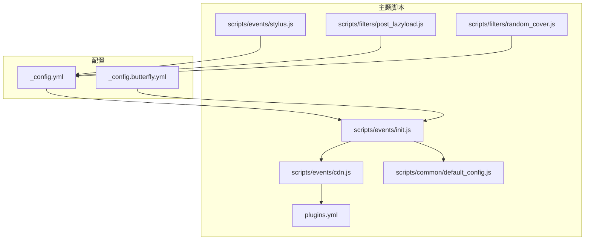
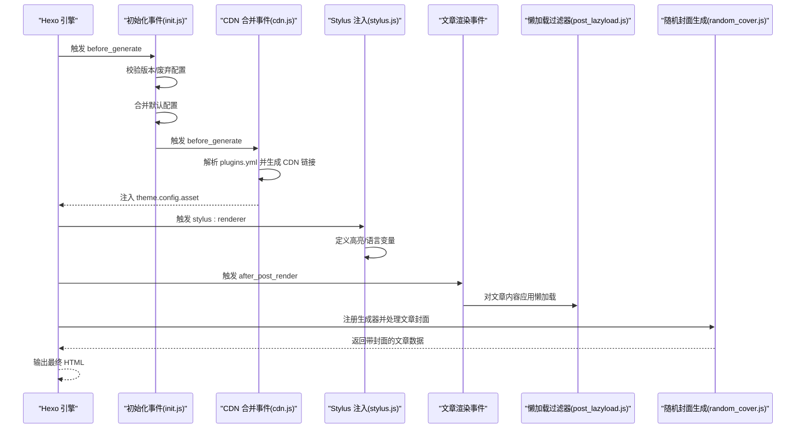
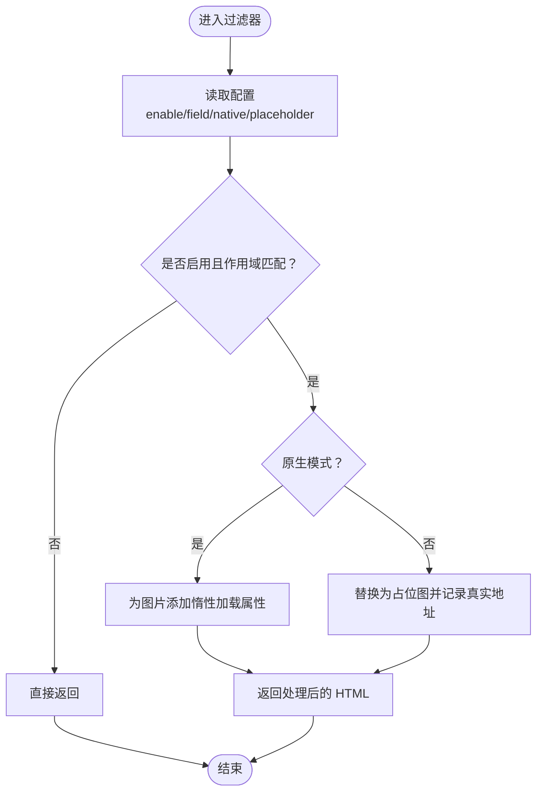
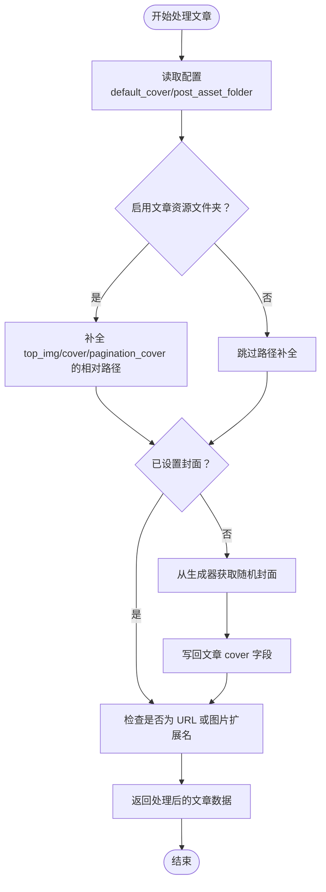
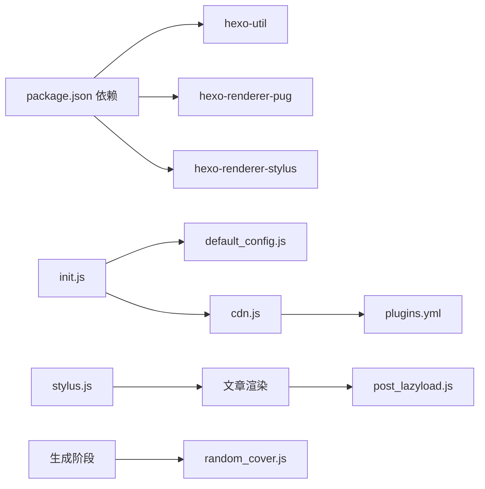

# 过滤器系统

<cite>
**本文引用的文件**
- [post_lazyload.js](file://themes/butterfly/scripts/filters/post_lazyload.js)
- [random_cover.js](file://themes/butterfly/scripts/filters/random_cover.js)
- [_config.butterfly.yml](file://_config.butterfly.yml)
- [_config.yml](file://_config.yml)
- [default_config.js](file://themes/butterfly/scripts/common/default_config.js)
- [cdn.js](file://themes/butterfly/scripts/events/cdn.js)
- [stylus.js](file://themes/butterfly/scripts/events/stylus.js)
- [init.js](file://themes/butterfly/scripts/events/init.js)
- [plugins.yml](file://themes/butterfly/plugins.yml)
- [package.json](file://themes/butterfly/package.json)
</cite>

## 目录
1. [简介](#简介)
2. [项目结构](#项目结构)
3. [核心组件](#核心组件)
4. [架构总览](#架构总览)
5. [组件详解](#组件详解)
6. [依赖关系分析](#依赖关系分析)
7. [性能考量](#性能考量)
8. [故障排查指南](#故障排查指南)
9. [结论](#结论)
10. [附录](#附录)

## 简介
本文件面向希望在 Hexo 生态中深度定制内容与资源处理的开发者，系统性阐述过滤器（Filter）的工作原理与实践方法，并结合 Butterfly 主题中的实现案例，重点解析以下能力：
- 内容过滤：在渲染后对 HTML 进行二次处理，实现图片懒加载、占位图替换等。
- 资源处理：在生成前合并与注入 CDN 资源链接，统一前端资源来源。
- 页面改写：在生成阶段为文章数据注入随机封面、路径补全等逻辑。
- 开发流程：从注册过滤器、编写处理函数、到性能优化与调试的完整闭环。

通过本指南，读者可以掌握如何基于 Hexo 的过滤器钩子扩展主题能力，构建可维护、高性能的内容与资源处理流水线。

## 项目结构
围绕过滤器与资源处理的关键目录与文件如下：
- scripts/filters：存放内容与页面级别的过滤器实现
- scripts/events：存放生成前事件与环境初始化逻辑
- scripts/common：存放默认配置等通用模块
- themes/butterfly/_config.yml 与 _config.butterfly.yml：主题与全局配置入口
- plugins.yml：第三方库清单，供 CDN 合并使用
- package.json：主题依赖声明

图表来源
- [post_lazyload.js:1-41](file://themes/butterfly/scripts/filters/post_lazyload.js#L1-L41)
- [random_cover.js:1-91](file://themes/butterfly/scripts/filters/random_cover.js#L1-L91)
- [init.js:1-87](file://themes/butterfly/scripts/events/init.js#L1-L87)
- [cdn.js:1-96](file://themes/butterfly/scripts/events/cdn.js#L1-L96)
- [stylus.js:1-25](file://themes/butterfly/scripts/events/stylus.js#L1-L25)
- [default_config.js:1-602](file://themes/butterfly/scripts/common/default_config.js#L1-L602)
- [_config.yml:120-173](file://_config.yml#L120-L173)
- [_config.butterfly.yml:491-690](file://_config.butterfly.yml#L491-L690)
- [plugins.yml:1-208](file://themes/butterfly/plugins.yml#L1-L208)

章节来源
- [post_lazyload.js:1-41](file://themes/butterfly/scripts/filters/post_lazyload.js#L1-L41)
- [random_cover.js:1-91](file://themes/butterfly/scripts/filters/random_cover.js#L1-L91)
- [init.js:1-87](file://themes/butterfly/scripts/events/init.js#L1-L87)
- [cdn.js:1-96](file://themes/butterfly/scripts/events/cdn.js#L1-L96)
- [stylus.js:1-25](file://themes/butterfly/scripts/events/stylus.js#L1-L25)
- [default_config.js:1-602](file://themes/butterfly/scripts/common/default_config.js#L1-L602)
- [_config.yml:120-173](file://_config.yml#L120-L173)
- [_config.butterfly.yml:491-690](file://_config.butterfly.yml#L491-L690)
- [plugins.yml:1-208](file://themes/butterfly/plugins.yml#L1-L208)

## 核心组件
- 图片懒加载过滤器（post_lazyload）
  - 在 HTML 渲染后或文章渲染后，对图片标签进行替换与属性注入，支持原生 lazy 与自定义占位图策略。
- 随机封面生成器（random_cover）
  - 在生成阶段为未设置封面的文章注入随机封面，同时处理资源路径补全与类型判定。
- 初始化与配置合并（init）
  - 检查 Hexo 版本与废弃配置，合并默认配置与用户配置，预处理评论系统等。
- CDN 资源合并（cdn）
  - 将内置与第三方资源映射为不同 CDN 提供商的链接，支持本地、jsDelivr、unpkg、cdnjs 与自定义格式。
- Stylus 渲染器注入（stylus）
  - 将高亮开关与语言等变量注入 Stylus 渲染上下文，影响样式编译结果。
- 默认配置（default_config）
  - 提供主题所有可配置项的默认值，作为配置合并的基础。

章节来源
- [post_lazyload.js:11-40](file://themes/butterfly/scripts/filters/post_lazyload.js#L11-L40)
- [random_cover.js:75-90](file://themes/butterfly/scripts/filters/random_cover.js#L75-L90)
- [init.js:79-86](file://themes/butterfly/scripts/events/init.js#L79-L86)
- [cdn.js:11-95](file://themes/butterfly/scripts/events/cdn.js#L11-L95)
- [stylus.js:7-24](file://themes/butterfly/scripts/events/stylus.js#L7-L24)
- [default_config.js:1-602](file://themes/butterfly/scripts/common/default_config.js#L1-L602)

## 架构总览
下图展示了从配置读取、事件触发到过滤器执行与最终输出的整体流程。

图表来源
- [init.js:79-86](file://themes/butterfly/scripts/events/init.js#L79-L86)
- [cdn.js:11-95](file://themes/butterfly/scripts/events/cdn.js#L11-L95)
- [stylus.js:7-24](file://themes/butterfly/scripts/events/stylus.js#L7-L24)
- [post_lazyload.js:29-40](file://themes/butterfly/scripts/filters/post_lazyload.js#L29-L40)
- [random_cover.js:75-90](file://themes/butterfly/scripts/filters/random_cover.js#L75-L90)

## 组件详解

### 图片懒加载过滤器（post_lazyload）
- 功能概述
  - 支持两种模式：
    - 原生模式：为图片添加惰性加载属性。
    - 自定义占位图模式：将 src 替换为占位图，并记录真实地址到 data-lazy-src，便于前端懒加载库接管。
  - 过滤时机：
    - HTML 渲染后：适用于站点级图片统一处理。
    - 文章渲染后：适用于按文章内容逐条处理。
- 关键点
  - 条件判断：根据主题配置决定启用与作用域（站点/文章）。
  - 正则替换：精准匹配图片标签，避免误伤脚本内的 src；支持带引号与无引号的多种写法。
  - 占位图：可使用自定义占位图或内嵌 Base64。
- 性能建议
  - 原生模式更轻量；自定义占位图模式需注意占位图体积与首屏体验。
  - 控制替换范围，避免对非图片内容产生多余处理。

图表来源
- [post_lazyload.js:11-40](file://themes/butterfly/scripts/filters/post_lazyload.js#L11-L40)

章节来源
- [post_lazyload.js:11-40](file://themes/butterfly/scripts/filters/post_lazyload.js#L11-L40)
- [_config.butterfly.yml:646-651](file://_config.butterfly.yml#L646-L651)
- [_config.yml:128-132](file://_config.yml#L128-L132)

### 随机封面生成器（random_cover）
- 功能概述
  - 为未设置封面的文章随机分配默认封面，避免列表页封面缺失。
  - 处理资源路径补全：当启用文章资源文件夹时，自动拼接相对路径。
  - 类型判定：根据 URL 或扩展名判断封面类型（图片）。
- 核心算法
  - 生成器：维护一个循环队列，确保随机序列不重复超过阈值，提升视觉多样性。
  - 配置来源：默认封面数组、单值、禁用状态与历史长度控制。
- 使用场景
  - 列表页封面一致性与美观性保障。
  - 与文章资源文件夹配合，实现资源就近管理。

图表来源
- [random_cover.js:43-73](file://themes/butterfly/scripts/filters/random_cover.js#L43-L73)
- [random_cover.js:75-90](file://themes/butterfly/scripts/filters/random_cover.js#L75-L90)

章节来源
- [random_cover.js:7-90](file://themes/butterfly/scripts/filters/random_cover.js#L7-L90)
- [_config.butterfly.yml:98-106](file://_config.butterfly.yml#L98-L106)

### 初始化与配置合并（init）
- 功能概述
  - 版本校验：要求 Hexo 版本不低于指定版本，防止不兼容。
  - 废弃配置检测：提示用户迁移至新的配置文件位置。
  - 配置合并：将默认配置与用户配置进行深合并，保证字段完整性。
  - 评论系统预处理：规范化评论系统名称，避免冲突。
- 影响范围
  - 所有后续事件与过滤器均基于合并后的配置运行。

章节来源
- [init.js:10-32](file://themes/butterfly/scripts/events/init.js#L10-L32)
- [init.js:37-45](file://themes/butterfly/scripts/events/init.js#L37-L45)
- [init.js:50-77](file://themes/butterfly/scripts/events/init.js#L50-L77)
- [init.js:79-86](file://themes/butterfly/scripts/events/init.js#L79-L86)
- [default_config.js:1-602](file://themes/butterfly/scripts/common/default_config.js#L1-L602)

### CDN 资源合并（cdn）
- 功能概述
  - 读取主题内置资源与第三方资源清单，生成多提供商的资源链接。
  - 支持本地、jsDelivr、unpkg、cdnjs 与自定义格式，可选附加版本参数。
  - 将生成的链接注入 theme.config.asset，供模板与渲染阶段使用。
- 关键点
  - 文件最小化规则：自动将 .js/.css 替换为 .min.js/.min.css。
  - 第三方资源与内部资源分别处理，最后合并去空值。
- 实践建议
  - 根据部署环境选择合适的提供商，平衡稳定性与访问速度。
  - 自定义格式用于私有 CDN 或特定命名规范。

章节来源
- [cdn.js:11-95](file://themes/butterfly/scripts/events/cdn.js#L11-L95)
- [plugins.yml:1-208](file://themes/butterfly/plugins.yml#L1-L208)

### Stylus 渲染器注入（stylus）
- 功能概述
  - 将高亮开关、行号显示、PrismJS 开关与语言等变量注入 Stylus 上下文。
  - 兼容新版本 Hexo 的语法高亮配置命名。
- 影响范围
  - 样式编译阶段生效，影响代码块样式与行为。

章节来源
- [stylus.js:7-24](file://themes/butterfly/scripts/events/stylus.js#L7-L24)

## 依赖关系分析
- 主题依赖
  - hexo-renderer-pug、hexo-renderer-stylus、hexo-util、moment-timezone 等，为渲染与工具能力提供基础。
- 过滤器与事件
  - init 事件负责前置准备；cdn 事件负责资源注入；stylus 事件负责样式上下文；post_lazyload 与 random_cover 分别处理内容与封面。
- 配置依赖
  - _config.yml 与 _config.butterfly.yml 提供运行期配置，default_config.js 提供默认值。

图表来源
- [package.json:25-30](file://themes/butterfly/package.json#L25-L30)
- [init.js:79-86](file://themes/butterfly/scripts/events/init.js#L79-L86)
- [cdn.js:11-95](file://themes/butterfly/scripts/events/cdn.js#L11-L95)
- [plugins.yml:1-208](file://themes/butterfly/plugins.yml#L1-L208)
- [post_lazyload.js:29-40](file://themes/butterfly/scripts/filters/post_lazyload.js#L29-L40)
- [random_cover.js:75-90](file://themes/butterfly/scripts/filters/random_cover.js#L75-L90)
- [stylus.js:7-24](file://themes/butterfly/scripts/events/stylus.js#L7-L24)

章节来源
- [package.json:1-35](file://themes/butterfly/package.json#L1-L35)
- [init.js:79-86](file://themes/butterfly/scripts/events/init.js#L79-L86)
- [cdn.js:11-95](file://themes/butterfly/scripts/events/cdn.js#L11-L95)
- [plugins.yml:1-208](file://themes/butterfly/plugins.yml#L1-L208)
- [post_lazyload.js:29-40](file://themes/butterfly/scripts/filters/post_lazyload.js#L29-L40)
- [random_cover.js:75-90](file://themes/butterfly/scripts/filters/random_cover.js#L75-L90)
- [stylus.js:7-24](file://themes/butterfly/scripts/events/stylus.js#L7-L24)

## 性能考量
- 懒加载策略
  - 原生模式对浏览器友好，减少额外脚本依赖；自定义占位图模式适合需要统一加载样式的场景，但需控制占位图体积。
  - 合理设置作用域（站点/文章），避免对整站 HTML 进行大规模字符串替换。
- 随机封面
  - 生成器维护历史避免短时间内的重复，提升视觉多样性；数组长度与历史长度需权衡随机性与重复率。
- CDN 选择
  - 优先选择就近或稳定的提供商；开启版本参数便于缓存控制；最小化文件名替换减少传输体积。
- 配置合并
  - 默认配置与用户配置合并一次完成，避免重复 IO；评论系统名称规范化减少运行时冲突判断。

## 故障排查指南
- 版本不兼容
  - 现象：启动时报错要求升级 Hexo。
  - 排查：确认 Hexo 版本满足最低要求；检查 init 事件中的版本校验逻辑。
  - 参考
    - [init.js:10-21](file://themes/butterfly/scripts/events/init.js#L10-L21)
- 配置文件弃用警告
  - 现象：提示使用新的配置文件位置。
  - 排查：迁移配置至 _config.butterfly.yml；移除旧文件。
  - 参考
    - [init.js:23-31](file://themes/butterfly/scripts/events/init.js#L23-L31)
- 懒加载未生效
  - 现象：图片未出现惰性加载属性或占位图未替换。
  - 排查：确认配置开关与作用域；检查正则是否命中目标图片；验证过滤器注册顺序。
  - 参考
    - [post_lazyload.js:29-40](file://themes/butterfly/scripts/filters/post_lazyload.js#L29-L40)
    - [_config.butterfly.yml:646-651](file://_config.butterfly.yml#L646-L651)
- 随机封面异常
  - 现象：封面重复过多或路径错误。
  - 排查：检查 default_cover 配置；确认文章资源文件夹启用时的路径拼接逻辑；调整历史长度阈值。
  - 参考
    - [random_cover.js:75-90](file://themes/butterfly/scripts/filters/random_cover.js#L75-L90)
    - [_config.butterfly.yml:98-106](file://_config.butterfly.yml#L98-L106)
- CDN 链接无效
  - 现象：资源 404。
  - 排查：核对提供商选择与文件路径；确认最小化文件名替换规则；检查自定义格式变量。
  - 参考
    - [cdn.js:48-78](file://themes/butterfly/scripts/events/cdn.js#L48-L78)
    - [plugins.yml:1-208](file://themes/butterfly/plugins.yml#L1-L208)

章节来源
- [init.js:10-31](file://themes/butterfly/scripts/events/init.js#L10-L31)
- [post_lazyload.js:29-40](file://themes/butterfly/scripts/filters/post_lazyload.js#L29-L40)
- [_config.butterfly.yml:646-651](file://_config.butterfly.yml#L646-L651)
- [random_cover.js:75-90](file://themes/butterfly/scripts/filters/random_cover.js#L75-L90)
- [_config.butterfly.yml:98-106](file://_config.butterfly.yml#L98-L106)
- [cdn.js:48-78](file://themes/butterfly/scripts/events/cdn.js#L48-L78)
- [plugins.yml:1-208](file://themes/butterfly/plugins.yml#L1-L208)

## 结论
通过合理利用 Hexo 的过滤器与事件机制，可以在渲染前后对内容与资源进行精细化处理。Butterfly 主题中的懒加载与随机封面实现体现了“配置驱动 + 事件前置”的设计思想：先在生成前完成资源与配置准备，再在渲染阶段进行轻量、可控的内容改写。遵循本文的开发流程与性能建议，开发者可以快速构建稳定、高效的过滤器系统，满足复杂内容与资源处理需求。

## 附录
- 开发流程建议
  - 明确过滤器钩子：选择合适时机（before_generate/after_post_render/after_render:html/stylus:renderer）。
  - 编写处理函数：保持幂等与可测试性；对输入进行严格校验。
  - 注册与合并：在事件中集中注册，避免分散注册导致顺序不可控。
  - 性能优化：减少字符串替换次数与范围；缓存计算结果；按需启用功能。
  - 调试技巧：打印关键中间态（HTML/数据对象）；分步验证正则与条件分支；在不同环境下对比效果。
- 相关配置参考
  - 懒加载：见 _config.butterfly.yml 中 lazyload 段落。
  - 随机封面：见 _config.butterfly.yml 中 cover 段落。
  - CDN：见 _config.butterfly.yml 中 CDN 段落与 plugins.yml。
  - 全局配置：见 _config.yml 中 lazyload、neat 等段落。