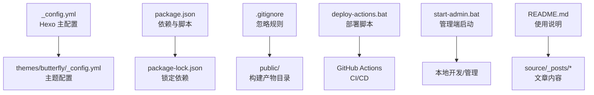
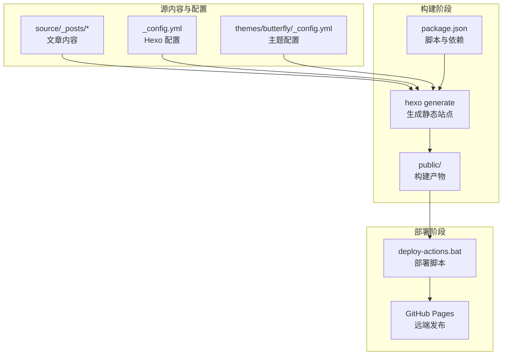
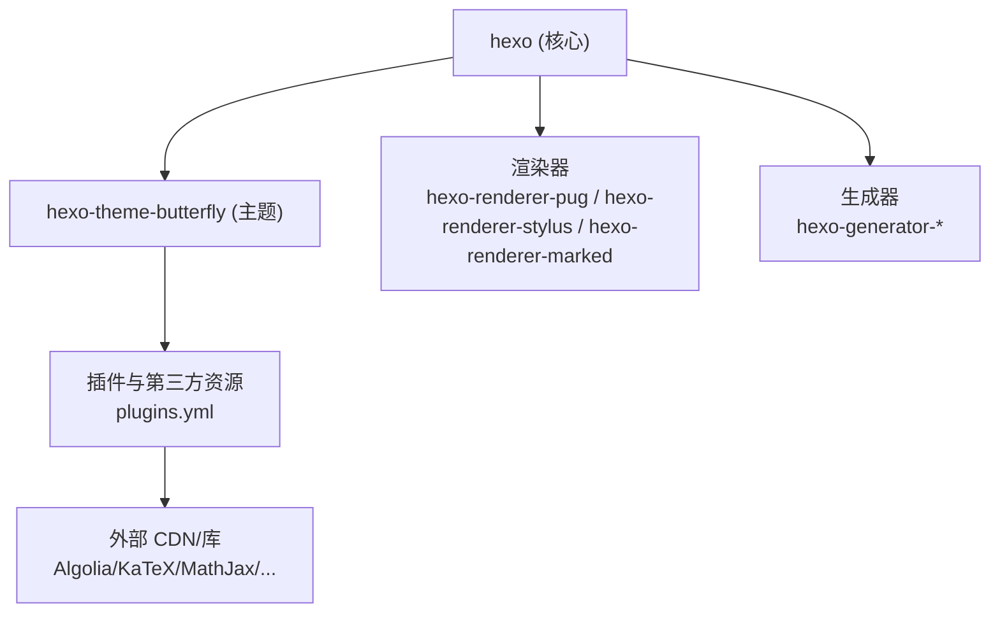

# 迁移与备份恢复

<cite>
**本文引用的文件**
- [_config.yml](file://_config.yml)
- [package.json](file://package.json)
- [package-lock.json](file://package-lock.json)
- [themes/butterfly/_config.yml](file://themes/butterfly/_config.yml)
- [themes/butterfly/package.json](file://themes/butterfly/package.json)
- [themes/butterfly/plugins.yml](file://themes/butterfly/plugins.yml)
- [deploy-actions.bat](file://deploy-actions.bat)
- [start-admin.bat](file://start-admin.bat)
- [.gitignore](file://.gitignore)
- [README.md](file://README.md)
- [source/_posts/hello-world.md](file://source/_posts/hello-world.md)
</cite>

## 目录
1. [简介](#简介)
2. [项目结构](#项目结构)
3. [核心组件](#核心组件)
4. [架构总览](#架构总览)
5. [详细组件分析](#详细组件分析)
6. [依赖关系分析](#依赖关系分析)
7. [性能考量](#性能考量)
8. [故障排查指南](#故障排查指南)
9. [结论](#结论)
10. [附录](#附录)

## 简介
本文件面向系统管理员与运维工程师，提供一套完整的 Hexo 博客迁移与备份恢复方案。内容覆盖：
- 不同版本之间的迁移流程：Hexo 版本升级、主题升级、配置文件迁移
- 数据备份策略：内容备份、配置备份、第三方服务数据备份
- 灾难恢复计划：紧急响应流程与数据恢复程序
- 多环境部署的备份策略：开发、测试、生产环境的数据同步
- 自动化备份脚本与监控告警配置
- 实际迁移案例与故障处理经验
- 备份验证与恢复测试方法

## 项目结构
该仓库采用标准 Hexo 结构，包含源内容、主题、配置与脚本等关键要素。下图展示了与备份恢复相关的关键路径与文件。

图表来源
- [_config.yml:1-173](file://_config.yml#L1-L173)
- [themes/butterfly/_config.yml:1-1137](file://themes/butterfly/_config.yml#L1-L1137)
- [package.json:1-42](file://package.json#L1-L42)
- [package-lock.json:1-8885](file://package-lock.json#L1-L8885)
- [.gitignore:1-8](file://.gitignore#L1-L8)
- [deploy-actions.bat:1-133](file://deploy-actions.bat#L1-L133)
- [start-admin.bat:1-48](file://start-admin.bat#L1-L48)
- [README.md:1-227](file://README.md#L1-L227)
- [source/_posts/hello-world.md:1-39](file://source/_posts/hello-world.md#L1-L39)

章节来源
- [_config.yml:1-173](file://_config.yml#L1-L173)
- [themes/butterfly/_config.yml:1-1137](file://themes/butterfly/_config.yml#L1-L1137)
- [package.json:1-42](file://package.json#L1-L42)
- [package-lock.json:1-8885](file://package-lock.json#L1-L8885)
- [.gitignore:1-8](file://.gitignore#L1-L8)
- [deploy-actions.bat:1-133](file://deploy-actions.bat#L1-L133)
- [start-admin.bat:1-48](file://start-admin.bat#L1-L48)
- [README.md:1-227](file://README.md#L1-L227)
- [source/_posts/hello-world.md:1-39](file://source/_posts/hello-world.md#L1-L39)

## 核心组件
- Hexo 主配置：站点元数据、URL、目录、写作、分页、扩展、部署等
- 主题配置：Butterfly 主题的导航、代码块、社交、图片、统计、评论、广告等
- 依赖与脚本：Hexo 核心、渲染器、生成器、主题及脚本命令
- 部署与管理脚本：Windows 批处理脚本用于本地部署、生成与启动管理端
- 忽略规则：控制哪些目录或文件不纳入版本管理与备份范围

章节来源
- [_config.yml:1-173](file://_config.yml#L1-L173)
- [themes/butterfly/_config.yml:1-1137](file://themes/butterfly/_config.yml#L1-L1137)
- [package.json:1-42](file://package.json#L1-L42)
- [deploy-actions.bat:1-133](file://deploy-actions.bat#L1-L133)
- [start-admin.bat:1-48](file://start-admin.bat#L1-L48)
- [.gitignore:1-8](file://.gitignore#L1-L8)

## 架构总览
下图展示了从源内容到静态站点再到部署的典型流程，以及备份恢复涉及的关键节点。

图表来源
- [package.json:6-12](file://package.json#L6-L12)
- [_config.yml:1-173](file://_config.yml#L1-L173)
- [themes/butterfly/_config.yml:1-1137](file://themes/butterfly/_config.yml#L1-L1137)
- [deploy-actions.bat:28-101](file://deploy-actions.bat#L28-L101)

章节来源
- [package.json:6-12](file://package.json#L6-L12)
- [_config.yml:1-173](file://_config.yml#L1-L173)
- [themes/butterfly/_config.yml:1-1137](file://themes/butterfly/_config.yml#L1-L1137)
- [deploy-actions.bat:28-101](file://deploy-actions.bat#L28-L101)

## 详细组件分析

### 组件一：Hexo 主配置迁移与备份
- 迁移要点
  - 版本升级：检查 Hexo 版本字段与 Node 引擎要求，确保兼容性
  - 目录与输出：确认 source_dir/public_dir 等路径未被误改
  - 写作与渲染：highlight/prismjs 等语法高亮配置保持一致
  - 扩展与主题：theme 字段指向正确主题目录
  - 部署：若使用 CI/CD，可禁用本地部署配置
- 备份策略
  - 定期备份 _config.yml 与 package.json
  - 对比历史快照，记录变更清单
  - 在升级前生成完整备份，包含 source、themes、配置与 node_modules（排除）

章节来源
- [_config.yml:1-173](file://_config.yml#L1-L173)
- [package.json:13-40](file://package.json#L13-L40)

### 组件二：主题配置迁移与备份
- 迁移要点
  - 主题版本：确认主题版本与 Hexo 版本兼容
  - 插件与第三方集成：导航、代码块、搜索、评论、统计、广告等
  - UI 与交互：深色模式、懒加载、图片灯箱、TOC 等
- 备份策略
  - 备份 themes/butterfly/_config.yml
  - 记录 plugins.yml 中的外部资源版本
  - 备份自定义样式与脚本（source/css、source/js）

章节来源
- [themes/butterfly/_config.yml:1-1137](file://themes/butterfly/_config.yml#L1-L1137)
- [themes/butterfly/package.json:1-35](file://themes/butterfly/package.json#L1-L35)
- [themes/butterfly/plugins.yml:1-208](file://themes/butterfly/plugins.yml#L1-L208)

### 组件三：依赖与脚本迁移
- 迁移要点
  - 锁定依赖：使用 package-lock.json 确保可复现
  - 脚本命令：build/clean/server 等命令保持一致
  - Node 版本：满足 engines 要求
- 备份策略
  - 备份 package.json 与 package-lock.json
  - 备份脚本文件（deploy-actions.bat、start-admin.bat）
  - 备份 README.md 中的使用说明

章节来源
- [package.json:6-40](file://package.json#L6-L40)
- [package-lock.json:1-8885](file://package-lock.json#L1-L8885)
- [deploy-actions.bat:1-133](file://deploy-actions.bat#L1-L133)
- [start-admin.bat:1-48](file://start-admin.bat#L1-L48)
- [README.md:64-86](file://README.md#L64-L86)

### 组件四：部署与管理脚本
- 迁移要点
  - 部署脚本：支持本地生成与推送至远端
  - 管理端脚本：启动本地管理端并打开浏览器
- 备份策略
  - 备份批处理脚本
  - 记录脚本执行顺序与前置条件（如 git 状态）

章节来源
- [deploy-actions.bat:28-101](file://deploy-actions.bat#L28-L101)
- [start-admin.bat:12-45](file://start-admin.bat#L12-L45)

### 组件五：忽略规则与构建产物
- 迁移要点
  - .gitignore 控制哪些目录/文件不纳入版本管理
  - public/ 为构建产物，通常不纳入版本管理
- 备份策略
  - 明确区分“源内容”与“构建产物”
  - 备份忽略规则，避免误删或误备份

章节来源
- [.gitignore:1-8](file://.gitignore#L1-L8)

### 组件六：内容与示例文章
- 迁移要点
  - 文章内容位于 source/_posts/
  - 示例文章可用于验证迁移后渲染是否正常
- 备份策略
  - 备份 source 目录下的所有内容
  - 对重要文章进行版本化管理

章节来源
- [source/_posts/hello-world.md:1-39](file://source/_posts/hello-world.md#L1-L39)

## 依赖关系分析
下图展示了 Hexo 与主题、插件、第三方服务之间的依赖关系，有助于识别备份与迁移中的关键依赖。

图表来源
- [package.json:16-36](file://package.json#L16-L36)
- [themes/butterfly/package.json:25-30](file://themes/butterfly/package.json#L25-L30)
- [themes/butterfly/plugins.yml:1-208](file://themes/butterfly/plugins.yml#L1-L208)

章节来源
- [package.json:16-36](file://package.json#L16-L36)
- [themes/butterfly/package.json:25-30](file://themes/butterfly/package.json#L25-L30)
- [themes/butterfly/plugins.yml:1-208](file://themes/butterfly/plugins.yml#L1-L208)

## 性能考量
- 构建性能
  - 使用 hexo-neat 压缩 HTML/CSS/JS
  - 启用图片懒加载与最小化资源
- 渲染性能
  - 选择合适的 highlight/prismjs 配置
  - 减少不必要的第三方脚本加载
- 部署性能
  - 利用 CI/CD 自动化构建与部署
  - 缓存依赖与构建产物以提升速度

[本节为通用建议，无需特定文件来源]

## 故障排查指南
- 部署脚本错误
  - 检查 git 仓库状态与推送权限
  - 确认网络连通性与代理设置
- 管理端无法访问
  - 检查端口占用与防火墙
  - 确认本地生成与启动顺序
- 构建失败
  - 核对 Node 版本与依赖安装
  - 清理缓存后重试（hexo clean）
- 主题配置异常
  - 对比历史配置，逐步回退定位问题
  - 检查第三方服务（评论、统计、搜索）的密钥与域名

章节来源
- [deploy-actions.bat:35-101](file://deploy-actions.bat#L35-L101)
- [start-admin.bat:12-45](file://start-admin.bat#L12-L45)
- [_config.yml:1-173](file://_config.yml#L1-L173)
- [themes/butterfly/_config.yml:1-1137](file://themes/butterfly/_config.yml#L1-L1137)

## 结论
通过明确的迁移流程、完善的备份策略与标准化的灾难恢复程序，可以显著降低 Hexo 博客在版本升级、主题更换与环境迁移过程中的风险。建议将“备份—验证—恢复”的闭环纳入日常运维流程，并结合自动化脚本与监控告警，持续提升系统的可靠性与可维护性。

[本节为总结性内容，无需特定文件来源]

## 附录

### A. 迁移与备份清单
- 源内容
  - source/_posts/*（文章）
  - source/_drafts/*（草稿）
  - source/about/index.md、source/archives/index.md 等页面
- 配置文件
  - _config.yml
  - themes/butterfly/_config.yml
  - package.json 与 package-lock.json
- 资源与脚本
  - source/css、source/js、source/images
  - deploy-actions.bat、start-admin.bat
  - README.md
- 忽略规则
  - .gitignore

章节来源
- [source/_posts/hello-world.md:1-39](file://source/_posts/hello-world.md#L1-L39)
- [_config.yml:1-173](file://_config.yml#L1-L173)
- [themes/butterfly/_config.yml:1-1137](file://themes/butterfly/_config.yml#L1-L1137)
- [package.json:1-42](file://package.json#L1-L42)
- [package-lock.json:1-8885](file://package-lock.json#L1-L8885)
- [deploy-actions.bat:1-133](file://deploy-actions.bat#L1-L133)
- [start-admin.bat:1-48](file://start-admin.bat#L1-L48)
- [README.md:1-227](file://README.md#L1-L227)
- [.gitignore:1-8](file://.gitignore#L1-L8)

### B. 灾难恢复流程（示例）
- 紧急响应
  - 确认故障范围与影响面
  - 启动应急小组并通知相关方
- 数据恢复
  - 从最近可用备份恢复源内容与配置
  - 重建依赖并验证构建
  - 重新部署至目标环境
- 验证与复盘
  - 进行全量回归测试
  - 更新应急预案与知识库

[本节为流程性建议，无需特定文件来源]

### C. 多环境备份策略
- 开发环境
  - 本地备份与小规模测试
  - 使用独立分支与标签
- 测试环境
  - 定期同步开发环境的备份
  - 执行一致性校验
- 生产环境
  - 最小化备份窗口与增量备份
  - 异地容灾与快速恢复演练

[本节为通用建议，无需特定文件来源]

### D. 自动化备份脚本与监控告警（建议）
- 备份脚本
  - 备份源内容与配置：tar/zip + 增量标记
  - 备份数据库/第三方服务：按服务商接口导出
- 监控告警
  - 构建失败、部署失败、第三方服务异常
  - 定期健康检查与日志轮转

[本节为通用建议，无需特定文件来源]

### E. 备份验证与恢复测试方法
- 验证
  - 解压后执行一次构建，检查关键页面
  - 校验第三方服务配置与链接有效性
- 测试
  - 在隔离环境中进行完整恢复测试
  - 记录测试结果与改进点

[本节为通用建议，无需特定文件来源]