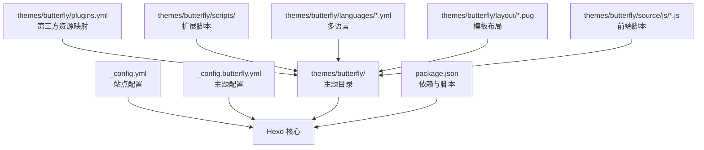
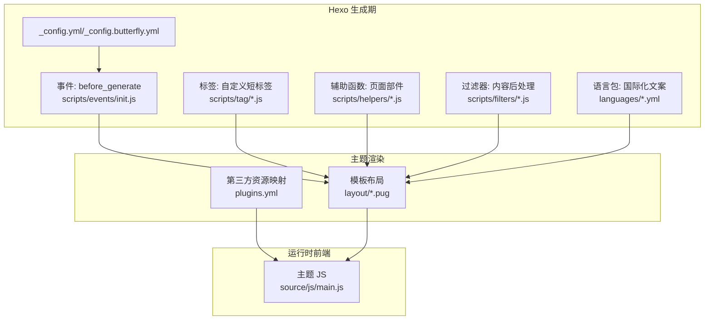
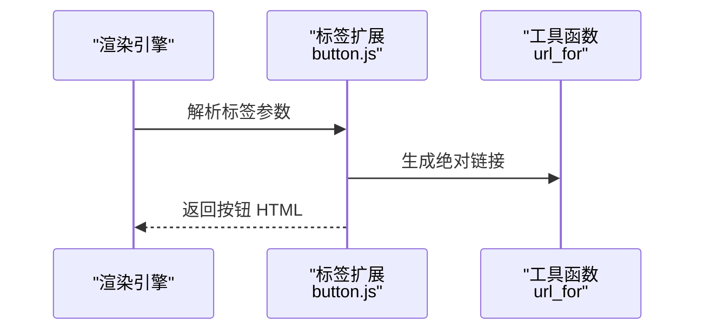
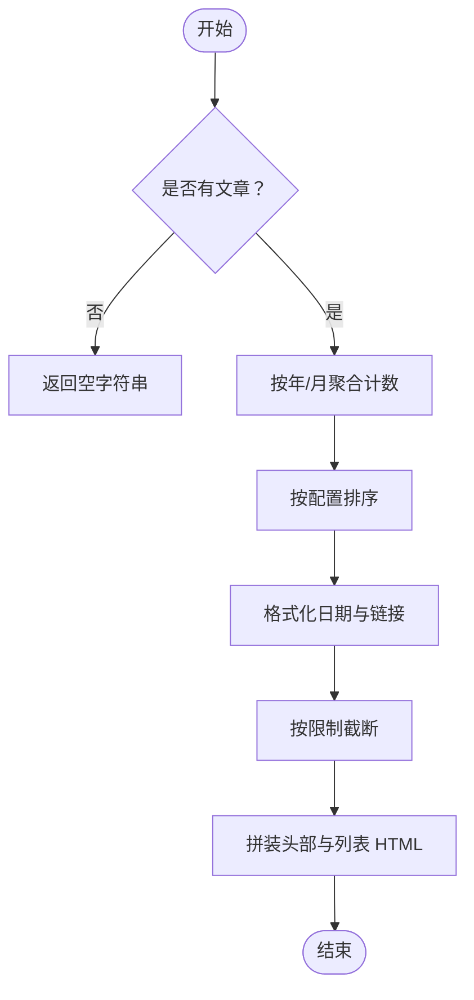
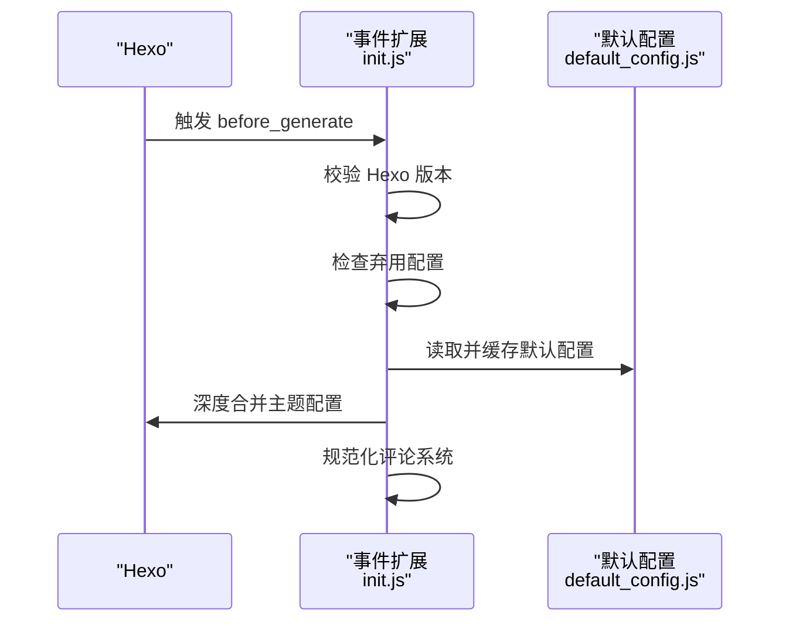
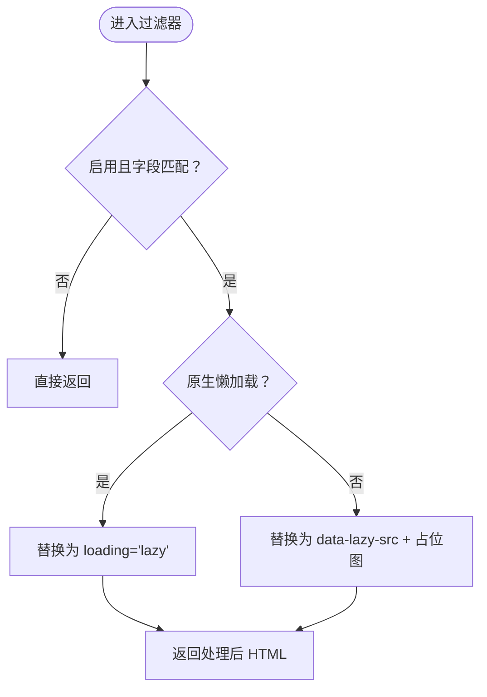
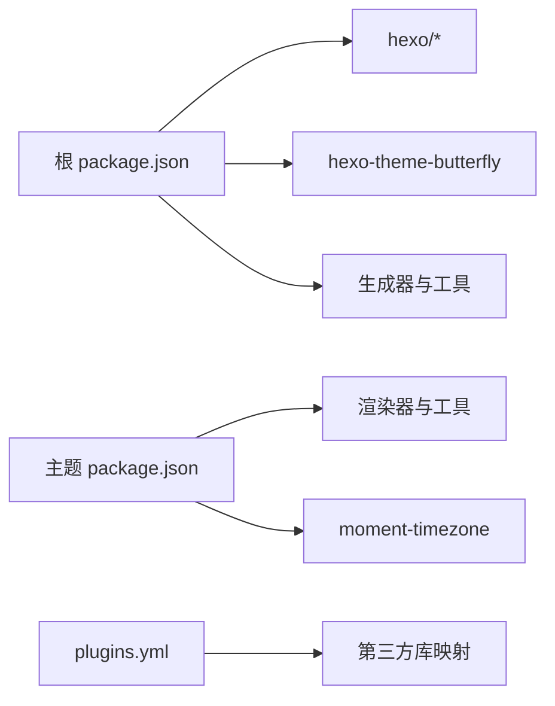

# 高级主题

<cite>
**本文引用的文件**
- [_config.yml](file://_config.yml)
- [_config.butterfly.yml](file://_config.butterfly.yml)
- [package.json](file://package.json)
- [themes/butterfly/package.json](file://themes/butterfly/package.json)
- [themes/butterfly/plugins.yml](file://themes/butterfly/plugins.yml)
- [themes/butterfly/scripts/tag/button.js](file://themes/butterfly/scripts/tag/button.js)
- [themes/butterfly/scripts/helpers/aside_archives.js](file://themes/butterfly/scripts/helpers/aside_archives.js)
- [themes/butterfly/scripts/events/init.js](file://themes/butterfly/scripts/events/init.js)
- [themes/butterfly/scripts/filters/post_lazyload.js](file://themes/butterfly/scripts/filters/post_lazyload.js)
- [themes/butterfly/scripts/common/default_config.js](file://themes/butterfly/scripts/common/default_config.js)
- [themes/butterfly/languages/zh-CN.yml](file://themes/butterfly/languages/zh-CN.yml)
- [themes/butterfly/layout/post.pug](file://themes/butterfly/layout/post.pug)
- [themes/butterfly/source/js/main.js](file://themes/butterfly/source/js/main.js)
</cite>

## 目录
1. [引言](#引言)
2. [项目结构](#项目结构)
3. [核心组件](#核心组件)
4. [架构总览](#架构总览)
5. [详细组件分析](#详细组件分析)
6. [依赖分析](#依赖分析)
7. [性能考虑](#性能考虑)
8. [故障排查指南](#故障排查指南)
9. [结论](#结论)
10. [附录](#附录)

## 引言
本文件面向高级用户与开发者，围绕 Hexo 博客工程的主题扩展与插件开发、自定义标签与辅助函数、事件与过滤器机制、多语言与本地化、SEO 优化、性能调优（含缓存与 CDN）、安全加固、迁移与灾备等主题，提供系统化的技术文档与实操建议。文档以仓库现有实现为依据，结合架构图与流程图帮助读者快速掌握扩展与优化方法。

## 项目结构
该仓库采用标准 Hexo 结构：根目录包含站点配置、脚本与内容；主题位于 themes/butterfly，内含主题配置、脚本扩展（标签、辅助函数、事件、过滤器）、国际化语言包与前端资源。主题通过 plugins.yml 管理第三方静态资源依赖，通过 scripts 目录扩展渲染期行为。

图表来源
- [_config.yml:1-173](file://_config.yml#L1-L173)
- [_config.butterfly.yml:1-690](file://_config.butterfly.yml#L1-L690)
- [themes/butterfly/plugins.yml:1-208](file://themes/butterfly/plugins.yml#L1-L208)
- [themes/butterfly/scripts/common/default_config.js:1-602](file://themes/butterfly/scripts/common/default_config.js#L1-L602)
- [themes/butterfly/layout/post.pug:1-36](file://themes/butterfly/layout/post.pug#L1-L36)
- [themes/butterfly/source/js/main.js:1-800](file://themes/butterfly/source/js/main.js#L1-L800)
- [package.json:1-42](file://package.json#L1-L42)

章节来源
- [_config.yml:1-173](file://_config.yml#L1-L173)
- [_config.butterfly.yml:1-690](file://_config.butterfly.yml#L1-L690)
- [package.json:1-42](file://package.json#L1-L42)
- [themes/butterfly/package.json:1-35](file://themes/butterfly/package.json#L1-L35)

## 核心组件
- 站点配置与部署：根配置控制站点元数据、URL、分页、写作与渲染选项，以及搜索、Sitemap、Robots 等输出与爬虫策略。
- 主题配置：主题配置集中于 _config.butterfly.yml，覆盖导航、封面、TOC、数学公式、搜索、评论、分析、广告、CDN 等。
- 主题脚本扩展：通过标签（Tag）、辅助函数（Helper）、事件（Event）、过滤器（Filter）在渲染期注入功能与行为。
- 多语言与本地化：主题语言包按语言文件组织，配合 Helper 的国际化函数实现文案本地化。
- 前端脚本：主题 JS 提供交互增强（菜单、滚动、目录、暗色模式、复制版权等），并与主题配置联动。

章节来源
- [_config.yml:1-173](file://_config.yml#L1-L173)
- [_config.butterfly.yml:1-690](file://_config.butterfly.yml#L1-L690)
- [themes/butterfly/scripts/tag/button.js:1-22](file://themes/butterfly/scripts/tag/button.js#L1-L22)
- [themes/butterfly/scripts/helpers/aside_archives.js:1-114](file://themes/butterfly/scripts/helpers/aside_archives.js#L1-L114)
- [themes/butterfly/scripts/events/init.js:1-87](file://themes/butterfly/scripts/events/init.js#L1-L87)
- [themes/butterfly/scripts/filters/post_lazyload.js:1-41](file://themes/butterfly/scripts/filters/post_lazyload.js#L1-L41)
- [themes/butterfly/languages/zh-CN.yml:1-125](file://themes/butterfly/languages/zh-CN.yml#L1-L125)
- [themes/butterfly/source/js/main.js:1-800](file://themes/butterfly/source/js/main.js#L1-L800)

## 架构总览
Hexo 在生成阶段通过配置驱动主题渲染，主题脚本在 before_generate 与渲染过滤器阶段参与内容处理；前端脚本在浏览器侧提供交互能力。主题通过 plugins.yml 统一管理第三方静态资源，确保版本与加载路径可控。

图表来源
- [themes/butterfly/scripts/events/init.js:79-87](file://themes/butterfly/scripts/events/init.js#L79-L87)
- [themes/butterfly/scripts/tag/button.js](file://themes/butterfly/scripts/tag/button.js#L21)
- [themes/butterfly/scripts/helpers/aside_archives.js:3-107](file://themes/butterfly/scripts/helpers/aside_archives.js#L3-L107)
- [themes/butterfly/scripts/filters/post_lazyload.js:29-41](file://themes/butterfly/scripts/filters/post_lazyload.js#L29-L41)
- [themes/butterfly/plugins.yml:1-208](file://themes/butterfly/plugins.yml#L1-L208)
- [themes/butterfly/layout/post.pug:1-36](file://themes/butterfly/layout/post.pug#L1-L36)
- [themes/butterfly/source/js/main.js:1-800](file://themes/butterfly/source/js/main.js#L1-L800)

## 详细组件分析

### 自定义标签：按钮标签
- 功能：提供统一的按钮渲染接口，支持 URL、文本、图标与样式选项。
- 实现要点：注册标签扩展，解析参数，拼装 HTML 并通过 url_for 生成绝对链接。
- 使用场景：导航入口、资源下载、社交分享等。

图表来源
- [themes/butterfly/scripts/tag/button.js:12-21](file://themes/butterfly/scripts/tag/button.js#L12-L21)

章节来源
- [themes/butterfly/scripts/tag/button.js:1-22](file://themes/butterfly/scripts/tag/button.js#L1-L22)

### 辅助函数：侧边栏归档卡片
- 功能：聚合文章按年/月统计，生成带计数的归档列表，支持本地化与排序。
- 实现要点：遍历站点文章，按类型聚合，格式化日期与链接，限制数量并返回 HTML 片段。
- 性能注意：使用 Map 聚合，避免重复计算；按需格式化日期与链接。

图表来源
- [themes/butterfly/scripts/helpers/aside_archives.js:23-107](file://themes/butterfly/scripts/helpers/aside_archives.js#L23-L107)

章节来源
- [themes/butterfly/scripts/helpers/aside_archives.js:1-114](file://themes/butterfly/scripts/helpers/aside_archives.js#L1-L114)

### 事件处理：初始化与配置合并
- 功能：在生成前检查 Hexo 版本与配置文件状态，合并默认配置，处理评论系统冲突。
- 实现要点：注册 before_generate 过滤器，读取默认配置缓存，深度合并主题配置，规范化评论系统选择。
- 安全与兼容：拒绝过低版本 Hexo，提示弃用配置文件，避免评论系统冲突。

图表来源
- [themes/butterfly/scripts/events/init.js:79-87](file://themes/butterfly/scripts/events/init.js#L79-L87)
- [themes/butterfly/scripts/common/default_config.js:1-602](file://themes/butterfly/scripts/common/default_config.js#L1-L602)

章节来源
- [themes/butterfly/scripts/events/init.js:1-87](file://themes/butterfly/scripts/events/init.js#L1-L87)
- [themes/butterfly/scripts/common/default_config.js:1-602](file://themes/butterfly/scripts/common/default_config.js#L1-L602)

### 过滤器：图片懒加载
- 功能：在 HTML 输出或文章内容渲染后替换 img src 为延迟加载属性，提升首屏性能。
- 实现要点：区分原生与占位符两种策略，按配置字段生效范围执行替换。
- 注意事项：避免对 script 内的 img 标签误替换，最小化正则匹配开销。

图表来源
- [themes/butterfly/scripts/filters/post_lazyload.js:11-41](file://themes/butterfly/scripts/filters/post_lazyload.js#L11-L41)

章节来源
- [themes/butterfly/scripts/filters/post_lazyload.js:1-41](file://themes/butterfly/scripts/filters/post_lazyload.js#L1-L41)

### 多语言与本地化策略
- 语言包：主题提供多语言 YAML 文件，键值对应界面文案；通过 Helper 的国际化函数进行翻译。
- 本地化流程：在渲染期根据页面语言选择对应文案，支持日期本地化与 moment 语言映射。
- 建议：新增语言时同步补充键值，避免缺失导致回退显示。

章节来源
- [themes/butterfly/languages/zh-CN.yml:1-125](file://themes/butterfly/languages/zh-CN.yml#L1-L125)
- [themes/butterfly/scripts/helpers/aside_archives.js:18-113](file://themes/butterfly/scripts/helpers/aside_archives.js#L18-L113)

### 前端交互与主题配置联动
- 交互能力：菜单折叠、滚动行为、目录高亮、暗色模式切换、复制版权、运行时/最后更新等。
- 配置联动：主题 JS 读取全局配置对象，按开关与阈值调整行为；与主题 Pug 模板共同决定渲染内容。

章节来源
- [themes/butterfly/layout/post.pug:1-36](file://themes/butterfly/layout/post.pug#L1-L36)
- [themes/butterfly/source/js/main.js:1-800](file://themes/butterfly/source/js/main.js#L1-L800)

## 依赖分析
- 站点依赖：Hexo 核心、主题、渲染器、生成器、压缩与服务器等。
- 主题依赖：渲染器与工具库，如 Pug、Stylus、moment-timezone 等。
- 第三方资源：通过 plugins.yml 映射第三方库名称、文件与版本，便于统一管理与 CDN 注入。

图表来源
- [package.json:16-36](file://package.json#L16-L36)
- [themes/butterfly/package.json:25-30](file://themes/butterfly/package.json#L25-L30)
- [themes/butterfly/plugins.yml:1-208](file://themes/butterfly/plugins.yml#L1-L208)

章节来源
- [package.json:1-42](file://package.json#L1-L42)
- [themes/butterfly/package.json:1-35](file://themes/butterfly/package.json#L1-L35)
- [themes/butterfly/plugins.yml:1-208](file://themes/butterfly/plugins.yml#L1-L208)

## 性能考虑
- 渲染期优化
  - 懒加载：通过过滤器替换图片属性，减少首屏资源压力。
  - 压缩：启用 HTML/CSS/JS 压缩与混淆，合理排除已压缩文件。
  - 代码块：按需启用复制、语言标识与高度限制，避免过度 DOM。
- 前端优化
  - 滚动节流与防抖：对目录定位与滚动百分比计算进行节流，降低重排压力。
  - 按需加载：无限画廊等组件按需加载脚本与数据，避免一次性渲染大量节点。
- 资源与缓存
  - CDN：通过主题配置的 CDN 字段统一引入第三方库，提升加载速度。
  - 预加载：在模板中注入必要的预连接与预加载指令，改善关键路径。
- 生成期优化
  - 合并默认配置：事件阶段缓存并合并默认配置，减少重复 IO。
  - 严格版本校验：避免旧版 Hexo 导致的兼容性问题与性能退化。

章节来源
- [themes/butterfly/scripts/filters/post_lazyload.js:1-41](file://themes/butterfly/scripts/filters/post_lazyload.js#L1-L41)
- [_config.yml:157-173](file://_config.yml#L157-L173)
- [themes/butterfly/scripts/events/init.js:37-45](file://themes/butterfly/scripts/events/init.js#L37-L45)
- [themes/butterfly/scripts/common/default_config.js:1-602](file://themes/butterfly/scripts/common/default_config.js#L1-L602)
- [themes/butterfly/source/js/main.js:364-381](file://themes/butterfly/source/js/main.js#L364-L381)
- [_config.butterfly.yml:682-690](file://_config.butterfly.yml#L682-L690)

## 故障排查指南
- 版本与配置
  - Hexo 版本过低：事件会在 before_generate 阶段抛错并记录日志，需升级 Hexo 至要求版本以上。
  - 弃用配置文件：检测到旧配置文件会提示改用新配置文件并中断生成。
- 评论系统冲突
  - 当同时启用多个评论系统时，事件会警告并仅保留第一个，避免重复加载与冲突。
- 懒加载无效
  - 检查配置字段与生效范围，确认过滤器是否按站点或文章内容触发。
- 多语言文案缺失
  - 新增键值或语言文件，确保 Helper 能正确解析并回退到默认语言。

章节来源
- [themes/butterfly/scripts/events/init.js:10-32](file://themes/butterfly/scripts/events/init.js#L10-L32)
- [themes/butterfly/scripts/events/init.js:69-77](file://themes/butterfly/scripts/events/init.js#L69-L77)
- [themes/butterfly/scripts/filters/post_lazyload.js:29-41](file://themes/butterfly/scripts/filters/post_lazyload.js#L29-L41)
- [themes/butterfly/languages/zh-CN.yml:1-125](file://themes/butterfly/languages/zh-CN.yml#L1-L125)

## 结论
本项目通过完善的主题配置、脚本扩展与前端交互，构建了可扩展、可维护且具备良好性能表现的 Hexo 博客体系。开发者可在不破坏主题结构的前提下，利用标签、辅助函数、事件与过滤器进行二次开发；同时结合多语言、SEO、CDN 与安全策略，实现从功能到体验的全面优化。

## 附录
- SEO 优化建议
  - 结构化数据：启用结构化数据开关并按需配置备用名称。
  - Open Graph：开启并配置必要元信息，提升社交分享质量。
  - Sitemap 与 Robots：保持 Sitemap 与 robots 配置完整，避免索引风险。
- 安全加固建议
  - 管理后台：使用强口令与密钥，限制访问路径与过期时间。
  - 外链与资源：对外部资源使用可信 CDN，避免 XSS 风险。
  - 输入校验：对用户输入与第三方评论进行严格校验与转义。
- 迁移与灾备
  - 迁移：备份源文件、配置与生成产物，更换环境后复用 plugins.yml 与主题配置。
  - 备份：定期导出站点配置与语言包，保存第三方资源清单。
  - 灾难恢复：优先恢复配置与内容，再重建依赖与前端资源。

章节来源
- [_config.butterfly.yml:661-669](file://_config.butterfly.yml#L661-L669)
- [_config.yml:110-127](file://_config.yml#L110-L127)
- [_config.yml:94-102](file://_config.yml#L94-L102)
- [themes/butterfly/plugins.yml:1-208](file://themes/butterfly/plugins.yml#L1-L208)